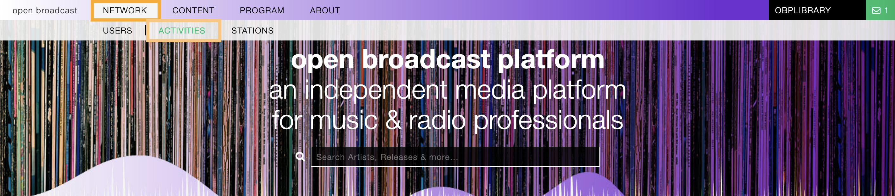
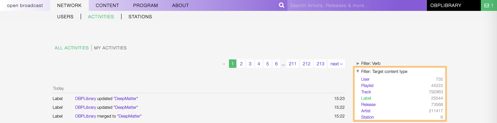

.. _activities:

##########
Activities
##########

The 'Activities' are the actions performed by the :ref:`users <user>` on the platform.

.. _activities-list:

***************
Activities list
***************

To access the list of activities, open the **NETWORK** menu and click on **ACTIVITIES**.

By default, the list is sorted by date, the newest activity is displayed on top of the list.

Filtering the list
==================

The list of activities can be filtered using the **Filters** located on the right side of the page,

   Example: Show all actions performed on the **label** profiles only.

To reset the result-set, click on the active option / filter to deselect it.

Filter: Verb
------------

The type of action performed by the user.

The options are:

* **Added**: The user added / created a profile in the library.
* **Download**: The user downloaded content.
* **Merged To**: The user merged two or more profiles *(Advanced editor only)*.
* **Rescheduled**: The user re-scheduled a playlist.
* **Scheduled**: The user scheduled a playlist for the first time.
* **Started Following**: The user started to follow a profile.
* **Stream**: The user played a track.
* **Updated**: The user updated a profile.

Filter: Target content type
---------------------------

The content the action was performed on.

The options are:

* **User**: The :ref:`User <user>` of the platform.
* **Playlist**: The :ref:`Playlist <playlist>` on the platform.
* **Track**: The :ref:`Track <track>` in the library.
* **Label**: The :ref:`Label <label>` in the library.
* **Release**: The :ref:`Release <release>` in the library.
* **Artist**: The :ref:`Artist <artist>` in the library.
* **Station**: The :ref:`Radio station <station>` on the platform.

