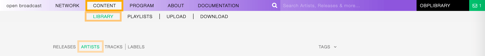
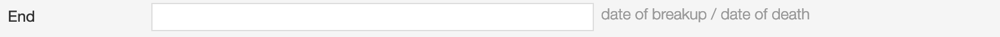

.. |mb-license| replace:: *CC-BY-NC-SA License*
.. _mb-license: https://creativecommons.org/licenses/by-nc-sa/3.0/
.. |wk-license| replace:: *CC-BY-SA License*
.. _wk-license: https://creativecommons.org/licenses/by-sa/3.0/

.. _artist:

#######
Artists
#######

.. _artist-overview:

********
Overview
********

An artist is generally a musician (or musician persona), group of musicians, or other music professional
(like a producer or engineer). Occasionally, it can also be a non-musical person (like a photographer, an illustrator,
or a poet in the library whose writings are set to music), or even a fictional character.
*(From the Musicbrainz article* |mb-artist|_ *, which is released under the* |mb-license|_ *).*

.. |mb-artist| replace:: *Artist*
.. _mb-artist: https://wiki.musicbrainz.org/Artist

Visit the :ref:`form view<artist-form>` chapter to see which information open broadcast collect for an artist.

.. _artist-list:

*********
List view
*********

The list view displays all artists that are in the library.

To access it, open the **CONTENT** menu, click on **LIBRARY**, and then on **ARTISTS**.

Note that search results are paginated (24 items per page). You can use the pagination controls above the list to
navigate through the results pages.

The **PLAY ALL** and **QUEUE ALL** buttons allow you to play/queue all artist's tracks in the list at once.

See also:

* :ref:`The popup player <popup-player>`

Sorting the list
================

By default the artists are sorted by **Creation date** (descending). The newly created artist profile is displayed
on the top-left side of the list.

You can change the ordering parameter by clicking on **Ordering** to open the menu and selecting a different option.

  Click again on the active option to reverse the sorting order from 'descending' to 'ascending' (DESC/ASC).

The available options are:

* :ref:`Name: <artist-form-artist-name>` The name of the artist.
* :ref:`Date of formation/date of birth: <artist-form-begin-date>` The date a group formed / a person was born.
* :ref:`Date of breakup/date of death: <artist-form-end-date>` The date a group dissolved / a person died.
* **Last Modified**: The last date an artist profile was edited.
* **Creation date**: The date an artist profile was created.

.. _artist-list-filter:

Filtering the list
==================

You can filter the list by tags and specific properties associated with the artists.

By Tags
-------

Click on **TAGS** to open the tag cloud and then on a tag to select it.

  .. figure:: img/artist-list-tags.png

The page automatically reloads the filtered results every time you select, add, or remove a tag.

By specific property
--------------------

Click on the **Filter: <property>** to open the menu, then click on one or more values in the list.

.. figure:: img/artist-list-filters-person.png

You can filter by the following properties:

* :ref:`Country: <artist-form-country>` The country a person was born / a band formed.
* :ref:`Type: <artist-form-type>` The type of artist.

Tags and filters also work in combination:

.. figure:: img/artist-list-tags-filters.png

   Example: Show all **REGGAE** **PRODUCERS** and **DRUMMERS** artists that are a **Person**. Sort the results by
   **Creation date**.

Click again on any active tag or filter to deselect it and reset the result-set.

.. _artist-list-card:

The Artist card
===============

A card contains information and actions about an artist in the list.

Starting at the top, the information is:

* :ref:`Country <artist-form-country>` / :ref:`Type <artist-form-type>`: The country a person was born / a band formed.
  The type of artist.
* :ref:`Image <artist-form-image>`: The picture of the artist.
* :ref:`Tags <artist-form-tags>`: The tags associated with the artist.
* :ref:`Name <artist-form-artist-name>` The name of the artist.
* :ref:`Begin <artist-form-begin-date>` / :ref:`End <artist-form-end-date>`: The year the group first
  formed / last dissolved or the person was born / died.
* **User name**: The name of the user who created the artist profile.
* **Tracks / Releases count** (right side): The number of tracks / releases the artist is credited.
* **Creation date** (right side): The date the artist profile was created.

The card also includes some functionalities, visible as soon as you move the cursor over the cover art.

You can click the ‘Play’ button to listen to all artist's tracks:

   The :ref:`popup player <popup-player>` opens and starts playing it automatically

To access additional options, click on **more options** (3 dots) to open the menu and then click on an option.

or on **more options** (3 dots) to access additional functionalities:

The available options are:

* **Queue**: Queue the tracks in :ref:`the popup player <popup-player>`.
* **Edit**: Open the :ref:`form view <artist-form>` of the artist.
* **Admin view**: *(Admin only)*.

.. _artist-detail:

***********
Detail view
***********

To open the detail view of an artist, go to the :ref:`artists list <artist-list>` page and click on the name of
the artist.

The detail view displays all information associated with the artist. Starting at the top, the information are:

* :ref:`Name <artist-form-artist-name>` (:ref:`Country <artist-form-country>`): The name of the artist (the country of origin
  of the artist).
* Appearance: The amount of tracks / releases associated with the artist.
* :ref:`Real name <artist-form-real-name>`: The real name of the artist.
* :ref:`Variations <artist-form-name-variations>`: The variations of the artist name.
* :ref:`Aliases <artist-form-aliases>`: The aliases of the artist.
* :ref:`Members <artist-form-members>`: The members of the band (group, orchestra).
* **Date created**: The date the artist profile was created / the :ref:`user <user>` who created the profile.
* **Last Updated**: The last date the artist profile was edited / the last :ref:`user <user>` who edited the profile.
* :ref:`Tags <release-form-tags>`: The tags associated with the artist.
* :ref:`Image <release-form-cover-art>` (right side): The image of the artist.
* **Thumb up / thumb down** (right side): The rating tool.

Overview tab
============

The most popular tracks / releases by the artist.

  Click on "Show all tracks / releases by <artist>" to display all tracks / releases in a new page.

Credited tab
============

The list of tracks the artist is :ref:`credited <track-form-credited-artists>` to.

Biography tab
=============

The :ref:`biography <artist-form-biography>` of the artist.

Statistics tab
==============

The artist's tracks usage statistics.

On the right side of the page are available the following options:

* :ref:`Edit <artist-form>`: Open the form to edit the information of the artist.
* **Administration view**: *(Admin only)*.
* **Follow artist**: Start to follow the artist.

  Below the options are listed the url(s) of the artist page on other online platforms.

.. _artist-form:

*********
Form view
*********

The form view allows to edit the information of the artist.

To open the form, go to the :ref:`artist detail <artist-detail>` page and click on **Edit**

Or from the :ref:`artists list <artist-list>`:

  Click on **more options** (3 dots) to open the menu and then click on **Edit**.

On the top side of the form are displayed the current information of the artist (as displayed in the
:ref:`detail view <artist-detail>`).

  After editing the information, click on **SAVE** to confirm the changes or on **CANCEL** to undo the changes and
  reset the form.

On the right side of the page are available the following options:

* **Back to detail view**: Exit the form and return to the detail view.
* **Administration view**: *(Admin only)*.

A comparison tool is available to help complete the information:

* **Compare - Discogs**: Search for matches in the `Discogs <https://www.discogs.com/>`__ database and retrieve the
  information from it.
* **Compare - Musicbrainz**: Search for matches in the `Musicbrainz <https://musicbrainz.org/>`__ database and retrieve
  the information from it.

Below are described the information open broadcast collect for an artist.

.. _artist-form-general:

General
=======

.. _artist-form-artist-name:

Name
----

The official name of the artist as found on the release, be it a person or a band.

.. _artist-form-name-variations:

Variations
----------

The variations of the artist name (abbreviations, different initials etc.). Multiple entries are separated by comma.

.. _artist-form-real-name:

Real name
---------

The real / legal name of the artist. Multiple entries are separated by comma.

.. _artist-form-type:

Artist type
-----------

The type of Artist. Please refer to the descriptions below to determine which value to choose.

**Person**

An individual person.

**Group**

A group of people (i.e. a band).

**Orchestra**

An orchestra (/ˈɔːrkɪstrə/; Italian: [orˈkɛstra]) is a large instrumental ensemble typical of classical music, which
combines instruments from different families.
*(From the Wikipedia article* |wk-orchestra|_ *, which is released under the* |wk-license|_ *).*

.. _wk-orchestra: https://en.wikipedia.org/wiki/International_Article_Number
.. |wk-orchestra| replace:: *Orchestra*

**Other**

Anything which does not fit into the above categories.

.. _artist-form-country:

Country
-------

The country a person was born / a band was formed.

.. _artist-form-generic-email:

E-mail
------

A valid e-mail address for general inquires.

.. _artist-form-booking-email:

Booking
-------

A valid e-mail address for booking inquires.

.. _artist-form-aliases:

Aliases
=======

Alias
-----

Other name(s) the artist uses to differentiate its work.

.. figure:: img/artist-form-aliases-alias.png

.. note::

  Typing inside the 'Alias' field activates the auto-completion, listing all profiles in the library whose name matches
  the current text typed in.

  Click on the matching profile to select it or on 'Close' to close the list and create a new profile.

  .. figure:: img/artist-form-alias-select-create.gif

    The system automatically creates a new empty field every time a name is entered. (up to 15 per editing session).

  To remove an artist click on the respective 'Delete' check-box and save the form.

.. _artist-form-members:

Members
=======

Member
------

The members of the group / orchestra (both current and past members).

.. note::

  Typing inside the 'Member' field activates the auto-completion, listing all profiles in the library whose name matches
  the current text typed in.

  Click on the matching profile to select it or on 'Close' to close the list and create a new profile.

  .. figure:: img/artist-form-member-select-create.gif

    The system automatically creates a new empty field every time a name is entered. (up to 15 per editing session).

  To remove an artist click on the respective 'Delete' check-box and save the form.

Identifiers
===========

The identification codes associated with the artist.

.. _artist-form-ipi-code:

IPI code
--------

The IPI code assigned by CISAC.

IPI (Interested party information) is a unique identifying number assigned by the CISAC database to each Interested
Party in collective rights management. It is used worldwide by more than 120 countries and three million right holders.
*(From the Wikipedia article* |wk-interested-parties-information|_ *, which is released under the* |wk-license|_ *).*

.. _wk-interested-parties-information: https://en.wikipedia.org/wiki/Interested_Parties_Information
.. |wk-interested-parties-information| replace:: *Interested parties information*

.. _artist-isni-code:

ISNI code
---------

The International Standard Name Identifier for the artist.

.. figure:: img/artist-form-identifiers-isni-code.png

The International Standard Name Identifier (ISNI) is an identifier for uniquely identifying the public identities of
contributors to media content such as books, television programmes, and newspaper articles. Such an identifier consists
of 16 digits. It can optionally be displayed as divided into four blocks.
*(From the Wikipedia article* |wk-interested-parties-information|_ *, which is released under the* |wk-license|_ *).*

.. _wk-international-standard-name-identifier: https://en.wikipedia.org/wiki/International_Standard_Name_Identifier
.. |wk-international-standard-name-identifier| replace:: *International standard name identifier*

.. _artist-form-activity:

Activity
========

.. _artist-form-begin-date:

Begin
-----

The date a group first formed / the person was born.

.. _artist-form-end-date:

End
---

The date a group last dissolved / the person died.

.. _artist-form-meta:

Meta information
================

.. _artist-form-biography:

Biography
---------

The artist's biography.

.. _artist-form-image:

Artist / band picture
---------------------

The picture or logo of the artist.

  To upload an image, click on **Browse** and select a picture from the computer file browser.

.. _artist-form-tags:

Tags
====

One or more keyword(s) to help describe the artist(i.e. the music genre, instruments, profession).

.. note::

  Typing inside the 'Tags' field activates the auto-completion, listing all tags in the library whose name matches with the
  current text typed in.

  Click on the matching tag to select it or hit the 'Enter' key to create a new tag.

  .. figure:: ../img/tags-field-select-create-remove.gif

    To remove a specific tag click on the 'X' within it.

.. _artist-form-relations:

Relations
=========

Website / URL
-------------

The url of the artist page on other online platforms.

To remove a url / link click on the respective 'Delete' check-box and save the form.
