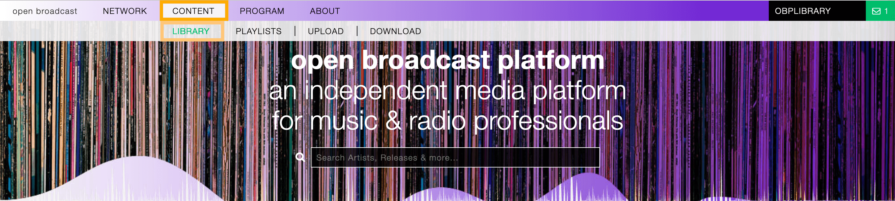

.. |mb-license| replace:: *CC-BY-NC-SA License*
.. _mb-license: https://creativecommons.org/licenses/by-nc-sa/3.0/
.. |wk-license| replace:: *CC-BY-SA License*
.. _wk-license: https://creativecommons.org/licenses/by-sa/3.0/

.. _library:

#######
Library
#######

.. _library-overview:

As the place of media production, the platform connects a high quality work environment with a comprehensive music
library.

The library includes:

* :ref:`Releases: <release>` The releases the tracks appear on.
* :ref:`Artists: <artist>` The artists the tracks and releases are credited to.
* :ref:`Tracks: <track>` The way recordings appear on releases.
* :ref:`Labels: <label>` The labels the releases are issued on.

To access it, open the **CONTENT** menu and click on **LIBRARY**.

You can change which profiles to display using the library navigation menu.

See also:

.. toctree::
    :maxdepth: 1

    releases/index
    artists/index
    tracks/index
    labels/index
