.. |mb-license| replace:: *CC-BY-NC-SA License*
.. _mb-license: https://creativecommons.org/licenses/by-nc-sa/3.0/
.. |wk-license| replace:: *CC-BY-SA License*
.. _wk-license: https://creativecommons.org/licenses/by-sa/3.0/

.. _library:

##############
Library
##############

As the place of media production, the platform connects a high quality work environment with a comprehensive music
library.

To start browsing the library, open the **CONTENT** menu and click on **LIBRARY**.

.. figure:: img/content-sub-nav-library.png

By default it display the list of **Releases**, to change it, click on a different entity using the page navigation menu.

.. figure:: img/library-nav-entities.png

The library includes:

* :ref:`Releases: <release>` The releases the recordings (tracks) appear on.
* :ref:`Artists: <artist>` The artist/s the tracks and releases are credited to.
* :ref:`Tracks <track>` The tracks themselves.
* :ref:`Labels: <label>` The labels the releases are issued on.

.. _release:

*********
Releases
*********

In the music industry, a release usually is a creative output from an artist, available for sale or distribution; a
broad term covering the many different formats music can be released in, and different forms of pieces (singles, albums,
extended plays, etc.).

The word can also refer to the event at which an album or single is first offered for sale in record stores.
Also an album launch, or single launch.
*(From the Wikipedia article* |wk-release|_ *, which is released under the* |wk-license|_ *).*

.. _wk-release: https://en.wikipedia.org/wiki/Art_release#Music
.. |wk-release| replace:: *Music release*

A release represents the unique release (i.e. issuing) of a product on a specific date with specific release information
such as the country, label, barcode and packaging.
*(From the Musicbrainz article* |mb-release|_ *, which is released under the* |mb-license|_ *).*

.. |mb-release| replace:: *Release*
.. _mb-release: https://musicbrainz.org/doc/Release

Visit the :ref:`Release form <release-form>` to see which information open broadcast collect for a release.

.. _release-list:

Release list
=============

To access the list of releases, open the **CONTENT** menu, click on **LIBRARY** and then on **RELEASES**.

By default the list is sorted by **Creation date** (descending), the newly created profile is displayed on the top-left
side of the list.

.. figure:: img/release-list-order.png

   Click on the active / highlighted option to change the sorting order from 'descending' to 'ascending' (DESC/ASC).

To sort it differently, click on **Ordering** and then on a different options:

* :ref:`Name: <release-form-title>` The title of the release.
* :ref:`Release date: <release-form-date>` The date the release was officially issued.
* Last Modified: The last date the release profile was edited.
* Creation date: The date the release profile was created.

.. _release-list-filter:

Filtering the list
------------------------------

The list of releases can be filtered using the tags or some fields associated to the release.

To filter by tags, click on **TAGS** and select one or more tag/s from the list.

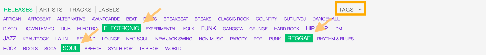

To filter by a specific field, use the apposite **Filters** located on the right side of the page,

.. figure:: img/release-list-filters.png

The available filters are:

* :ref:`Release date: <release-form-date>` The date the release was officially issued.
* :ref:`Release type: <release-form-type>` The type of release.
* :ref:`Release country: <release-form-country>` The country the release was issued in.
* :ref:`Label type: <label-form-type>` The type of label the release was issued on.

.. note::

  **TAGS** and **Filters** also work in combination. To reset the result-set, Click again on the active tag/s or filter/s.

.. figure:: img/release-list-tags-filters.png

   Example: Show all **ELECTRONIC** and **ACID JAZZ** **Album** releases sorted by **Creation date**.

.. _release-list-card:

The Release card
-----------------

The release card display some information for the release and it includes functions to interact with.

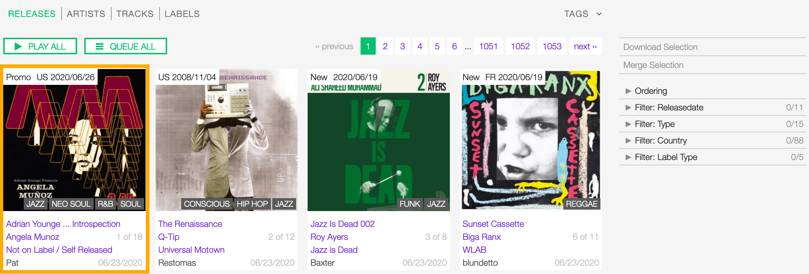

To play its content, move the cursor over the Cover art and click on the 'Play' icon. The :ref:`popup player <popup-player>`
opens automatically and starts play the content. Be sure the browser permissions are set to 'Autoplay' else click again
on the 'Play' button displayed in the player.

.. figure:: img/release-list-card-play.png

To access additional options, click on 'more options' icon (3 dots), then select one of the available functions.

.. figure:: img/release-list-card-options.png

The functions are:

* **Queue**: Queue the tracks in :ref:`the popup player <popup-player>`.
* **Download**: Download the entire release.
* **Edit**: Open the :ref:`edit form <release-form>` for the release.
* **Admin view**: *(Admin only)*.

Starting from the top, the information displayed are:

* :ref:`Release country: <release-form-country>` The country the release was issued in.
* :ref:`Release date: <release-form-date>` The date the release was officially issued.
* :ref:`Cover art: <release-form-cover-art>` the cover art of the release.
* :ref:`Release title: <release-form-title>` The title of the release
* :ref:`Artist: <release-form-album-artist>` The name of the artist the release is credited to.
* :ref:`Label: <label>` The name of label the release was issued on.
* Track count: The number of tracks available for the release / the total number.
* User name: The user who created the release profile.
* Creation date: The date the release profile was created.

.. note::

  **NEW** or **PROMO** are additional information that are displayed for the following cases:

  * **New**: The release is 'new on the market' (up to 60 days from the date of issue).
  * **Promo**: The release is not available on the market yet (the current date precedes the release date).

.. _release-list-selection:

Actions on selection
--------------------

To select one or more release/s, move the cursor over the card (below the image) and click on it.

.. figure:: img/release-list-selection.gif

    Click on the card again to deselect it.

The available actions are:

* **Download selection:** Download the selected items *(Radio pro only)*.
* **Merge selection:** Merge the selected items *(Admin only)*.

.. _release-profile:

Release profile
===============

UNDER CONSTRUCTION

.. _release-form:

Release form
============

The release form allows to add or change information for a release.

After editing the information, click on **SAVE** to confirm the changes or on **CANCEL** to undo the changes and
reset the form.

Below are described the information open broadcast collect for a release.

.. _release-form-general:

General
-------

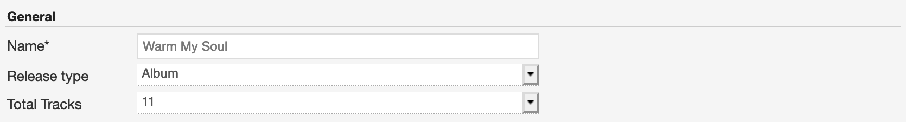

  Mandatory fields are marked with ***** and cannot be omitted.

.. _release-form-title:

Name
^^^^^

The official title of the release. It can be found in the cover art, promo sheet or on reliable online sources.

.. _release-form-type:

Release type
^^^^^^^^^^^^

The type of release. Please refer to the descriptions below to determine which value to choose.

**Album**

An album is a collection of audio recordings issued as a collection on compact disc (CD), vinyl, audio tape, or another
medium.

In the United States, The Recording Academy's rules for Grammy Awards state that an album must comprise a minimum total
playing time of 15 minutes with at least five distinct tracks or a minimum total playing time of 30 minutes with no
minimum track requirement. In the United Kingdom, the criteria for the UK Albums Chart is that a recording counts as
an 'album' if it either has more than four tracks or lasts more than 25 minutes.
*(From the Wikipedia article* |wk-album|_ *, which is released under the* |wk-license|_ *).*

.. _wk-album: https://en.wikipedia.org/wiki/Album
.. |wk-album| replace:: *Album*

**Single**

In music, a single is a type of release, typically a song recording of fewer tracks than an LP record or an album.
This can be released for sale to the public in a variety of different formats. In most cases, a single is a song that
is released separately from an album, although it usually also appears on an album. Typically, these are the songs from
albums that are released separately for promotional uses such as digital download or commercial radio airplay and are
expected to be the most popular.
*(From the Wikipedia article* |wk-single|_ *, which is released under the* |wk-license|_ *).*

.. _wk-single: https://en.wikipedia.org/wiki/Single_(music)
.. |wk-single| replace:: *Single*

**EP**

An extended play record, often referred to as an EP, is a musical recording that contains more tracks than a single,
but is usually unqualified as an album or LP. Contemporary EPs generally contain a minimum of three tracks and maximum
of six tracks. *(From the Wikipedia article* |wk-extended-play|_ *, which is released under the* |wk-license|_ *).*

.. _wk-extended-play: https://en.wikipedia.org/wiki/Extended_play
.. |wk-extended-play| replace:: *Extended-play*

**Compilation**

A compilation album comprises tracks, which may be previously released or unreleased, usually from several separate
recordings by either one or several performers. If by one artist, then generally the tracks were not originally intended
for release together as a single work,[1] but may be collected together as a greatest hits album or box set.
*(From the Wikipedia article* |wk-compilation-album|_ *, which is released under the* |wk-license|_ *).*

.. _wk-compilation-album: https://en.wikipedia.org/wiki/Compilation_album
.. |wk-compilation-album| replace:: *Compilation album*

**Soundtrack**

A soundtrack album is any album that incorporates music directly recorded from the soundtrack of a particular feature
film or television show.
*(From the Wikipedia article* |wk-soundtrack-album|_ *, which is released under the* |wk-license|_ *).*

.. _wk-soundtrack-album: https://en.wikipedia.org/wiki/Soundtrack_album
.. |wk-soundtrack-album| replace:: *Soundtrack album*

**Audiobook**

An audiobook (or a talking book) is a recording of a book or other work being read out loud.
*(From the Wikipedia article* |wk-audiobook|_ *, which is released under the* |wk-license|_ *).*

.. _wk-audiobook: https://en.wikipedia.org/wiki/Audiobook
.. |wk-audiobook| replace:: *Audiobook*

**Spoken word**

A spoken word album is a recording of spoken material, a predecessor of the contemporary audiobook genre. Rather than
featuring music or songs, the content of spoken word albums include political speeches, dramatic readings of historical
documents, dialogue from a film soundtrack, dramatized versions of literary classics, stories for children, and comedic
material. *(From the Wikipedia article* |wk-spoken-word-album|_ *, which is released under the* |wk-license|_ *).*

.. _wk-spoken-word-album: https://en.wikipedia.org/wiki/Spoken_word_album
.. |wk-spoken-word-album| replace:: *Spoken word album*

**Interview**

In media terms, an interview disc is a recorded disc with spoken word recordings in an interview style format, with a
specific person or group of people, as opposed to the usual music features. The source of the recording can vary.
*(From the Wikipedia article* |wk-interview-disc|_ *, which is released under the* |wk-license|_ *).*

.. _wk-interview-disc: https://en.wikipedia.org/wiki/Interview_disc
.. |wk-interview-disc| replace:: *Interview disc*

**Jingle**

A jingle album is an album consisting of memorable slogan (jingles) for radio and television commercials.

**Live**

Live albums may be recorded at a single concert, or combine recordings made at multiple concerts. They may include
applause and other noise from the audience, comments by the performers between pieces, improvisation, and so on.
*(From the Wikipedia article* |wk-album-live|_ *, which is released under the* |wk-license|_ *).*

.. _wk-album-live: https://en.wikipedia.org/wiki/Album#Live
.. |wk-album-live| replace:: *Live album*

**Remix**

A remix album is an album consisting of remixes or rerecorded versions of an artist's earlier released material.
*(From the Wikipedia article* |wk-remix-album|_ *, which is released under the* |wk-license|_ *).*

.. _wk-remix-album: https://en.wikipedia.org/wiki/Remix_album
.. |wk-remix-album| replace:: *Remix album*

**Broadcast**

An episodic release that was originally broadcast via radio, television, or the Internet, including podcasts.

**Dj-mix**

A DJ mix or DJ mixset is a sequence of musical tracks typically mixed together to appear as one continuous track.
DJ mixes are usually performed using a DJ mixer and multiple sounds sources, such as turntables, CD players, digital
audio players or computer sound cards, sometimes with the addition of samplers and effects units, although it is possible
to create one using sound editing software.
*(From the Wikipedia article* |wk-dj-mix|_ *, which is released under the* |wk-license|_ *).*

.. _wk-dj-mix: https://en.wikipedia.org/wiki/DJ_mix
.. |wk-dj-mix| replace:: *Dj mix*

**Mixtape**

A mixtape (alternatively mix-tape or mix tape) is a compilation of music, typically from multiple sources, recorded onto
a medium. With origins in the 1980s, the term normally describes a homemade compilation of music onto a cassette tape,
CD, or digital playlist.

In hip hop and R&B culture, a mixtape often describes a self-produced or independently released album issued free of
charge to gain publicity or avoid possible copyright infringement. However, the term has been applied to a number of
releases published for profit in the 2010s; in this context, a mixtape is comparable to a studio album or extended play.
*(From the Wikipedia article* |wk-mixtape|_ *, which is released under the* |wk-license|_ *).*

.. _wk-mixtape: https://en.wikipedia.org/wiki/Mixtape
.. |wk-mixtape| replace:: *Mixtape*

**Other**

Any release that does not fit in any of the categories above.

.. _release-form-total-tracks:

Total tracks
^^^^^^^^^^^^

The total number of tracks on the release.

.. _release-form-album-artist:

Album artists
-------------

The artist(s) the release is primarily credited to.

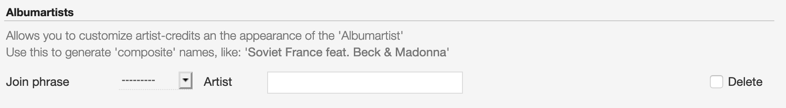

  The system automatically creates a new empty field every time a name is entered. (up to 15 per editing session).

By default the system display the name of the artist the tracks on the release are credited to. If the tracks are
credited to multiple artists (i.e. a compilation) 'Various artists' will be displayed instead.

To override the default value, type the artist name inside the first field. To combine multiple artists / names, type
the names in separated fields and select the 'join phrase' to be used in between.

Typing inside the 'Album artists' field activates the auto-completion, listing all profiles in the library whose name
matches the current text typed in.

Click on the matching profile to select it or on 'Close' to close the list and create a new profile.

.. figure:: img/album-artist-field-select-create.gif

  To remove an artist click on the respective 'Delete' check-box and save the form.

.. _release-form-meta:

Meta
----

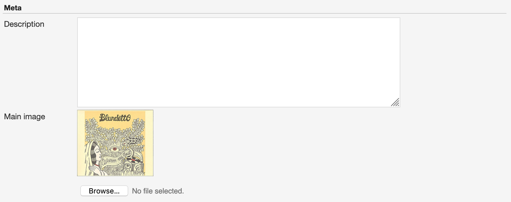

.. _release-form-description:

Description
^^^^^^^^^^^^

The description of the release.

.. _release-form-cover-art:

Main image
^^^^^^^^^^

The cover art of the release. To upload an image, click on **Browse** and select a picture from the computer file browser.

.. _release-form-label-catalog:

Label / Catalog
---------------

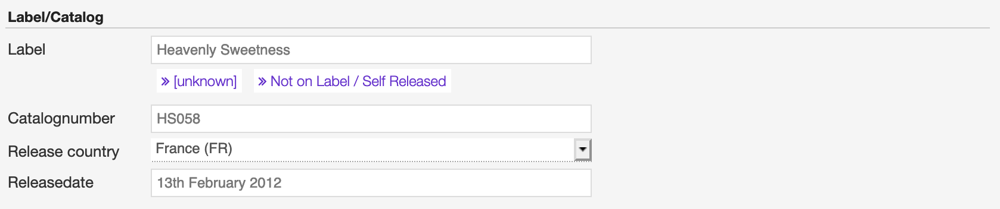

.. _release-form-label:

Label
^^^^^

The name of the label the release was issued on.

Typing inside the 'Label' field activates the auto-completion, listing all profiles in the library whose name matches
the current text typed in.

Click on the matching profile to select it or on 'Close' to close the list and create a new profile.

.. figure:: img/label-field-select-create.gif

Click on **[unknown]** if the information is not available or on **Not on Label / Self Released** if the release is
not issued on a label or it is released by the artist itself.

.. _release-form-catalog-number:

Catalog number
^^^^^^^^^^^^^^

The catalog number the label assigned to the release.

.. _release-form-country:

Release country
^^^^^^^^^^^^^^^

The country the release was issued in.

.. _release-form-date:

Release date
^^^^^^^^^^^^

The date the release was officially issued.

.. _release-form-identifiers:

Identifiers
------------

The identification code associated to the release.

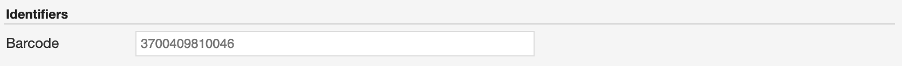

.. _release-form-barcode:

Barcode
^^^^^^^^

The barcode of the release. Please refer to the description below.

Barcodes are numbers used as stock control mechanisms by retailers: as such they are highly standardised and well
recognised, and form an invaluable identifier for communication between companies. On physical releases, they usually
appear in the form of a machine-readable series of black and white bars, hence the name 'barcode'.

There are many different types of barcode, but the ones usually found on music releases are two:

* `Universal Product Code (UPC) <https://en.wikipedia.org/wiki/Universal_Product_Code>`__,  which is the original
  barcode used in North America. They are 12 digits long, but any number of zeros at the start can be left off, so the
  actual printed barcode can be shorter than this.
* `European Article Number (EAN) <https://en.wikipedia.org/wiki/International_Article_Number>`__ also known as Japanese
  Article Number (JAN), which is widely used in the rest of the world. The 13 digit type (EAN-13) is the most common,
  although there are others such as EAN-8. A UPC can be turned into an EAN-13 by adding a leading zero.

*(From the Musicbrainz article* |mb-barcode|_ *, which is released under the* |mb-license|_ *).*

.. |mb-barcode| replace:: *Barcode*
.. _mb-barcode: https://musicbrainz.org/doc/Barcode

.. _release-form-tags:

Tags
----

One or more keyword/s to help/s describe the release (i.e. the music genre / style).

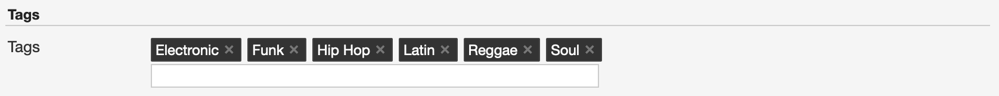

Typing inside the 'Tags' field activates the auto-completion, listing all tags in the library whose name matches the
current text typed in.

Click on the matching tag to select it or hit the 'Enter' key to create a new tag.

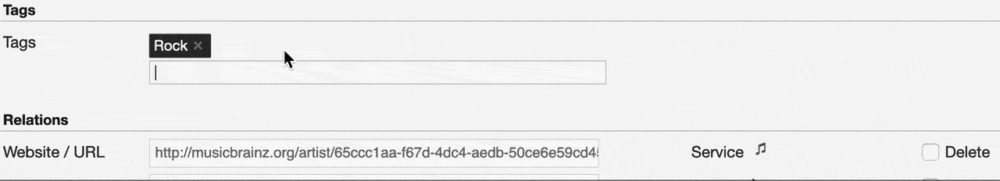

  To remove a tag click on the 'X' within it.

.. _release-form-relations:

Relations
---------

The url of the release page on other online platforms.

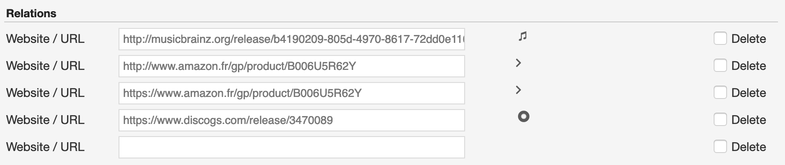

  To remove a url / link click on the respective 'Delete' check-box and save the form.

.. _release-form-tracks-list:

Tracklist
---------

UNDER CONSTRUCTION

Bulk editing box
^^^^^^^^^^^^^^^^

UNDER CONSTRUCTION

Tracks list
^^^^^^^^^^^

UNDER CONSTRUCTION

.. _artist:

**********
Artists
**********

An artist is generally a musician (or musician persona), group of musicians, or other music professional
(like a producer or engineer). Occasionally, it can also be a non-musical person (like a photographer, an illustrator,
or a poet in the library whose writings are set to music), or even a fictional character.
*(From the Musicbrainz article* |mb-artist|_ *, which is released under the* |mb-license|_ *).*

.. |mb-artist| replace:: *Artist*
.. _mb-artist: https://wiki.musicbrainz.org/Artist

Visit the :ref:`Artist form <artist-form>` to see which information open broadcast collect for an artist.

.. _artist-list:

Artists list
============

To access the list of artists, open the **CONTENT** menu, click on **LIBRARY** and then on **ARTISTS**.

By default, the list is sorted by **Creation date** (descending). The newly created profile is displayed on the top-left
side of the list.

.. figure:: img/artist-list-order.png

  Click on the active / highlighted option to change the sorting order from ‘descending’ to ‘ascending’ (DESC/ASC).

To sort it differently, click on **Ordering** and then on a different options:

* :ref:`Name: <artist-form-artist-name>` The name of the artist.
* :ref:`Date of formation / date of birth: <artist-form-begin-date>` The date a group formed / a person was born.
* :ref:`Date of breakup / date of death: <artist-form-end-date>` The date a group dissolved / a person died.
* Last Modified: The last date an artist profile was edited.
* Creation date: The date an artist profile was created.

.. _artist-list-filter:

Filtering the list
------------------

The list of artists can be filtered using the tags or some fields associated to the artist.

To filter by tags, click on **TAGS** and select one or more tag/s from the list.

To filter by a specific field, use the apposite **Filters** located on the right side of the page,

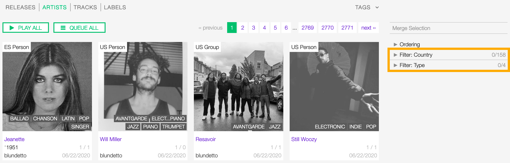

The available filters are:

* :ref:`Country: <artist-form-country>` The country a person was born / a band formed.
* :ref:`Type: <artist-form-type>` The type of artist.

.. _artist-profile:

Artist profile
==============

UNDER CONSTRUCTION

.. _artist-form:

Artist form
===========

The artist form allows to add or change information for an artist.

After editing the information, click on **SAVE** to confirm the changes or on **CANCEL** to undo the changes and
reset the form.

Below are described the information open broadcast collect for an artist.

.. _artist-form-general:

General
--------

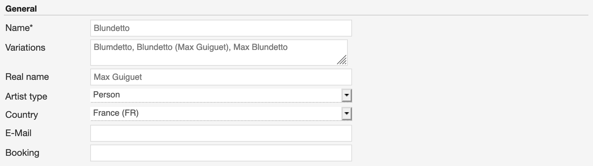

.. _artist-form-artist-name:

Name
^^^^

The official name of the artist as found on the release, be it a person or a band.

.. _artist-form-name-variations:

Variations
^^^^^^^^^^^

The variations of the artist name (abbreviations, different initials etc.). Multiple entries are separated by comma.

.. _artist-form-real-name:

Real name
^^^^^^^^^

The real / legal name of the artist. Multiple entries are separated by comma.

.. _artist-form-type:

Artist type
^^^^^^^^^^^

The type of Artist. Please refer to the descriptions below to determine which value to choose.

**Person**

An individual person.

**Group**

A group of people (i.e. a band).

**Orchestra**

An orchestra (/ˈɔːrkɪstrə/; Italian: [orˈkɛstra]) is a large instrumental ensemble typical of classical music, which
combines instruments from different families.
*(From the Wikipedia article* |wk-orchestra|_ *, which is released under the* |wk-license|_ *).*

.. _wk-orchestra: https://en.wikipedia.org/wiki/International_Article_Number
.. |wk-orchestra| replace:: *Orchestra*

**Other**

Anything which does not fit into the above categories.

.. _artist-form-country:

Country
^^^^^^^

The country a person was born / a band was formed.

.. _artist-form-generic-email:

E-mail
^^^^^^^

A valid e-mail address for general inquires.

.. _artist-form-booking-email:

Booking
^^^^^^^

A valid e-mail address for booking inquires.

.. _artist-form-aliases:

Aliases
--------

Other name/s the artist uses to differentiate its work.

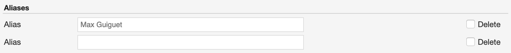

  The system automatically creates a new empty field every time a name is entered. (up to 15 per editing session).

Typing inside the 'Alias' field activates the auto-completion, listing all profiles in the library whose name matches
the current text typed in.

Click on the matching profile to select it or on 'Close' to close the list and create a new profile.

.. figure:: img/alias-field-select-create.gif

  To remove an artist click on the respective 'Delete' check-box and save the form.

.. _artist-form-members:

Members
--------

The members of the group / orchestra (both current and past members).

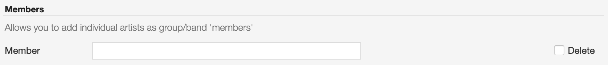

  The system automatically creates a new empty field every time a name is entered. (up to 15 per editing session).

Typing inside the 'Member' field activates the auto-completion, listing all profiles in the library whose name matches
the current text typed in.

Click on the matching profile to select it or on 'Close' to close the list and create a new profile.

.. figure:: img/member-field-select-create.gif

  To remove an artist click on the respective 'Delete' check-box and save the form.

Identifiers
-----------

The identification codes associated to the artist.

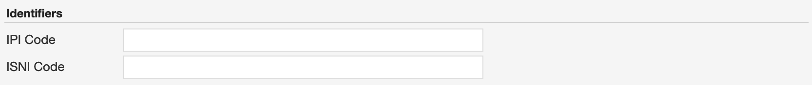

.. _artist-form-ipi-code:

IPI code
^^^^^^^^^

The IPI code assigned by CISAC. Please refer to the descriptions below.

IPI (Interested party information) is a unique identifying number assigned by the CISAC database to each Interested
Party in collective rights management. It is used worldwide by more than 120 countries and three million right holders.
*(From the Wikipedia article* |wk-interested-parties-information|_ *, which is released under the* |wk-license|_ *).*

.. _wk-interested-parties-information: https://en.wikipedia.org/wiki/Interested_Parties_Information
.. |wk-interested-parties-information| replace:: *Interested parties information*

.. _artist-isni-code:

ISNI code
^^^^^^^^^^

The International Standard Name Identifier for the artist. Please refer to the descriptions below.

The International Standard Name Identifier (ISNI) is an identifier for uniquely identifying the public identities of
contributors to media content such as books, television programmes, and newspaper articles. Such an identifier consists
of 16 digits. It can optionally be displayed as divided into four blocks.
*(From the Wikipedia article* |wk-interested-parties-information|_ *, which is released under the* |wk-license|_ *).*

.. _wk-international-standard-name-identifier: https://en.wikipedia.org/wiki/International_Standard_Name_Identifier
.. |wk-international-standard-name-identifier| replace:: *International standard name identifier*

.. _artist-form-activity:

Activity
--------

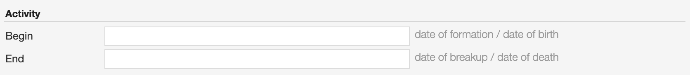

.. _artist-form-begin-date:

Begin
^^^^^^

The date a group first formed / the person was born.

.. _artist-form-end-date:

End
^^^

The date a group last dissolved / the person died.

.. _artist-form-meta:

Meta information
----------------

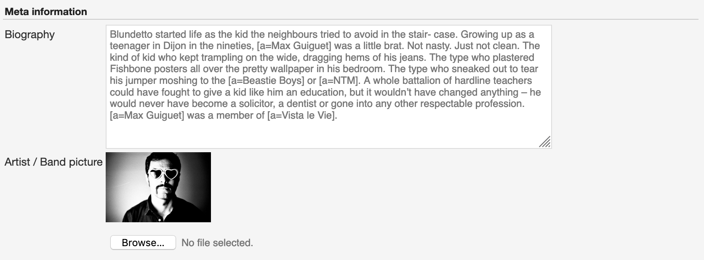

.. _artist-form-biography:

Biography
^^^^^^^^^

The artist's biography.

.. _artist-form-image:

Artist / band picture
^^^^^^^^^^^^^^^^^^^^^

The picture or logo of the artist. To upload an image, click on **Browse** and select a picture from the computer file
browser.

.. _artist-form-tags:

Tags
----

One or more keyword/s to help/s describe the artist(i.e. the music genre, instruments, profession).

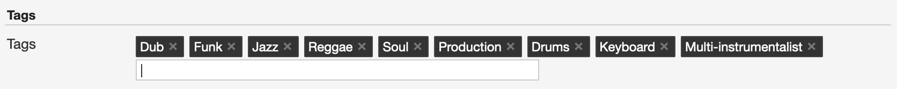

Typing inside the 'Tags' field activates the auto-completion, listing all tags in the library whose name matches with the
current text typed in.

Click on the matching tag to select it or hit the 'Enter' key to create a new tag.

  To remove a specific tag click on the 'X' within it.

.. _artist-form-relations:

Relations
---------

The url of the artist page on other online platforms.

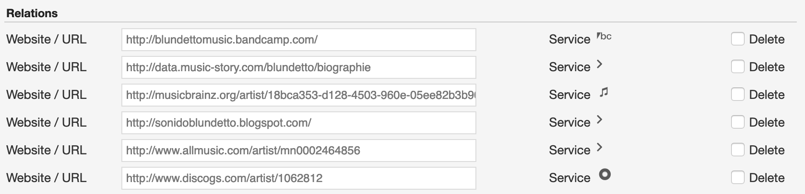

  To remove a url / link click on the respective 'Delete' check-box and save the form.

.. _track:

**********
Tracks
**********

A track is the way a recording appears in a particular :ref:`release <release>` or, more exactly, in a particular tracklist.
Every track has a title and is credited to one or more artists.
*(From the Musicbrainz article* |mb-track|_ *, which is released under the* |mb-license|_ *).*

.. |mb-track| replace:: *Track*
.. _mb-track: https://musicbrainz.org/doc/Track

Visit the :ref:`Track form <track-form>` to see which information open broadcast collect for a track.

.. _track-list:

Tracks list
===========

To access the tracks list, open the **CONTENT** menu, click on **LIBRARY** and then on **TRACKS**.

By default the list is sorted by **Creation date** (descending). The newly created profile is displayed
on the top side of the list / page.

.. figure:: img/track-list-order.png

  Click on the sorting option twice to change the sorting order from 'descending' to 'ascending' (DESC/ASC).

To sort it differently, click on **Ordering** and then on a different options:

* :ref:`Name: <track-form-title>` The title of the track.
* :ref:`Artist name: <track-form-primary-artist>` The name of the artist(s) the track is credited to.
* Duration: The duration of the track.
* Num Emissions: The number of times the track was played on-air (airplay).
* Last Emission: The last date the track was played on-air.
* Last Modified: The last date the track profile was edited.
* Creation date: The date the track profile was created.

.. _track-list-filter:

Filtering the list
------------------

The list of tracks can be filtered using the tags or some fields associated to the track.

To filter by tags, click on **TAGS** and select one or more tag/s from the list.

.. figure:: img/track-list-tags.png

To filter by a specific field, use the apposite **Filters** located on the right side of the page,

.. figure:: img/track-list-filters.png

The available filters are:

* :ref:`Type: <track-form-type>` The type of track.
* :ref:`Version: <track-form-version>` The version of the track.
* Num Emissions: The number of times the track was played on-air (airplay).
* Last Emission: The last date the track was played on-air.
* Bitrate: The bitrate property of the file associated to the track.
* Samplerate: The samplerate property of the file associated to the track.
* Encoding: The audio encoder property of the file associated to the track.
* :ref:`License: <track-form-license>` The license applied to a track.
* :ref:`Lyrics Language: <track-form-lyrics-language>` The language of the lyrics.

.. _track-profile:

Track profile
=============

UNDER CONSTRUCTION

.. _track-form:

Track form
===========

The track form allows to add or change information for a track.

After editing the information, click on **SAVE** to confirm the changes or on **CANCEL** to undo the changes and
reset the form.

Below are described the information open broadcast collect for a track.

.. _track-form-general:

General
-------

.. _track-form-title:

Title
^^^^^

The title of the track.

.. _track-form-release-title:

Release
^^^^^^^

The title of the release the track appears on.

Typing inside the 'Release' field activates the auto-completion, listing all profiles in the library whose name matches
the current text typed in.

Click on the matching profile to select it or on 'Close' to close the list and create a new profile.

.. figure:: img/track-release-field-select-create.gif

.. _track-form-primary-artist:

Artist
^^^^^^

The name of the artist the track is primarily credited to. Use the :ref:`track artists fields <track-form-track-artists>`
to add multiple artists.

Typing inside the 'Artist' field activates the auto-completion, listing all profiles in the library whose name matches
the current text typed in.

Click on the matching profile to select it or on 'Close' to close the list and create a new profile.

.. figure:: img/track-artist-field-select-create.gif

.. _track-form-type:

Type
^^^^

The type of recording. Please refer to the descriptions below to determine which value to choose.

UNDER CONSTRUCTION

.. _track-form-track-number:

Track number
^^^^^^^^^^^^

The track number (the position in the release tracklist).

.. _track-form-disc-number:

Disc number
^^^^^^^^^^^

The disc number (for releases consisting of multiple discs).

.. _track-form-opus-number:

Opus number
^^^^^^^^^^^

The Opus number the composer (or their publisher) assigned to the composition. Please refer to the descriptions below.

In musical composition, the opus number is the 'work number' that is assigned to a composition, or to a set of compositions,
to indicate the chronological order of the composer's production. Opus numbers are used to distinguish among compositions with
similar titles; the word is abbreviated as 'Op.' for a single work, or 'Opp.' when referring to more than one work.
*(From the Wikipedia article* |wk-opus|_ *, which is released under the* |wk-license|_ *).*

.. _wk-opus: https://en.wikipedia.org/wiki/Opus_number
.. |wk-opus| replace:: *Opus number*

.. _track-form-version:

Version
^^^^^^^

The version of the recording. Please refer to the descriptions below to determine which value to choose.

UNDER CONSTRUCTION

.. _track-form-track-artists:

Track Artists
-------------

The artist(s) the recording is primarily credited to.

  The system automatically creates a new empty field every time a name is entered. (up to 15 per editing session).

By default the system display the name written in the :ref:`primary artist field <track-form-primary-artist>`.

To override the default value, type again the primary artist name inside the first field. Keep adding names in separated
fields and select the 'join phrase' to be used in between.

Typing inside the 'Artist' field activates the auto-completion, listing all profiles in the library whose name
matches the current text typed in.

Click on the matching profile to select it or on 'Close' to close the list and create a new profile.

.. figure:: img/track-artists-field-select-create.gif

  To remove an artist click on the respective 'Delete' check-box and save the form.

.. _track-form-credited-artists:

Credits & Credited Artists
--------------------------

The extra artist(s) credited to the recording (remixer, composer, lyricist, etc).

.. figure:: img/track-form-credited-artists.png

  The system automatically creates a new empty field every time a name is entered. (up to 15 per editing session).

Type the artist name inside the first field. Keep adding names in separated fields and select the appropriate role from
the 'Credited as' dropdown list.

Typing inside the 'Artist' field activates the auto-completion, listing all profiles in the library whose name
matches the current text typed in.

Click on the matching profile to select it or on 'Close' to close the list and create a new profile.

.. figure:: img/track-artists-field-select-create.gif

  To remove an artist click on the respective 'Delete' check-box and save the form.

.. _track-form-identifiers:

Identifiers
-----------

The identification code associated to the recording.

.. _track-form-isrc:

ISRC
^^^^

The ISRC code. Please refer to the description below.

The International Standard Recording Code (ISRC) is an international standard code for uniquely identifying sound
recordings and music video recordings.

ISRC codes are always 12 characters long, in the form 'CC-XXX-YY-NNNNN'. The hyphens are not part of the ISRC code itself,
but codes are often presented that way in print to make them easier to read.
*(From the Wikipedia article* |wk-isrc|_ *, which is released under the* |wk-license|_ *).*

.. |wk-isrc| replace:: *International standard recording code*
.. _wk-isrc: https://en.wikipedia.org/wiki/International_Standard_Recording_Code

.. _track-form-license:

License / Source
-----------------

The license applied to the recording.

.. figure:: img/track-form-license-source.png

Please refer to the descriptions below to determine which value to choose.

Restricted - Commercial
^^^^^^^^^^^^^^^^^^^^^^^^

Apply this license when the usage of the recording is monetized.

Restricted use
^^^^^^^^^^^^^^^^^^^^^^^^

Apply this license when the copyright information is unknown.

Restricted - Self owned
^^^^^^^^^^^^^^^^^^^^^^^^

Apply this license when you are the copyright holder of the composition and sound recording.

Multiple
^^^^^^^^^

Apply this license when the recording contains multiple content with different licenses apply to them.

Public domain
^^^^^^^^^^^^^^

The public domain consists of all the creative work to which no exclusive intellectual property rights apply. Those
rights may have expired, been forfeited, expressly waived, or may be inapplicable.

As examples, the works of William Shakespeare and Ludwig van Beethoven, and most early silent films, are in the public
domain either by virtue of their having been created before copyright existed, or by their copyright term having expired.
*(From the Wikipedia article* |wk-public-domain|_ *, which is released under the* |wk-license|_ *).*

.. |wk-public-domain| replace:: *Public domain*
.. _wk-public-domain: https://en.wikipedia.org/wiki/Public_domain

Creative Commons
^^^^^^^^^^^^^^^^^

A Creative Commons (CC) license is one of several public copyright licenses that enable the free distribution of an
otherwise copyrighted 'work'. A CC license is used when an author wants to give other people the right to share, use,
and build upon a work that they (the author) have created.
*(From the Wikipedia article* |wk-creative-commons-license|_ *, which is released under the* |wk-license|_ *).*

.. |wk-creative-commons-license| replace:: *Creative Commons license*
.. _wk-creative-commons-license: https://en.wikipedia.org/wiki/Creative_Commons_license

**Seven regularly used licenses**

* BY: Attribution alone
* BY-NC: Attribution + Noncommercial
* BY-NC-ND: Attribution + Noncommercial + NoDerivatives
* BY-NC-SA: Attribution + Noncommercial + ShareAlike
* BY-ND: Attribution + NoDerivatives
* BY-SA: Attribution + ShareAlike

.. _track-form-meta:

Meta
----

.. figure:: img/track-form-meta.png

.. _track-form-lyrics:

Lyrics
------

.. figure:: img/track-form-lyrics.png

.. _track-form-lyrics-language:

Lyrics language
^^^^^^^^^^^^^^^

Self explanatory.

Lyrics
^^^^^^

The words that make up a song.

.. _track-form-tags:

Tags
----

One or more keyword/s to help/s describe the track (i.e. the music genre / style).

Typing inside the 'Tags' field activates the auto-completion, listing all tags in the library whose name matches with the
current text typed in.

Click on the matching tag to select it or hit the 'Enter' key to create a new tag.

  To remove a specific tag click on the 'X' within it.

.. _track-form-relations:

Relations
---------

The url of the track page on other online platforms.

.. figure:: img/track-form-relations.png

  To remove a url / link click on the respective 'Delete' check-box and save the form.

.. _label:

**********
Labels
**********

A record label, or record company, is a brand or trademark associated with the marketing of music recordings and
music videos. Sometimes, a record label is also a publishing company that manages such brands and trademarks,
coordinates the production, manufacture, distribution, marketing, promotion, and enforcement of copyright for sound
recordings and music videos, while also conducting talent scouting and development of new artists
('artists and repertoire' or 'A&R'), and maintaining contracts with recording artists and their managers.
*(From the Wikipedia article* |wk-label|_ *, which is released under the* |wk-license|_ *).*

.. |wk-label| replace:: *Record label*
.. _wk-label: https://en.wikipedia.org/wiki/Record_label

Visit the :ref:`Label form <label-form>` to see which information open broadcast collect for a label.

.. _label-list:

Labels list
===========

To access the list of labels, open the **CONTENT** menu, click on **LIBRARY** and then on **LABELS**.

By default, the list is sorted by **Creation date** (descending). The newly created profile is displayed
on the top-left side of the list / page.

.. figure:: img/label-list-order.png

  Click on the sorting option twice to change the sorting order from 'descending' to 'ascending' (DESC/ASC).

To sort it differently, click on **Ordering** and then on a different options:

* **Creation date:** The date the label profile was created.
* **Modification date:** The last date a label profile was edited.
* :ref:`Name: <label-form-name>` The name of the label.

.. _label-list-filter:

Filtering the list
------------------

The list of labels can be filtered using the tags or some fields associated to the label.

To filter by tags, click on **TAGS** and select one or more tag/s from the list.

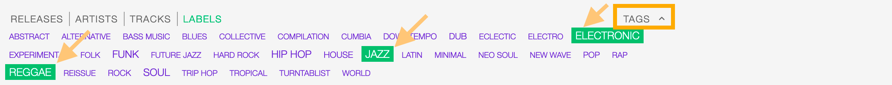

To filter by a specific field, use the apposite **Filters** located on the right side of the page,

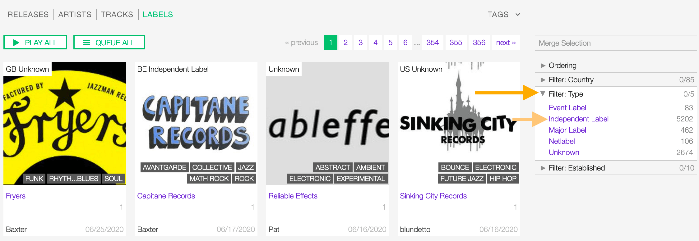

The available filters are:

* :ref:`Country: <label-form-country>` The country the label was created.
* :ref:`Type: <label-form-type>` The type of label.
* :ref:`Established: <label-form-life-start>` The year the label was established.

.. _label-profile:

Label profile
=============

UNDER CONSTRUCTION

.. _label-form:

Label form
===========

The label form allows to add or change information for a label.

.. _label-form-general:

General
-------

.. figure:: img/label-form-general.png

.. _label-form-name:

Name
^^^^^

The official name of the label.

.. _label-form-type:

Label type
^^^^^^^^^^^

The type of label. Please refer to the descriptions below to determine the which value to choose.

**Unknown**

The type is unknown.

**Major label**

*(From the Wikipedia article* |wk-record-label-major-labels|_ *, which is released under the* |wk-license|_ *).*

.. |wk-record-label-major-labels| replace:: *Record label - Major labels*
.. _wk-record-label-major-labels: https://en.wikipedia.org/wiki/Record_label#Major_labels

**Independent label**

An independent record label (or indie label) is a record label that operates without the funding of major record labels;
they are a type of small to medium-sized enterprise, or SME. The labels and artists are often represented by trade
associations in their country or region, which in turn are represented by the international trade body, the Worldwide
Independent Network (WIN).
*(From the Wikipedia article* |wk-independent-record-label|_ *, which is released under the* |wk-license|_ *).*

.. |wk-independent-record-label| replace:: *Independent record label*
.. _wk-independent-record-label: https://en.wikipedia.org/wiki/Independent_record_label

**Netlabel**

A netlabel (also online label, web label, digi label, MP3 label or download label) is a record label that distributes
its music through digital audio formats (such as MP3, Ogg Vorbis, FLAC, or WAV) over the Internet. While similar to
traditional record labels in many respects, netlabels typically emphasize free distribution online, often under licenses
that encourage works to be shared (e.g., Creative Commons licenses), and artists often retain copyright.
*(From the Wikipedia article* |wk-netlabel|_ *, which is released under the* |wk-license|_ *).*

.. |wk-netlabel| replace:: *Netlabel*
.. _wk-netlabel: https://en.wikipedia.org/wiki/Netlabel

**Event label**

The label / venue organizing events on a regular basis (festivals, concerts, clubs)

.. _label-form-label-code:

Label code (LC code)
^^^^^^^^^^^^^^^^^^^^^

The label code associated to the label. Please refer to the descriptions below.

The Label Code (LC) was introduced in 1977 by the IFPI (International Federation of Phonogram and Videogram Industries)
in order to unmistakably identify the different record labels (see Introduction, Record labels) for rights purposes.

The Label Code consists historically of 4 figures, presently being extended to 5 figures, preceded by LC and a dash
(e.g. LC-0193 = Electrola; LC-0233 = His Master's Voice). Note that the number of countries using the LC is limited, and
that the code given on the item is not always accurate.
*(From the Musicbrainz article* |mb-label-code|_ *, which is released under the* |mb-license|_ *).*

.. |mb-label-code| replace:: *Label code*
.. _mb-label-code: https://wiki.musicbrainz.org/Label/Label_Code

.. _label-form-parent-label:

Parent label
^^^^^^^^^^^^

The parent label / record company of the label whose profile is being edited.

Typing inside the 'Parent Label' field activates the auto-completion, listing all profiles in the library whose name
matches the current text typed in.

Click on the matching profile to select it or on 'Close' to close the list and create a new profile.

.. figure:: img/parent-label-field-select-create.gif

.. _label-form-activity:

Activity
--------

.. figure:: img/label-form-activity.png

.. _label-form-life-start:

Life-span begin
^^^^^^^^^^^^^^^^

The date the label was established.

.. _label-form-life-end:

Life-span end
^^^^^^^^^^^^^^^^

The date the label closed.

.. _label-form-contact:

Contact
--------------

.. _label-form-address:

Address
^^^^^^^^

.. _label-form-country:

Country
^^^^^^^

The country the label was created.

.. _label-form-phone:

Phone
^^^^^

A valid phone number including the dialling code.

.. _label-form-fax:

Fax
^^^

A valid fax number including the dialling code.

.. _label-form-email:

Email
^^^^^

A valid e-mail address for general inquires.

.. _label-form-meta:

Meta
----

.. figure:: img/label-form-meta.png

.. _label-form-description:

Description
^^^^^^^^^^^^

The description of the label.

.. _label-form-image:

Main image
^^^^^^^^^^

The logo of the label. To upload an image, click on **Browse** and select a picture from the computer file browser.

.. _label-form-tags:

Tags
----

One or more keyword/s to help/s describe the label (i.e. the music genre / style).

Typing inside the 'Tags' field activates the auto-completion, listing all tags in the library whose name matches with the
current text typed in.

Click on the matching tag to select it or hit the 'Enter' key to create a new tag.

  To remove a specific tag click on the 'X' within it.

.. _label-form-relations:

Relations
---------

.. figure:: img/label-form-relations.png

  To remove a url / link click on the respective 'Delete' check-box and save the form.

The url of the label page on other online platforms.

