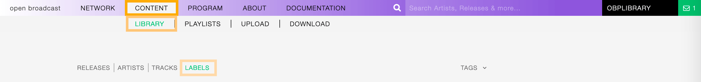

.. |mb-license| replace:: *CC-BY-NC-SA License*
.. _mb-license: https://creativecommons.org/licenses/by-nc-sa/3.0/
.. |wk-license| replace:: *CC-BY-SA License*
.. _wk-license: https://creativecommons.org/licenses/by-sa/3.0/

.. _label:

######
Labels
######

.. _label-overview:

********
Overview
********

A record label, or record company, is a brand or trademark associated with the marketing of music recordings and
music videos. Sometimes, a record label is also a publishing company that manages such brands and trademarks,
coordinates the production, manufacture, distribution, marketing, promotion, and enforcement of copyright for sound
recordings and music videos, while also conducting talent scouting and development of new artists
('artists and repertoire' or 'A&R'), and maintaining contracts with recording artists and their managers.
*(From the Wikipedia article* |wk-label|_ *, which is released under the* |wk-license|_ *).*

.. |wk-label| replace:: *Record label*
.. _wk-label: https://en.wikipedia.org/wiki/Record_label

Visit the :ref:`form view<label-form>` chapter to see which information open broadcast collect for a label.

.. _label-list:

*********
List view
*********

The list view displays all labels that are in the library.

To access it, open the **CONTENT** menu, click on **LIBRARY**, and then on **LABELS**.

Note that search results are paginated (24 items per page). You can use the pagination controls above the list to
navigate the results pages.

Sorting the list
================

By default, the labels are sorted by **Creation** date (descending), the newly created label profile is displayed on
the top-left of the list.

You can change the ordering parameter by clicking on **Ordering** to open the menu and selecting a different option.

  Click again on the active option to reverse the sorting order from 'descending' to 'ascending' (DESC/ASC).

The available options are:

* **Creation date**: The date the label profile was created.
* **Modification date**: The last date a label profile was edited.
* :ref:`Name: <label-form-name>` The name of the label.

.. _label-list-filter:

Filtering the list
==================

You can filter the list by tags and specific properties associated with the labels.

By tags
-------

Click on **TAGS** to open the tag cloud and then on a tag to select it.

.. figure:: img/label-list-tags.png

The page automatically reloads the filtered results every time you select, add, or remove a tag.

By specific property
--------------------

Click on the **Filter: <property>** to open the menu, then click on one or more values in the list.

.. figure:: img/label-list-filters.png

You can filter by the following properties:

* :ref:`Country: <label-form-country>` The country the label was created.
* :ref:`Type: <label-form-type>` The type of label.
* :ref:`Established: <label-form-life-start>` The year the label was established.

Tags and filters also work in combination:

   Example: Show all 'ELECTRONIC', 'JAZZ' and 'REGGAE'' 'Independent' labels.

Click again on any active tag or filter to deselect it and reset the result-set.

.. _label-list-card:

The Label card
==============

The label card displays some information of the label and it includes some functions that can be performed on the label.

Starting at the top, the information displayed are:

* :ref:`Country <label-form-country>` / :ref:`Type <label-form-type>`: The country the label was created / the type of
  label.
* :ref:`Image: <label-form-image>` the logo of the label.
* :ref:`Tags: <label-form-tags>` The tags associated with the label.
* :ref:`Name: <label-form-name>` The name of the label.
* :ref:`Begin <artist-form-begin-date>` / :ref:`End <artist-form-end-date>`: The year the group first
  formed / last dissolved or the person was born / died.
* **User name**: The name of the user who created the label profile.
* **Releases count** (right side): The number of tracks / releases by the artist.
* **Creation date** (right side): The date the label profile was created.

To access additional options, click on **more options** (3 dots) to open the menu and then click on an option.

The available options are:

* **Edit**: Open the :ref:`form view <label-form>` of the label.
* **Admin view**: *(Admin only)*.

.. _label-detail:

***********
Detail view
***********

To open the detail view of a label, go to the :ref:`labels list <label-list>` page and click on the name of
the label.

The detail view displays all information associated with the release. Starting at the top, the information are:

* :ref:`Name <label-form-name>` / :ref:`Type <label-form-type>` (:ref:`Country <label-form-country>`):
  The name of the label / the type of label (the country the label was created).
* Appearance: The amount of releases issued by the label.
* :ref:`Parent <label-form-parent-label>`: The parent label.
* :ref:`Sub Labels <label-form-parent-label>`: The sub label(s).
* :ref:`Address <label-form-parent-label>`: The address and the contact information.
* **Date created**: The date the label profile was created / the :ref:`user <user>` who created the profile.
* **Last Updated**: The last date the label profile was edited / The last :ref:`user <user>` who edited the profile.
* :ref:`Tags <label-form-tags>`: The tags associated with the label.
* :ref:`Logo <label-form-image>` (right side): The logo of the label.
* **Thumb up / thumb down** (right side): The rating tool.

Overview tab
============

The most popular releases issued by the label.

Description tab
===============

The :ref:`description <label-form-description>` of the label.

Statistics tab
==============

The tracks usage statistics.

On the right side of the page are available the following options:

* :ref:`Edit <label-form>`: Open the form to edit the information of the label.
* **Administration view**: *(Admin only)*.
* **Follow label**: Start to follow the label.

  Below the options are listed the url(s) of the label page on other online platforms.

.. _label-form:

*********
Form view
*********

The form view allows to edit the information of the artist.

To open the form, go to the :ref:`label detail <label-detail>` page and click on **Edit**

Or from the :ref:`labels list <label-list>`:

  Click on **more options** (3 dots) to open the menu and then click on **Edit**.

On the top side of the form are displayed the current information of the label (as displayed in the
:ref:`detail view <label-detail>`).

  After editing the information, click on **SAVE** to confirm the changes or on **CANCEL** to undo the changes and
  reset the form.

On the right side of the page are available the following options:

* **Back to detail view**: Exit the form and return to the detail view.
* **Administration view**: *(Admin only)*.

A comparison tool is available to help complete the information:

* **Compare - Discogs**: Search for matches in the `Discogs <https://www.discogs.com/>`__ database and retrieve the
  information from it.
* **Compare - Musicbrainz**: Search for matches in the `Musicbrainz <https://musicbrainz.org/>`__ database and retrieve
  the information from it.

Below are described the information open broadcast collect for a label.

.. _label-form-general:

General
=======

.. figure:: img/label-form-general.png

.. _label-form-name:

Name
----

The official name of the label.

.. _label-form-type:

Label type
----------

The type of label. Please refer to the descriptions below to determine which value to choose.

**Unknown**

The type is unknown.

**Major label**

The Association of Independent Music (AIM) defines a 'major' as "a multinational company which (together with the
companies in its group) has more than 5% of the world market(s) for the sale of records or music videos." As of 2012,
there are only three labels that can be referred to as "major labels" (Universal Music Group, Sony Music Entertainment,
and Warner Music Group).
*(From the Wikipedia article* |wk-record-label-major-labels|_ *, which is released under the* |wk-license|_ *).*

.. |wk-record-label-major-labels| replace:: *Record label - Major labels*
.. _wk-record-label-major-labels: https://en.wikipedia.org/wiki/Record_label#Major_labels

**Independent label**

An independent record label (or indie label) is a record label that operates without the funding of major record labels;
they are a type of small to medium-sized enterprise, or SME. The labels and artists are often represented by trade
associations in their country or region, which in turn are represented by the international trade body, the Worldwide
Independent Network (WIN).
*(From the Wikipedia article* |wk-independent-record-label|_ *, which is released under the* |wk-license|_ *).*

.. |wk-independent-record-label| replace:: *Independent record label*
.. _wk-independent-record-label: https://en.wikipedia.org/wiki/Independent_record_label

**Netlabel**

A netlabel (also online label, web label, digi label, MP3 label or download label) is a record label that distributes
its music through digital audio formats (such as MP3, Ogg Vorbis, FLAC, or WAV) over the Internet. While similar to
traditional record labels in many respects, netlabels typically emphasize free distribution online, often under licenses
that encourage works to be shared (e.g., Creative Commons licenses), and artists often retain copyright.
*(From the Wikipedia article* |wk-netlabel|_ *, which is released under the* |wk-license|_ *).*

.. |wk-netlabel| replace:: *Netlabel*
.. _wk-netlabel: https://en.wikipedia.org/wiki/Netlabel

**Event label**

The label / venue organizing events on a regular basis (festivals, concerts, clubs)

.. _label-form-label-code:

Label code (LC code)
--------------------

The label code associated with the label. Please refer to the descriptions below.

The Label Code (LC) was introduced in 1977 by the IFPI (International Federation of Phonogram and Videogram Industries)
in order to unmistakably identify the different record labels (see Introduction, Record labels) for rights purposes.

The Label Code consists historically of 4 figures, presently being extended to 5 figures, preceded by LC and a dash
(e.g. LC-0193 = Electrola; LC-0233 = His Master's Voice). Note that the number of countries using the LC is limited, and
that the code given on the item is not always accurate.
*(From the Musicbrainz article* |mb-label-code|_ *, which is released under the* |mb-license|_ *).*

.. |mb-label-code| replace:: *Label code*
.. _mb-label-code: https://wiki.musicbrainz.org/Label/Label_Code

.. _label-form-parent-label:

Parent label
------------

The parent label / record company of the label whose profile is being edited.

.. note::

  Typing inside the 'Parent Label' field activates the auto-completion, listing all profiles in the library whose name
  matches the current text typed in.

  Click on the matching profile to select it or on 'Close' to close the list and create a new profile.

  .. figure:: img/label-form-parent-label-select-create.gif

.. _label-form-activity:

Activity
========

.. _label-form-life-start:

Life-span begin
---------------

The date the label was established.

.. _label-form-life-end:

Life-span end
-------------

The date the label closed.

.. _label-form-contact:

Contact
=======

.. figure:: img/label-form-contact.png

.. _label-form-address:

Address
-------

.. _label-form-country:

Country
-------

The country the label was created.

.. _label-form-phone:

Phone
-----

A valid phone number including the dialling code.

.. _label-form-fax:

Fax
---

A valid fax number including the dialling code.

.. _label-form-email:

Email
-----

A valid e-mail address for general inquires.

.. _label-form-meta:

Meta
====

.. _label-form-description:

Description
-----------

The description of the label.

.. _label-form-image:

Main image
----------

The logo of the label. To upload an image, click on **Browse** and select a picture from the computer file browser.

.. _label-form-tags:

Tags
====

One or more keyword(s) to help describe the label (i.e. the music genre / style).

.. figure:: img/label-form-tags.png

.. note::

  Typing inside the 'Tags' field activates the auto-completion, listing all tags in the library whose name matches with
  the current text typed in.

  Click on the matching tag to select it or hit the 'Enter' key to create a new tag.

  .. figure:: ../img/tags-field-select-create-remove.gif

  To remove a specific tag click on the 'X' within it.

.. _label-form-relations:

Relations
=========

Website / URL
-------------

The url of the label page on other online platforms.

To remove a url / link click on the respective 'Delete' check-box and save the form.
