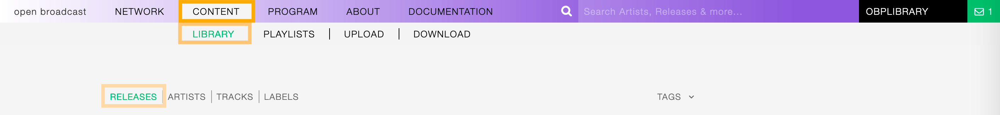

.. |mb-license| replace:: *CC-BY-NC-SA License*
.. _mb-license: https://creativecommons.org/licenses/by-nc-sa/3.0/
.. |wk-license| replace:: *CC-BY-SA License*
.. _wk-license: https://creativecommons.org/licenses/by-sa/3.0/

.. _release:

########
Releases
########

.. _release-overview:

********
Overview
********

In the music industry, a release usually is a creative output from an artist, available for sale or distribution; a
broad term covering the many different formats music can be released in, and different forms of pieces (singles, albums,
extended plays, etc.).

The word can also refer to the event at which an album or single is first offered for sale in record stores.
Also an album launch, or single launch.
*(From the Wikipedia article* |wk-release|_ *, which is released under the* |wk-license|_ *).*

.. _wk-release: https://en.wikipedia.org/wiki/Art_release#Music
.. |wk-release| replace:: *Music release*

A release represents the unique release (i.e. issuing) of a product on a specific date with specific release information
such as the country, label, barcode and packaging.
*(From the Musicbrainz article* |mb-release|_ *, which is released under the* |mb-license|_ *).*

.. |mb-release| replace:: *Release*
.. _mb-release: https://musicbrainz.org/doc/Release

Visit the :ref:`form view<release-form>` chapter to see which information open broadcast collect for a release.

.. _release-list:

*********
List view
*********

The list view displays all releases that are in the library.

To access it, open the **CONTENT** menu, click on **LIBRARY**, and then on **RELEASES**.

Note that search results are paginated (24 items per page). You can use the pagination controls above the list
to navigate through the results pages.

The **PLAY ALL** and **QUEUE ALL** buttons allow you to play/queue all releases in the list at once.

See also:

* :ref:`The popup player <popup-player>`

Sorting the list
================

By default, the releases are sorted by **Creation date** (descending), the newly created release profile is
displayed on the top-left side of the list.

You can change the ordering parameter by clicking on **Ordering** to open the menu and selecting a different option.

  Click again on the active option to reverse the sorting order from 'descending' to 'ascending' (DESC/ASC).

The available options are:

* :ref:`Name: <release-form-title>` The title of the release.
* :ref:`Release date: <release-form-release-date>` The date the release was officially issued.
* **Last Modified**: The last date the release profile was edited.
* **Creation date**: The date the release profile was created.

.. _release-list-filter:

Filtering the list
==================

You can filter the list by tags and specific properties associated with the releases.

By tags
-------

Click on **TAGS** to open the tag cloud and then on a tag to select it.

  .. figure:: img/release-list-tags.png

The page automatically reloads the filtered results every time you select, add, or remove a tag.

By specific property
--------------------

Click on the **Filter: <property>** to open the menu, then click on one or more values in the list.

The page automatically reloads the filtered results every time you select, add, remove values from a
specific filter, or add other filters/properties to the query.

You can filter by the following properties:

* :ref:`Release date: <release-form-release-date>` The date the release was officially issued.
* :ref:`Release type: <release-form-type>` The type of release.
* :ref:`Release Country: <release-form-country>` The country the release was issued in.
* :ref:`Label type: <label-form-type>` The type of label the release was issued on.

Tags and filters also work in combination:

   Example: Show all **ELECTRONIC** and **ACID JAZZ** **Album** releases sorted by **Creation date**.

Click again on any active tag or filter to deselect it and reset the result-set.

.. _release-list-card:

The Release card
================

The release card displays some information about the release.

.. figure:: img/release-list-card.png

Starting at the top, the information is:

* :ref:`Release Country: <release-form-country>` The country the release was issued in.
* :ref:`Release date: <release-form-release-date>` The date the release was officially issued.
* :ref:`Cover art: <release-form-cover-art>` the cover art of the release.
* :ref:`Tags: <release-form-tags>` The tags associated with the release.
* :ref:`Release title: <release-form-title>` The title of the release
* :ref:`Artist: <release-form-album-artist>` The name of the artist the release is credited to.
* :ref:`Label: <label>` The name of label the release was issued on.
* **Track count**: The number of tracks available for the release / the total number.
* **User name**: The name of the user who created the release profile.
* **Creation date**: The date the release profile was created.

The card also includes some functionalities, visible as soon as you move the cursor over the cover art.

You can click the 'Play' button to listen to all tracks on the release:

   The :ref:`popup player <popup-player>` opens and starts playing it automatically

or on **more options** (3 dots) to access additional functionalities:

The available options are:

* **Queue**: Queue the tracks in :ref:`the popup player <popup-player>`.
* **Download**: Download the entire release.
* **Edit**: Open the :ref:`form view <release-form>` of the release.
* **Admin view**: *(Admin only)*.

.. note::

  **NEW** or **PROMO** is a piece of additional information that is displayed automatically for the following cases:

  * **New**: The release is 'new on the market' (up to 60 days from the issue date).
  * **Promo**: The release is not available on the market yet (the current date precedes the issue date).

.. _release-list-selection:

Actions on selection
====================

To select one or more release(s), move the cursor over the card (below the image) and click on it.

    Click on the card again to deselect it.

The available actions are:

* **Download selection**: Download the selected items *(Radio pro only)*.
* **Merge selection**: Merge the selected items *(Admin only)*.

.. _release-detail:

***********
Detail view
***********

To open the detail view of a release, go to the :ref:`releases list <release-list>` page and click on the title of
the release.

.. figure:: img/release-list-open-detail-view.png

The detail view displays all information associated with the release. Starting at the top, the information are:

* :ref:`Title <release-form-title>` / :ref:`Type <release-form-type>` (:ref:`Country <release-form-country>`):
  The title of the release / the type of release (the country release was issued in).
* :ref:`Artist <release-form-album-artist>`: The artist(s) the release is credited to.
* :ref:`Label <release-form-label>`: The label the release was issued on.
* :ref:`Catalog No <release-form-catalog-number>`: The label the release was issued on.
* :ref:`Release date <release-form-release-date>`: The date the release was officially issued.
* :ref:`License <track-form-license>`: The license applied to the tracks on the release.
* **Date created**: The date the release profile was created / the :ref:`user <user>` who created the profile.
* **Last Updated**: The last date the release profile was edited / The last :ref:`user <user>` who edited the profile.
* :ref:`Tags <release-form-tags>`: The tags associated with the release.
* :ref:`Cover art <release-form-cover-art>` (right side): The cover art of the release.
* **Thumb up / thumb down** (right side): The rating tool.

Trackslist tab
==============

The tracks list of the release.

Statistics tab
==============

The tracks usage statistics.

On the right side of the page are available the following options:

* :ref:`Edit <release-form>`: Open the form to edit the information of the release.
* **Administration view**: *(Admin only)*.
* **Follow release**: Start to follow the release.
* **Download release**: *(Radio Pro only)*.
* **Download selection**: *(Radio Pro only)*.
* **Merge selection**: *(Admin only)*.
* **Re-assign selection**: *(Admin only)*.

  Below the options are listed the url(s) of the artist page on other online platforms.

.. _release-form:

*********
Form view
*********

The form view allows to edit the information of the release.

To open the form, go to the :ref:`release detail <release-detail>` page and click on **Edit**

Or from the :ref:`releases list <release-list>`:

  Click on **more options** (3 dots) to open the menu and then click on **Edit**.

On the top side of the form are displayed the current information of the release (as displayed in the
:ref:`detail view <release-detail>`).

  After editing the information, click on **SAVE** to confirm the changes or on **CANCEL** to undo the changes and
  reset the form.

On the right side of the page are available the following options:

* **Back to detail view**: Exit the form and return to the detail view.
* **Administration view**: *(Admin only)*.

A comparison tool is available to help complete the information:

* **Compare - Discogs**: Search for matches in the `Discogs <https://www.discogs.com/>`__ database and retrieve the
  information from it.
* **Compare - Musicbrainz**: Search for matches in the `Musicbrainz <https://musicbrainz.org/>`__ database and retrieve
  the information from it.

Below are described the information open broadcast collect for a release.

.. _release-form-general:

General
=======

.. _release-form-title:

Name
----

The official title of the release. It can be found in the cover art, promo sheet or on reliable online sources.

  Mandatory fields are marked with ***** and cannot be omitted.

.. _release-form-type:

Release type
------------

The type of release. Please refer to the descriptions below to determine which value to choose.

**Album**

An album is a collection of audio recordings issued as a collection on compact disc (CD), vinyl, audio tape, or another
medium.

In the United States, The Recording Academy's rules for Grammy Awards state that an album must comprise a minimum total
playing time of 15 minutes with at least five distinct tracks or a minimum total playing time of 30 minutes with no
minimum track requirement. In the United Kingdom, the criteria for the UK Albums Chart is that a recording counts as
an 'album' if it either has more than four tracks or lasts more than 25 minutes.
*(From the Wikipedia article* |wk-album|_ *, which is released under the* |wk-license|_ *).*

.. _wk-album: https://en.wikipedia.org/wiki/Album
.. |wk-album| replace:: *Album*

**Single**

In music, a single is a type of release, typically a song recording of fewer tracks than an LP record or an album.
This can be released for sale to the public in a variety of different formats. In most cases, a single is a song that
is released separately from an album, although it usually also appears on an album. Typically, these are the songs from
albums that are released separately for promotional uses such as digital download or commercial radio airplay and are
expected to be the most popular.
*(From the Wikipedia article* |wk-single|_ *, which is released under the* |wk-license|_ *).*

.. _wk-single: https://en.wikipedia.org/wiki(s)ingle_(music)
.. |wk-single| replace:: *Single*

**EP**

An extended play record, often referred to as an EP, is a musical recording that contains more tracks than a single,
but is usually unqualified as an album or LP. Contemporary EPs generally contain a minimum of three tracks and maximum
of six tracks. *(From the Wikipedia article* |wk-extended-play|_ *, which is released under the* |wk-license|_ *).*

.. _wk-extended-play: https://en.wikipedia.org/wiki/Extended_play
.. |wk-extended-play| replace:: *Extended-play*

**Compilation**

A compilation album comprises tracks, which may be previously released or unreleased, usually from several separate
recordings by either one or several performers. If by one artist, then generally the tracks were not originally intended
for release together as a single work,[1] but may be collected together as a greatest hits album or box set.
*(From the Wikipedia article* |wk-compilation-album|_ *, which is released under the* |wk-license|_ *).*

.. _wk-compilation-album: https://en.wikipedia.org/wiki/Compilation_album
.. |wk-compilation-album| replace:: *Compilation album*

**Soundtrack**

A soundtrack album is any album that incorporates music directly recorded from the soundtrack of a particular feature
film or television show.
*(From the Wikipedia article* |wk-soundtrack-album|_ *, which is released under the* |wk-license|_ *).*

.. _wk-soundtrack-album: https://en.wikipedia.org/wiki(s)oundtrack_album
.. |wk-soundtrack-album| replace:: *Soundtrack album*

**Audiobook**

An audiobook (or a talking book) is a recording of a book or other work being read out loud.
*(From the Wikipedia article* |wk-audiobook|_ *, which is released under the* |wk-license|_ *).*

.. _wk-audiobook: https://en.wikipedia.org/wiki/Audiobook
.. |wk-audiobook| replace:: *Audiobook*

**Spoken word**

A spoken word album is a recording of spoken material, a predecessor of the contemporary audiobook genre. Rather than
featuring music or songs, the content of spoken word albums include political speeches, dramatic readings of historical
documents, dialogue from a film soundtrack, dramatized versions of literary classics, stories for children, and comedic
material. *(From the Wikipedia article* |wk-spoken-word-album|_ *, which is released under the* |wk-license|_ *).*

.. _wk-spoken-word-album: https://en.wikipedia.org/wiki(s)poken_word_album
.. |wk-spoken-word-album| replace:: *Spoken word album*

**Interview**

In media terms, an interview disc is a recorded disc with spoken word recordings in an interview style format, with a
specific person or group of people, as opposed to the usual music features. The source of the recording can vary.
*(From the Wikipedia article* |wk-interview-disc|_ *, which is released under the* |wk-license|_ *).*

.. _wk-interview-disc: https://en.wikipedia.org/wiki/Interview_disc
.. |wk-interview-disc| replace:: *Interview disc*

**Jingle**

A jingle album is an album consisting of memorable slogan (jingles) for radio and television commercials.

**Live**

Live albums may be recorded at a single concert, or combine recordings made at multiple concerts. They may include
applause and other noise from the audience, comments by the performers between pieces, improvisation, and so on.
*(From the Wikipedia article* |wk-album-live|_ *, which is released under the* |wk-license|_ *).*

.. _wk-album-live: https://en.wikipedia.org/wiki/Album#Live
.. |wk-album-live| replace:: *Live album*

**Remix**

A remix album is an album consisting of remixes or rerecorded versions of an artist's earlier released material.
*(From the Wikipedia article* |wk-remix-album|_ *, which is released under the* |wk-license|_ *).*

.. _wk-remix-album: https://en.wikipedia.org/wiki/Remix_album
.. |wk-remix-album| replace:: *Remix album*

**Broadcast**

An episodic release that was originally broadcast via radio, television, or the Internet, including podcasts.

**Dj-mix**

A DJ mix or DJ mixset is a sequence of musical tracks typically mixed together to appear as one continuous track.
DJ mixes are usually performed using a DJ mixer and multiple sounds sources, such as turntables, CD players, digital
audio players or computer sound cards, sometimes with the addition of samplers and effects units, although it is possible
to create one using sound editing software.
*(From the Wikipedia article* |wk-dj-mix|_ *, which is released under the* |wk-license|_ *).*

.. _wk-dj-mix: https://en.wikipedia.org/wiki/DJ_mix
.. |wk-dj-mix| replace:: *Dj mix*

**Mixtape**

A mixtape (alternatively mix-tape or mix tape) is a compilation of music, typically from multiple sources, recorded onto
a medium. With origins in the 1980s, the term normally describes a homemade compilation of music onto a cassette tape,
CD, or digital playlist.

In hip hop and R&B culture, a mixtape often describes a self-produced or independently released album issued free of
charge to gain publicity or avoid possible copyright infringement. However, the term has been applied to a number of
releases published for profit in the 2010s; in this context, a mixtape is comparable to a studio album or extended play.
*(From the Wikipedia article* |wk-mixtape|_ *, which is released under the* |wk-license|_ *).*

.. _wk-mixtape: https://en.wikipedia.org/wiki/Mixtape
.. |wk-mixtape| replace:: *Mixtape*

**Other**

Any release that does not fit in any of the categories above.

.. _release-form-total-tracks:

Total tracks
------------

The total number of tracks on the release.

.. _release-form-album-artist:

Album artists
=============

The artist(s) the release is primarily credited to.

By default the system display the name of the artist the tracks on the release are credited to. If the tracks are
credited to multiple artists (i.e. a compilation) 'Various artists' will be displayed instead.

To override the default value, type the artist name inside the first field. To combine multiple artists / names, type
the names in separated fields and select the 'join phrase' to be used in between.

.. note::

  Typing inside the 'Album artists' field activates the auto-completion, listing all profiles in the library whose name
  matches the current text typed in.

  Click on the matching profile to select it or on 'Close' to close the list and create a new profile.

  .. figure:: img/release-form-album-artist-select-create.gif

    The system automatically creates a new empty field every time a name is entered. (up to 15 per editing session).

  To remove an artist click on the respective 'Delete' check-box and save the form.

.. _release-form-meta:

Meta
====

.. _release-form-description:

Description
-----------

The description of the release.

.. _release-form-cover-art:

Main image
----------

The cover art of the release.

  To upload an image, click on **Browse** and select a picture from the computer file browser.

.. _release-form-label-catalog:

Label / Catalog
===============

.. _release-form-label:

Label
-----

The name of the label the release was issued on.

.. note::

  Typing inside the 'Label' field activates the auto-completion, listing all profiles in the library whose name matches
  the current text typed in.

  Click on the matching profile to select it or on 'Close' to close the list and create a new profile.

  .. figure:: img/release-form-label-select-create.gif

Click on **[unknown]** if the information is not available or on **Not on Label / Self Released** if the release is
not issued on a label or it is released by the artist itself.

.. _release-form-catalog-number:

Catalog number
--------------

The catalog number the label assigned to the release.

.. _release-form-country:

Release country
---------------

The country the release was issued in.

.. _release-form-release-date:

Release date
------------

The date the release was officially issued.

.. _release-form-identifiers:

Identifiers
===========

The identification code associated with the release.

.. _release-form-barcode:

Barcode
-------

The barcode of the release.

Barcodes are numbers used as stock control mechanisms by retailers: as such they are highly standardised and well
recognised, and form an invaluable identifier for communication between companies. On physical releases, they usually
appear in the form of a machine-readable series of black and white bars, hence the name 'barcode'.

There are many different types of barcode, but the ones usually found on music releases are two:

* `Universal Product Code (UPC) <https://en.wikipedia.org/wiki/Universal_Product_Code>`__,  which is the original
  barcode used in North America. They are 12 digits long, but any number of zeros at the start can be left off, so the
  actual printed barcode can be shorter than this.
* `European Article Number (EAN) <https://en.wikipedia.org/wiki/International_Article_Number>`__ also known as Japanese
  Article Number (JAN), which is widely used in the rest of the world. The 13 digit type (EAN-13) is the most common,
  although there are others such as EAN-8. A UPC can be turned into an EAN-13 by adding a leading zero.

*(From the Musicbrainz article* |mb-barcode|_ *, which is released under the* |mb-license|_ *).*

.. |mb-barcode| replace:: *Barcode*
.. _mb-barcode: https://musicbrainz.org/doc/Barcode

.. _release-form-tags:

Tags
====

One or more keyword(s) to help describe the release (i.e. the music genre / style).

.. note::

  Typing inside the 'Tags' field activates the auto-completion, listing all tags in the library whose name matches the
  current text typed in.

  Click on the matching tag to select it or hit the 'Enter' key to create a new tag.

  .. figure:: ../img/tags-field-select-create-remove.gif

    To remove a tag click on the 'X' within it.

.. _release-form-relations:

Relations
=========

The url of the release page on other online platforms.

To remove a url / link click on the respective 'Delete' check-box and save the form.

.. _release-form-tracks-list:

Tracklist
=========

UNDER CONSTRUCTION

Bulk editing box
----------------

UNDER CONSTRUCTION

Tracks list
-----------

UNDER CONSTRUCTION

