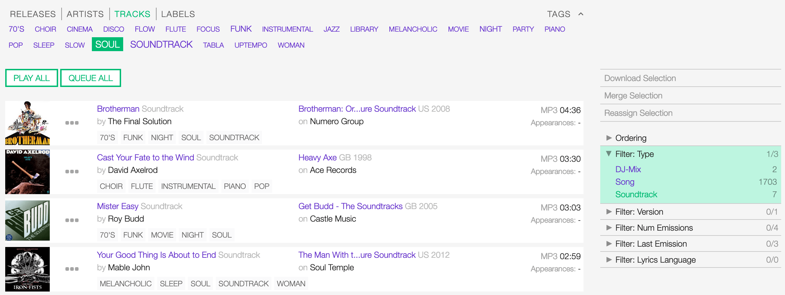
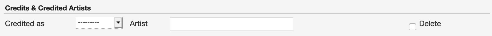

.. |mb-license| replace:: *CC-BY-NC-SA License*
.. _mb-license: https://creativecommons.org/licenses/by-nc-sa/3.0/
.. |wk-license| replace:: *CC-BY-SA License*
.. _wk-license: https://creativecommons.org/licenses/by-sa/3.0/

.. _track:

######
Tracks
######

.. _track-overview:

********
Overview
********

A track is the way a recording appears on a particular :ref:`release <release>` or, more exactly, on a particular tracklist.
Every track has a title and is credited to one or more :ref:`artist(s) <artist>`.
*(From the Musicbrainz article* |mb-track|_ *, which is released under the* |mb-license|_ *).*

.. |mb-track| replace:: *Track*
.. _mb-track: https://musicbrainz.org/doc/Track

Visit the :ref:`form view <track-form>` chapter to see which information open broadcast collect for a track.

.. _track-list:

*********
List view
*********

The list view displays all tracks that are in the library.

To access it, open the **CONTENT** menu, click on **LIBRARY** and then on **TRACKS**.

Note that search results are paginated (24 items per page). You can use the pagination controls above the list to
navigate the results pages.

.. figure:: img/track-list-overview.png

The **PLAY ALL** and **QUEUE ALL** buttons allow you to play/queue all tracks in the list at once.

See also:

* :ref:`The popup player <popup-player>`

Sorting the list
================

By default, the tracks are sorted by **Creation date** (descending). The newly created track profile is displayed
on the top of the list.

You can change the ordering parameter by clicking on **Ordering** to open the menu and selecting a different option.

  Click again on the active option to reverse the sorting order from 'descending' to 'ascending' (DESC/ASC).

The available options are:

* :ref:`Name: <track-form-title>` The title of the track.
* :ref:`Artist name: <track-form-primary-artist>` The name of the artist(s) the track is credited to.
* Duration**: The duration of the track.
* **Num Emissions**: The number of times the track was played on-air (airplay).
* **Last Emission**: The last date the track was played on-air.
* **Last Modified**: The last date the track profile was edited.
* **Creation date**: The date the track profile was created.

.. _track-list-filter:

Filtering the list
==================

You can filter the list by tags and specific properties associated with the tracks.

By Tags
-------

Click on **TAGS** to open the tag cloud and then on a tag to select it.

The page automatically reloads the filtered results every time you select, add, or remove a tag.

By specific property
--------------------

Click on the **Filter: <property>** to open the menu, then click on one or more values in the list.

You can filter by the following properties:

* :ref:`Type: <track-form-type>` The type of track.
* :ref:`Version: <track-form-version>` The version of the track.
* **Num Emissions**: The number of times the track was played on-air (airplay).
* **Last Emission**: The last date the track was played on-air.
* :ref:`Lyrics Language: <track-form-lyrics-language>` The language of the lyrics.

Tags and filters also work in combination:

   Example: Show all 'Soul' 'Soundtrack' tracks.

Click again on any active tag or filter to deselect it and reset the result-set.

.. _track-list-card:

The Track card
==============

UNDER CONSTRUCTION

.. _track-detail:

***********
Detail view
***********

UNDER CONSTRUCTION

.. _track-form:

*********
Form view
*********

The form view allows to edit the information of the track.

On the top side of the form are displayed the current information of the track (as displayed in the
:ref:`detail view <track-detail>`).

  After editing the information, click on **SAVE** to confirm the changes or on **CANCEL** to undo the changes and
  reset the form.

On the right side of the page are available the following options:

* **Back to detail view**: Exit the form and return to the detail view.
* **Administration view**: *(Admin only)*.

A comparison tool is available to help complete the information:

* **Compare - Musicbrainz**: Search for matches in the `Musicbrainz <https://musicbrainz.org/>`__ database and retrieve
  the information from it.

Below are described the information open broadcast collect for a track.

.. _track-form-general:

General
=======

.. figure:: img/track-form-general.png

.. _track-form-title:

Title
-----

The title of the track.

.. _track-form-release-title:

Release
-------

The title of the release the track appears on.

.. note::

  Typing inside the 'Release' field activates the auto-completion, listing all profiles in the library whose name matches
  the current text typed in.

  Click on the matching profile to select it or on 'Close' to close the list and create a new profile.

  .. figure:: img/track-form-release-select-create.gif

.. _track-form-primary-artist:

Artist
------

The name of the artist the track is primarily credited to. Use the :ref:`track artists fields <track-form-track-artists>`
to add multiple artists.

.. note::

  Typing inside the 'Artist' field activates the auto-completion, listing all profiles in the library whose name matches
  the current text typed in.

  Click on the matching profile to select it or on 'Close' to close the list and create a new profile.

  .. figure:: img/track-form-primary-artist-select-create.gif

.. _track-form-type:

Type
----

The type of recording. Please refer to the descriptions below to determine which value to choose.

UNDER CONSTRUCTION

.. _track-form-track-number:

Track number
------------

The track number (the position in the release tracklist).

.. _track-form-disc-number:

Disc number
-----------

The disc number (for releases consisting of multiple discs).

.. _track-form-opus-number:

Opus number
-----------

The Opus number the composer (or their publisher) assigned to the composition. Please refer to the descriptions below.

In musical composition, the opus number is the 'work number' that is assigned to a composition, or to a set of compositions,
to indicate the chronological order of the composer's production. Opus numbers are used to distinguish among compositions with
similar titles; the word is abbreviated as 'Op.' for a single work, or 'Opp.' when referring to more than one work.
*(From the Wikipedia article* |wk-opus|_ *, which is released under the* |wk-license|_ *).*

.. _wk-opus: https://en.wikipedia.org/wiki/Opus_number
.. |wk-opus| replace:: *Opus number*

.. _track-form-version:

Version
-------

The version of the recording. Please refer to the descriptions below to determine which value to choose.

UNDER CONSTRUCTION

.. _track-form-track-artists:

Track Artists
=============

The artist(s) the recording is primarily credited to.

.. figure:: img/track-form-track-artists.png

  The system automatically creates a new empty field every time a name is entered. (up to 15 per editing session).

By default the system display the name written in the :ref:`primary artist field <track-form-primary-artist>`.

To override the default value, type again the primary artist name inside the first field. Keep adding names in separated
fields and select the 'join phrase' to be used in between.

.. note::

  Typing inside the 'Artist' field activates the auto-completion, listing all profiles in the library whose name
  matches the current text typed in.

  Click on the matching profile to select it or on 'Close' to close the list and create a new profile.

  .. figure:: img/track-form-track-artists-select-create.gif

  To remove an artist click on the respective 'Delete' check-box and save the form.

.. _track-form-credited-artists:

Credits & Credited Artists
==========================

The extra artist(s) credited to the recording (remixer, composer, lyricist, etc).

  The system automatically creates a new empty field every time a name is entered. (up to 15 per editing session).

Type the artist name inside the first field. Keep adding names in separated fields and select the appropriate role from
the 'Credited as' dropdown list.

.. note::

  Typing inside the 'Artist' field activates the auto-completion, listing all profiles in the library whose name
  matches the current text typed in.

  Click on the matching profile to select it or on 'Close' to close the list and create a new profile.

  .. figure:: img/track-form-track-credits-select-create.gif

  To remove an artist click on the respective 'Delete' check-box and save the form.

.. _track-form-identifiers:

Identifiers
===========

The identification code associated with the recording.

.. figure:: img/track-form-identifiers.png

.. _track-form-isrc:

ISRC
----

The ISRC code. Please refer to the description below.

The International Standard Recording Code (ISRC) is an international standard code for uniquely identifying sound
recordings and music video recordings.

ISRC codes are always 12 characters long, in the form 'CC-XXX-YY-NNNNN'. The hyphens are not part of the ISRC code itself,
but codes are often presented that way in print to make them easier to read.
*(From the Wikipedia article* |wk-isrc|_ *, which is released under the* |wk-license|_ *).*

.. |wk-isrc| replace:: *International standard recording code*
.. _wk-isrc: https://en.wikipedia.org/wiki/International_Standard_Recording_Code

.. _track-form-license:

License / Source
================

The license applied to the recording.

Please refer to the descriptions below to determine which value to choose.

Restricted - Commercial
-----------------------

Apply this license when the usage of the recording is monetized.

Restricted use
--------------

Apply this license when the copyright information is unknown.

Restricted - Self owned
-----------------------

Apply this license when you are the copyright holder of the composition and sound recording.

Multiple
--------

Apply this license when the recording contains multiple content with different licenses apply to them.

Public domain
-------------

The public domain consists of all the creative work to which no exclusive intellectual property rights apply. Those
rights may have expired, been forfeited, expressly waived, or may be inapplicable.

As examples, the works of William Shakespeare and Ludwig van Beethoven, and most early silent films, are in the public
domain either by virtue of their having been created before copyright existed, or by their copyright term having expired.
*(From the Wikipedia article* |wk-public-domain|_ *, which is released under the* |wk-license|_ *).*

.. |wk-public-domain| replace:: *Public domain*
.. _wk-public-domain: https://en.wikipedia.org/wiki/Public_domain

Creative Commons
----------------

A Creative Commons (CC) license is one of several public copyright licenses that enable the free distribution of an
otherwise copyrighted 'work'. A CC license is used when an author wants to give other people the right to share, use,
and build upon a work that they (the author) have created.
*(From the Wikipedia article* |wk-creative-commons-license|_ *, which is released under the* |wk-license|_ *).*

.. |wk-creative-commons-license| replace:: *Creative Commons license*
.. _wk-creative-commons-license: https://en.wikipedia.org/wiki/Creative_Commons_license

**Seven regularly used licenses**

* BY: Attribution alone
* BY-NC: Attribution + Noncommercial
* BY-NC-ND: Attribution + Noncommercial + NoDerivatives
* BY-NC-SA: Attribution + Noncommercial + ShareAlike
* BY-ND: Attribution + NoDerivatives
* BY-SA: Attribution + ShareAlike

.. _track-form-meta:

Meta
====

.. _track-form-lyrics:

Lyrics
======

.. _track-form-lyrics-language:

Lyrics language
---------------

Self explanatory.

Lyrics
------

The words that make up a song.

.. _track-form-tags:

Tags
====

One or more keyword(s) to help describe the track (i.e. the music genre / style).

.. figure:: img/track-form-tags.png

.. note::

  Typing inside the 'Tags' field activates the auto-completion, listing all tags in the library whose name matches with the
  current text typed in.

  Click on the matching tag to select it or hit the 'Enter' key to create a new tag.

  .. figure:: ../img/tags-field-select-create-remove.gif

  To remove a specific tag click on the 'X' within it.

.. _track-form-relations:

Relations
=========

Website / URL
-------------

The url of the track page on other online platforms.

To remove a url / link click on the respective 'Delete' check-box and save the form.

.. _track-how-tos:

*******
How-tos
*******

.. _track-how-tos-reassign-track:

Reassigning a track
===================

The reasons you may want to reassign a track to a different release are mainly two:

#. The system wrongly assigned it to a release with an identical title during the import.
#. A user assigned/moved it to a wrong release.

The tool is available on the release page:

   Track assigned to a wrong release (identical title)

Or the tracks list page:

To start, select the track(s) to be reassigned and then click on **Reassign Selection** (right sidebar).

   Move the cursor over the track card and click on it to select it. Click on it again to deselect it.

In the popup panel that opens up, type the release title.

Note that typing inside the field activates the auto-completion, listing all releases in the library whose name matches with the
current text typed in.

If you want to assign the track(s) to an existing release, click on a result to select it:

Else, check 'Create new Release':

Finally, click on **CONFIRM RE-ASSIGN** within the panel.

.. note::

  Click on **CLOSE (ESC)** at any time to close the panel and abort the operation.

The system will automatically redirect you to the release profile/page the track(s) are now assigned.

If needed, also adjust the track number according to the 'new' release tracklist.

See also:

* :ref:`Release form <release-form>`
