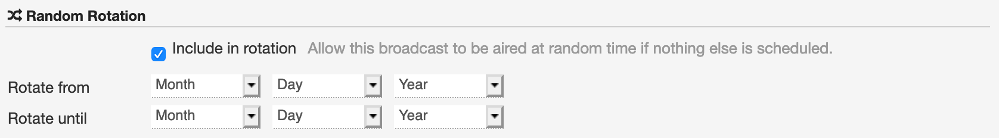
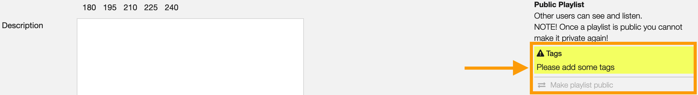

.. |wk-license| replace:: *CC-BY-SA License*
.. _wk-license: https://creativecommons.org/licenses/by-sa/3.0/

.. _playlist:

#########
Playlists
#########

.. _playlist-overview:

********
Overview
********

A playlist is a list of audio files that are played in sequence.

At open broadcast, the playlist is a list of :ref:`tracks <track-list>` and is curated by the :ref:`user <user>`.
On the platform there are 3 types of playlist:

* **Private**: The playlist is only visible to the creator.
* **Public**: The playlist is visible to all the users and it appears in the :ref:`playlists list <playlist-list>`.
* **Broadcast ready**: The playlist is visible to all the users, it appears in the :ref:`playlists list <playlist-list>`
  and it can be :ref:`scheduled to broadcast <scheduler-how-to-schedule-playlist>`.

See also:

* :ref:`Creating a playlist <playlist-how-to-create-playlist>`.

.. _playlist-list:

*********
List view
*********

Accessing the list
==================

To access the list of playlists, open the **CONTENT** menu and click on **PLAYLISTS**.

.. figure:: img/content-sub-nav-playlists.png

By default the list is sorted by **Creation date** (descending), the newly created playlist is displayed on the top-left
side of the list.

.. figure:: img/playlist-list-order-by-creation-date.png

To change the ordering parameter, click on **Ordering** to open the menu and click on a different option.

.. figure:: img/playlist-list-order-by-name.png

  Click again on the active option to reverse the sorting order from 'descending' to 'ascending' (DESC/ASC).

The available options are:

* :ref:`Name: <playlist-form-title>` The title of the playlist.
* **Num emissions**: The number of times the playlist was broadcast.
* **Last emission**: The last date the playlist was broadcast.
* **Next emission**: The next date the playlist will be broadcast.
* **Duration**: The duration of the playlist.
* **Last Modified**: The last date the playlist profile was edited.
* **Creation date**: The date the playlist profile was created.

.. _playlist-list-filter:

Filtering the list
==================

The list can be filtered by tags or specific properties associated with the playlists.

**BY TAGS**

Click on **TAGS** to open the menu and click on the tag(s).

**BY SPECIFIC PROPERTY**

Click on **Filter:<property>** to open the menu and click on one of the available options.

.. figure:: img/playlist-list-filters.png

The available filters are:

* **Type**: The type of playlist.
* :ref:`Daypart Days: <playlist-form-best-dayparts>` The day the playlist was designed.
* :ref:`Daypart Slots: <playlist-form-best-dayparts>` The time / slot the playlist was designed.
* :ref:`Target duration: <playlist-form-target-duration>` The target duration of the playlist.
* **Num emissions**: The number of times the playlist was broadcast.
* **Last emission**: The last date the playlist was broadcast.
* **Next emission**: The next date the playlist will be broadcast.
* **Flags**: The flags applied to the playlist (:ref:`Include in rotation / Archived <playlist-form-random-rotation>`).

Tags and filters also work in combination:

.. figure:: img/playlist-list-tags-filters.png

   Example: Show all **ELECTRONIC** and **DOWNTEMPO** **Broadcast** playlists sorted by **Creation date**.

Click again on any active tag or filter to deselect it and reset the result-set.

.. _playlist-list-card:

The Playlist card
=================

The playlist card displays some information of the playlist and it includes some functions that can be performed on the
playlist.

.. figure:: img/playlist-list-card.png

Starting at the top, the information displayed are:

* **Type**: The type of playlist.
* :ref:`Target duration <playlist-form-target-duration>`: The target duration of the playlist.
* :ref:`H (History) <playlist-list-card-history>`: Shortcut to display the broadcast history of the playlist.
* :ref:`Cover art <playlist-form-cover-art>`: The cover art of the playlist.
* :ref:`Tags <playlist-form-tags>`: The tags associated with the playlist.
* :ref:`Title <playlist-form-title>` / count: The title of the playlist / The number of times the playlist was broadcast.
* :ref:`Series name <playlist-form-series-name>` /  :ref:`Series number <playlist-form-series-number>`: The series
  name / number of the playlist.
* :ref:`User name <user>`: The name of the user who created the playlist.
* **Actual duration**: The actual duration of the playlist.

To play the tracks on the playlist, move the cursor over the Cover art and click on the 'Play' icon.

.. figure:: img/playlist-list-card-play.png

  The :ref:`popup player <popup-player>` opens and starts playing it automatically

To access additional options, click on **more options** (3 dots) to open the menu and then click on an option.

.. figure:: img/playlist-list-card-options.png

The available options are:

* **Queue**: Queue the tracks in :ref:`the popup player <popup-player>`.
* **Download**: Download the entire release.
* **Schedule for playout**: :ref:`Add the playlist to the scheduler clipboard <scheduler-how-to-schedule-playlist>`.
* **Edit**: Open the :ref:`form view <playlist-form>` of the playlist.
  *(it is displayed only if you are the creator of the playlist)*.
* **Admin view**: *(Admin only)*.

.. _playlist-list-card-history:

The History tab
---------------

The History tab notify the user the day / time a playlist is scheduled to broadcast.

Move the mouse over the **H** to open the notification panel.

.. figure:: img/playlist-list-card-emission-info.png

Click on the **H** to open the 'Emission matrix' panel.

.. figure:: img/playlist-list-card-emission-matrix.png

The 'Emission matrix' displays:

* **X-axis**: The name of the days (28 days / 4 weeks).
* **Y-axis**: The dayparts (from 6 a.m. onwards)
* **Purple cursor**: It highlights the current day.
* **Green slots**: It highlights the :ref:`dayparts <playlist-form-best-dayparts>` defined by the user.
* **Dark grey slots**: The position the playlist is scheduled to broadcast.

The 'Emission matrix' displays:

* **X-axis**: The name of the days (28 days / 4 weeks).
* **Y-axis**: The dayparts (from 6 a.m. onwards)
* **Purple cursor**: It highlights the current day.
* **Green slots**: It highlights the :ref:`dayparts <playlist-form-best-dayparts>` defined by the user.
* **Light grey slots**: The position the playlist is scheduled to broadcast.

.. _playlist-detail:

***********
Detail view
***********

To open the detail view of a playlist, go to the :ref:`playlists list <playlist-list>` page and click on the title of
the playlist.

.. figure:: img/playlist-detail-info-card.png

The detail view display all information associated with the playlist. Starting at the top, the information are:

* **Heading**: The :ref:`title <playlist-form-title>` / type of playlist.
* :ref:`Series <playlist-form-series>`: The title of the series / the number of the series.
* **Author**: The :ref:`user <user>` who created the playlist.
* **Date created**: The date the playlist was created.
* **Last Updated**: The last date the playlist was edited.
* **Type**: The type of playlist.
* :ref:`Rotation <playlist-form-include-rotation>`: It informs if the playlist is included in rotation.
* **Duration**: The actual / :ref:`target <playlist-form-target-duration>` of the playlist.
* :ref:`Broadcast Dayparts <playlist-form-best-dayparts>`: The broadcast dayparts of the playlist.
* :ref:`Tags <playlist-form-tags>`: The tags associated with the playlist.
* :ref:`Cover art <playlist-form-cover-art>` (right side): The cover art of the playlist.
* **Thumb up / thumb down** (right side): The rating tool.

Trackslist tab
==============

The tracks list of the playlist.

.. figure:: img/playlist-detail-tab-trackslist.png

Emissions tab
==============

The date(s) the playlist was broadcast.

Mixdown tab
==============

The mixdown of the playlist.

On the right side of the page are available the following options:

* :ref:`Create playlist <playlist-how-to-create-playlist>`: Create a new playlist.
* :ref:`Edit <playlist-form>`: Open the form to edit the information of the playlist (only visible to the creator).
* :ref:`Delete playlist <playlist-how-to-delete-playlist>`: Delete the playlist (only visible to the creator).
* **Administration view**: *(Admin only)*.
* **Follow playlist**: Start to follow the playlist.
* **Download playlist**: *(Radio Pro only)*.

.. _playlist-form:

*********
Form view
*********

The form view allows to edit the information of the playlist.

  After editing the information, click on **SAVE** to confirm the changes or on **CANCEL** to undo the changes and
  reset the form.

On the right side of the page are available the following options:

* **Back to detail view**: Exit the form and return to the detail view.
* :ref:`Delete playlist <playlist-how-to-delete-playlist>`: Delete the playlist.
* **Administration view**: *(Admin only)*.

Below are described the information open broadcast collect for a playlist.

.. _playlist-form-general:

General
=======

.. figure:: img/playlist-form-general.png

  Mandatory fields are marked with ***** and cannot be omitted.

.. _playlist-form-title:

Title
-----

The title of the playlist.

.. _playlist-form-target-duration:

Target duration
---------------

The target duration of the playlist. Select a value between 15 minutes and 240 minutes.

.. note::

  The value is constantly compared to the ‘actual’ duration of the playlist, that is the sum of the tracks duration and
  cue points.

  .. figure:: img/playlist-form-target-actual-duration-diff.png

.. _playlist-form-description:

Description
-----------

The description of the release.

.. _playlist-form-cover-art:

Main image
----------

The cover art of the playlist. To upload an image, click on **Browse** and select a picture from the computer file browser.

.. _playlist-form-tags:

Tags
====

One or more keyword/s to help describe the playlist (i.e. the music genre / style).

.. note::

  Typing inside the 'Tags' field activates the auto-completion, listing all tags in the library whose name matches the
  current text typed in.

  Click on the matching tag to select it or hit the 'Enter' key to create a new tag.

  .. figure:: img/tags-field-select-create-remove.gif

    To remove a tag click on the 'X' within it.

.. _playlist-form-series:

Series
======

.. _playlist-form-series-name:

Series name
-----------

The name of the series the playlist will be grouped under.

.. note::

  Typing inside the 'Series' field activates the auto-completion, listing all profiles in the library whose name matches
  the current text typed in.

  Click on the matching profile to select it or on 'Close' to close the list and create a new profile.

  .. figure:: img/series-field-select-create.gif

.. _playlist-form-series-number:

Series number
-------------

The series number. Leave it empty to let the system apply, or continue, the number progression of the series.

.. _playlist-form-random-rotation:

Random rotation
===============

In broadcasting, rotation is the repeated airing of a limited playlist of songs on a radio station or satellite radio
channel, or music videos on a TV network.
*(From the Wikipedia article* |wk-rotation-music|_ *, which is released under the* |wk-license|_ *).*

.. |wk-rotation-music| replace:: *Rotation (Music)*
.. _wk-rotation-music: https://en.wikipedia.org/wiki/Rotation_(music)

.. _playlist-form-include-rotation:

Include in rotation
-------------------

Include the playlist in rotation.

.. _playlist-form-rotate-from:

Rotate from
-----------

Define at which date the playlist will be included in rotation.

.. _playlist-form-rotate-until:

Rotate until
------------

Define at which date the playlist will be excluded from rotation and will be flagged as 'Archived'.

.. _playlist-form-best-broadcast:

Best broadcast...
=================

.. _playlist-form-best-dayparts:

...Dayparts
-----------

The best dayparts to play the playlist. Please refer to the description below.

In broadcast programming, dayparting is the practice of dividing the broadcast day into several parts, in which a
different type of radio or television program apropos for that time period is aired.
*(From the Wikipedia article* |wk-dayparting|_ *, which is released under the* |wk-license|_ *).*

.. _wk-dayparting: https://en.wikipedia.org/wiki/Dayparting
.. |wk-dayparting| replace:: *dayparting*

You can select up to 5 days.

.. figure:: img/playlist-form-best-dayparts.png

.. _playlist-form-best-season:

...Seasons
----------

The best 'season' to play the playlist.

.. _playlist-form-weather:

...Weather
----------

The best 'weather' to play the playlist.

.. _playlist-editor:

Playlist editor
===============

The playlist editor allows to edit the content of the playlist.

To access the editor, click on the **Playlist editor** tab.

.. figure:: img/playlist-form-playlist-editor-tab.png

The available features are:

* Change the sequence of the :ref:`tracks <track>` (drag and drop the track to the desired position).
* Remove a specific track (click on the **trash** icon within it).
* Add a track to another playlist (click on the **+** icon within it).
* Quickly add more tracks using the :ref:`search field <playlist-editor-search-field>`.
* Add :ref:`fade in / out effects <playlist-editor-fade>` or :ref:`cue points <playlist-editor-cue>` on the tracks.

.. _playlist-editor-fade:

Fade-In / Out
--------------

The gradual increase from silence at the beginning of the track (fade-in) / The gradual decrease to silence at the end
of the track (fade-out).

Fade-in / fade-out effects can be applied in one of the following ways:

* Drag the fade point and drop it to the desired position (green dot)
* Type the value in milliseconds in the corresponding field and click outside the track card to apply it.

.. figure:: img/playlist-editor-add-fade-in-out.gif

To listen the result, click on the play icon located on the left side of the waveform. When the track end, the player
automatically play the next track in the list.

.. _playlist-editor-cue:

Cue-In / Out
-------------

The initial playback point (cue-in) / the end playback point (cue-out).

Cue-in / cue-out effects can be applied in one of the following ways:

* Drag the cue point and drop it to the desired position (green square bracket)
* Type the value in milliseconds in the corresponding field and click outside the track card to apply it.

  Note the 'Actual' duration is automatically updated.

To listen the result, click on the play icon located on the left side of the waveform.

.. _playlist-editor-search-field:

Search field
-------------

The 'Search' field allows to quickly search for tracks to add to the playlist.

It is located at the bottom of the tracks list and it includes a checkbox to narrow down the result, in this case, to
tracks whose :ref:`type <track-form-type>` is set to jingle.

.. figure:: img/playlist-editor-search-field.png

To search for any track that is not a jingle, uncheck the **Search for jingles only** filter and type the title of the
track.

.. note::

  Typing inside the 'Search' field activates the auto-completion, listing all profiles in the library whose name matches
  the current text typed in.

  Click on the matching profile to select it. The track will be automatically added to the playlist.

   Note the 'Actual' duration is automatically updated.

To search for a jingle, repeat the steps described above leaving the **Search for jingles only** box checked.

.. figure:: img/playlist-editor-search-field-add-jingle.gif

  Note the 'Actual' duration is automatically updated.

.. _playlist-how-to:

*******
How-tos
*******

.. _playlist-how-to-create-playlist:

Creating a playlist
===================

To create a playlist, go the :ref:`playlists list <playlist-list>` page and click on the **Create playlist** button
located on the right side of the page.

The :ref:`playlist form <playlist-form>` will open automatically. Complete the information and click on **SAVE**.

The playlist is now created and the form is reloaded to include additional information. Keep adding information or click
on **Back to detail view** to exit the form and return to the :ref:`playlist detail <playlist-detail>` view.

.. note::

  By default, a new playlist is set to 'Private' and is not visible in the **PUBLIC PLAYLISTS** :ref:`list view
  <playlist-list>`. To access your private playlists, click on **MY PLAYLISTS**.

  .. figure:: img/playlist-list-my-playlists.png

See also:

* :ref:`Adding tracks to playlists using the popup-player <media-player-add-track-to-existing-playlist>`.
* :ref:`Converting a 'Private' playlist into 'Public' <playlist-how-to-transform-private-to-public>`.

.. _playlist-how-to-transform-private-to-public:

Converting a 'Private' playlist into 'Public'
=============================================

To transform a 'Private' playlist into 'Public' :ref:`tags <playlist-form-tags>` are required.

Add some tags and save the form. Then click on **Make playlists public**.

.. _playlist-how-to-transform-public-to-broadcast:

Converting a 'Public' playlist into 'Broadcast'
===============================================

To transform a 'Public' playlist into 'Broadcast ready' the following requirements need to be met:

#. The :ref:`target duration <playlist-form-target-duration>` and the :ref:`dayparts <playlist-form-best-dayparts>`
   must be defined.
#. The 'actual' duration must match the :ref:`'target' duration <playlist-form-target-duration>`.

Once the requirements are met, click on **Make playlists broadcastable**.

.. figure:: img/playlist-form-transform-public-to-broadcast.png

See also:

* :ref:`Adding a playlist to the scheduler clipboard <scheduler-how-to-add-playlist-to-clipboard>`.

.. _playlist-how-to-delete-playlist:

Deleting a playlist
===================

Open the :ref:`playlist detail <playlist-detail>` or :ref:`playlist form <playlist-form>` view and click on **Delete**.

Click on **DELETE <name-of-the-playlist>** to confirm it.

.. figure:: img/playlist-detail-delete-confirm.png

.. important::

  'Public' and 'Broadcast' playlists cannot be deleted.
