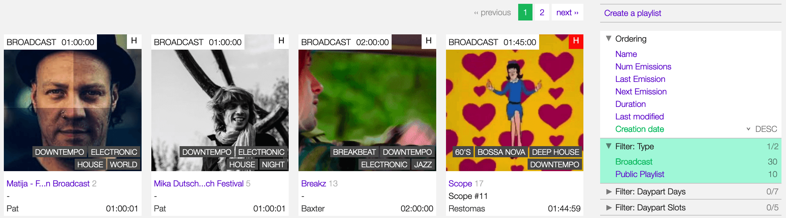
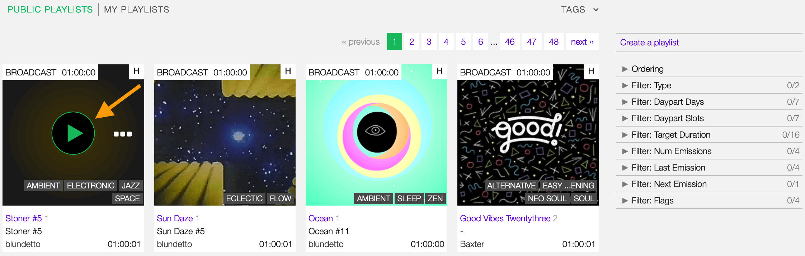
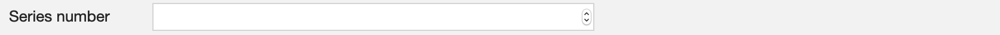

.. |wk-license| replace:: *CC-BY-SA License*
.. _wk-license: https://creativecommons.org/licenses/by-sa/3.0/

.. _playlist:

#########
Playlists
#########

.. _playlist-overview:

********
Overview
********

A playlist is a list of :ref:`tracks<track-list>` (recordings) curated by the :ref:`user <user>`.
On the platform, there are three types of playlists:

* **Private**: The playlist is only visible to the creator.
* **Public**: The playlist is visible to all the users, and it appears in the :ref:`playlists list <playlist-list>`.
* **Broadcast ready**: The playlist is visible to all the users; it appears in the :ref:`playlists list <playlist-list>`
  and can be :ref:`scheduled to broadcast <scheduler-how-to-schedule-playlist>`.

See also:

* :ref:`Creating a playlist <playlist-how-to-create-playlist>`
* :ref:`Browsing the playlists list <playlist-list>`

.. _playlist-list:

*********
List view
*********

The list view displays all playlists created by the users.

To access it, open the **CONTENT** menu, and click on **PLAYLISTS**.

Note that search results are paginated (24 items per page). You can use the pagination controls above the list to
navigate through the results pages.

The **PLAY ALL** and **QUEUE ALL** buttons allow you to play/queue all playlists in the list at once.

See also:

* :ref:`The popup player <popup-player>`

Sorting the list
================

By default, the playlists are sorted by **Creation date** (descending), the newly created playlist is
displayed on the top-left side of the list.

.. figure:: img/playlist-list-order-by-creation-date.png

To change the ordering parameter, click on **Ordering** to open the menu and select a different option.

  Click again on the active option to reverse the sorting order from 'descending' to 'ascending' (DESC/ASC).

The available options are:

* :ref:`Name: <playlist-form-title>` The title of the playlist.
* **Num emissions**: The number of times the playlist was broadcast.
* **Last emission**: The last date the playlist was broadcast.
* **Next emission**: The next date the playlist will be broadcast.
* **Duration**: The duration of the playlist.
* **Last Modified**: The last date the playlist profile was edited.
* **Creation date**: The date the playlist profile was created.

.. _playlist-list-filter:

Filtering the list
==================

You can filter the list by tags and specific properties associated with the playlists.

By tags
-------

Click on **TAGS** to open the tag cloud and then on a tag to select it.

.. figure:: img/playlist-list-tags.png

The page automatically reloads the filtered results every time you select, add, or remove a tag.

By specific property
--------------------

Click on the **Filter: <property>** to open the menu, then click on one or more values in the list.

The page automatically reloads the filtered results every time you select, add, remove values from a specific
filter, or add other filters/properties to the query.

You can filter by the following properties:

* **Type**: The type of playlist.
* :ref:`Daypart Days: <playlist-form-best-dayparts>` The day for which the playlist was intended.
* :ref:`Daypart Slots: <playlist-form-best-dayparts>` The time/slot for which the playlist was designed.
* :ref:`Target duration: <playlist-form-target-duration>` The target duration of the playlist.
* **Num emissions**: The number of times the playlist was broadcast.
* **Last emission**: The last date the playlist was broadcast.
* **Next emission**: The next date the playlist will be broadcast.
* **Flags**: The flags applied to the playlist (:ref:`Include in rotation / Archived <playlist-form-random-rotation>`).

Tags and filters also work in combination:

.. figure:: img/playlist-list-tags-filters.png

   Example: Show all **ELECTRONIC** and **DOWNTEMPO** **Broadcast** playlists sorted by the **Creation date**.

Click again on any active tag or filter to deselect it and reset the result-set.

.. _playlist-list-card:

The Playlist card
=================

The playlist card displays some information about the playlist in the list.

Starting at the top, it displays:

* **Type**: The type of playlist.
* :ref:`Target duration <playlist-form-target-duration>`: The target duration of the playlist.
* :ref:`H (History) <playlist-list-card-history>`: Shortcut to show the broadcast history of the playlist.
* :ref:`Cover art <playlist-form-cover-art>`: The cover art of the playlist.
* :ref:`Tags <playlist-form-tags>`: The tags associated with the playlist.
* :ref:`Title <playlist-form-title>`/**Count**: The title of the playlist/The number of times the playlist was broadcast.
* :ref:`Series name <playlist-form-series-name>`/:ref:`Series number <playlist-form-series-number>`: The series
  name/Series number of the playlist.
* :ref:`User name <user>`: The name of the user who created the playlist.
* **Actual duration**: The actual length of the playlist.

It also includes some functions that you can perform on the playlist, such as playing it, moving the cursor
over the Cover art, and clicking on the 'Play' icon.

  The :ref:`popup player <popup-player>` opens and starts playing it automatically.

To access additional options, click on **more options** (3 dots) to open the menu.

Then click on one of the options available:

* **Queue**: Queue the tracks in :ref:`the popup player <popup-player>` trackslist.
* **Download**: Download the playlist.
* **Schedule for playout**: :ref:`Add the playlist to the scheduler clipboard <scheduler-how-to-schedule-playlist>`.
* **Edit**: Open the :ref:`form <playlist-form>` to edit the playlist. *(it is visible only to the playlist creator)*.
* **Admin view**: *(Admin only)*.

.. _playlist-list-card-history:

The History tab
---------------

The History tab notifies the day/time a playlist is scheduled to broadcast.

Moving the mouse over the **H** will open a window showing the last/next time the playlist was/is scheduled to broadcast.

.. figure:: img/playlist-list-card-emission-info.png

To display more information, click on the H to open the 'Emission matrix' panel.

.. figure:: img/playlist-list-card-emission-matrix.png

The matrix displays:

* **X-axis**: The name of the days (28 days / 4 weeks).
* **Y-axis**: The dayparts (from 6 a.m. onwards)
* **Purple cursor**: It highlights the current day.
* **Green slots**: It highlights the :ref:`dayparts <playlist-form-best-dayparts>` defined by the user.
* **Dark grey slots**: The day/daypart the playlist is already scheduled to broadcast.

.. _playlist-detail:

***********
Detail view
***********

The 'detail view' shows all information associated with the playlist.

To open it, go to the :ref:`playlists list <playlist-list>` page and click on the title of the playlist.

.. figure:: img/playlist-list-open-detail-view.png

On the right side of the page are available the following options:

* :ref:`Create playlist <playlist-how-to-create-playlist>`: Create a new playlist.
* :ref:`Edit <playlist-form>`: Open the form to edit the playlist *(it is visible only to the playlist creator)*.
* :ref:`Delete playlist <playlist-how-to-delete-playlist>`: Delete the playlist *(it is visible only to the playlist creator)*.
* **Administration view**: *(Admin only)*.
* **Follow playlist**: Start to follow the playlist.
* **Download playlist**: Download the playlist *(Radio Pro only)*.

Playlist details card
=====================

The card displays:

* Header: The :ref:`title <playlist-form-title>` of the playlist / the type of playlist.
* :ref:`Series <playlist-form-series>`: The title of the series / the number of the series.
* **Author**: The :ref:`user <user>` who created the playlist.
* **Date created**: The date the playlist was created.
* **Last Updated**: The last time the playlist was edited.
* **Type**: The type of playlist.
* :ref:`Rotation <playlist-form-include-rotation>`: It informs if the playlist is included in rotation.
* **Duration**: The actual / :ref:`target <playlist-form-target-duration>` of the playlist.
* :ref:`Broadcast Dayparts <playlist-form-best-dayparts>`: The broadcast dayparts of the playlist.
* :ref:`Tags <playlist-form-tags>`: The tags associated with the playlist.
* :ref:`Cover art <playlist-form-cover-art>` *(right side)*: The cover art of the playlist.
* **Thumb up / thumb down** *(right side)*: The rating tool.
* Footer: Tabs to access other information.

Tracklist tab
==============

The tracklist of the playlist.

Emissions tab
==============

The date(s) the playlist was broadcast.

.. figure:: img/playlist-detail-tab-emissions.png

Mixdown tab
==============

The mixdown of the playlist.

.. figure:: img/playlist-detail-tab-mixdown.png

.. _playlist-form:

*********
Form view
*********

The form view allows you to edit both the information and the playlist's tracklist.

.. figure:: img/playlist-form-overview.png

On the right side of the page are available the following options:

* **Back to detail view**: Exit the form and return to the detail view.
* :ref:`Delete playlist <playlist-how-to-delete-playlist>`: Delete the playlist.
* **Administration view**: *(Admin only)*.

By default, the form shows you the playlist information ('Metadata' tab). To access the tracks list, click on the
:ref:`Playlist editor <playlist-form-playlist-editor>` tab.

.. _playlist-form-metadata:

Metadata
========

Below are described the information open broadcast collect for a playlist.

.. _playlist-form-general:

General
-------

.. _playlist-form-title:

Title
^^^^^

The title of the playlist.

   Fields marked with * are mandatory.

.. _playlist-form-target-duration:

Target duration
^^^^^^^^^^^^^^^

The target duration of the playlist.

Select a value between 15 minutes and 240 minutes.

.. _playlist-form-description:

Description
^^^^^^^^^^^

The description of the playlist.

.. _playlist-form-cover-art:

Main image
^^^^^^^^^^

The cover art of the playlist.

To upload an image, click on **Browse** and select a picture from the computer file browser.

.. _playlist-form-tags:

Tags
----

One or more keyword(s) to help describe the playlist (i.e., the music genre/style).

.. figure:: img/playlist-form-tags.png

.. note::

  Typing inside the 'Tags' field activates the auto-completion, listing all tags in the library whose name matches the
  current text typed.

  Click on the matching tag to select it or hit the 'Enter' key to create a new tag.

  .. figure:: img/tags-field-select-create-remove.gif

    To remove a tag click on the 'X' within it.

.. _playlist-form-series:

Series
------

.. _playlist-form-series-name:

Series name
^^^^^^^^^^^

The name of the series of which the playlist is part.

.. note::

  Typing inside the 'Series' field activates the auto-completion, listing all series already in the library whose name
  matches the current text typed.

  Click on the matching profile to select it or on **CLOSE** to close the list and create a new profile.

  .. figure:: img/playlist-form-series-select-create.gif

.. _playlist-form-series-number:

Series number
^^^^^^^^^^^^^

The series number.

Leave it empty to let the system apply, or continue, the number progression of the series.

.. _playlist-form-random-rotation:

Random rotation
---------------

In broadcasting, rotation is the repeated airing of a limited playlist of songs on a radio station or satellite radio
channel, or music videos on a TV network.
*(From the Wikipedia article* |wk-rotation-music|_ *, which is released under the* |wk-license|_ *).*

.. |wk-rotation-music| replace:: *Rotation (Music)*
.. _wk-rotation-music: https://en.wikipedia.org/wiki/Rotation_(music)

.. _playlist-form-include-rotation:

Include in rotation
^^^^^^^^^^^^^^^^^^^

Include the playlist in rotation.

.. _playlist-form-rotate-from:

Rotate from
^^^^^^^^^^^

The date the playlist will be included in the rotation.

.. _playlist-form-rotate-until:

Rotate until
^^^^^^^^^^^^

The date the playlist will be excluded from rotation and will be flagged as 'Archived.'

.. _playlist-form-best-broadcast:

Best broadcast...
-----------------

.. _playlist-form-best-dayparts:

...Dayparts
^^^^^^^^^^^

The best dayparts to play the playlist.

   You can select up to 5 days.

In broadcast programming, dayparting is the practice of dividing the broadcast day into several parts, in which a
different type of radio or television program apropos for that time period is aired.
*(From the Wikipedia article* |wk-dayparting|_ *, which is released under the* |wk-license|_ *).*

.. _wk-dayparting: https://en.wikipedia.org/wiki/Dayparting
.. |wk-dayparting| replace:: *dayparting*

.. _playlist-form-best-season:

...Seasons
^^^^^^^^^^

The 'best season' to play the playlist.

.. _playlist-form-weather:

...Weather
^^^^^^^^^^

The 'best weather' to play the playlist.

.. _playlist-form-playlist-editor:

Playlist editor
===============

The playlist editor allows you to edit the tracklist of the playlist.

To access it, click on the **Playlist Editor** tab.

Here you can:

* Change the sequence of the :ref:`tracks <track>`: simply drag and drop the track to the desired position.
* Remove a specific track: click on the **trash** icon within it.
* Add a particular track to another playlist: click on the **+** icon within it.
* Add more tracks to the playlist using the :ref:`integrated search field <playlist-editor-search-field>`.
* Add :ref:`fade-in / out effects <playlist-editor-fade>` or :ref:`cue points <playlist-editor-cue>` on the tracks.

.. _playlist-editor-fade:

Fade-In / Out
-------------

Fade-in is the gradual increase from silence at the beginning of the track, while fade-out is the gradual decrease to
silence at the end of the track.

You can apply fade-in / fade-out effects in one of the following ways:

* Drag the fade point and drop it to the desired position *(green dot)*.
* Type the value in milliseconds in the corresponding field and click outside the track card to apply it.

To listen to the result, click on the play icon on the left side above the waveform. When the track end, the player
automatically plays the next track in the list.

.. _playlist-editor-cue:

Cue-In / Out
------------

Cue-in is the initial playback point, while cue-out is the end playback point.

You can apply cue-in / cue-out effects in one of the following ways:

* Drag the cue point and drop it to the desired position *(green square bracket)*.
* Type the value in milliseconds in the corresponding field and click outside the track card to apply it.

.. figure:: img/playlist-editor-add-cue-in-out.gif

  Note the 'Actual' duration is automatically updated.

To listen to the result, click on the play icon on the left side above the waveform.

.. _playlist-editor-search-field:

Search field
------------

The 'Search' field allows searching for tracks to add to the playlist quickly.

It is located at the bottom of the tracks list.

It also includes a checkbox to narrow down the search results to jingles (tracks whose :ref:`type <track-form-type>`
was set to jingle). To search for any kind of track, uncheck the **Search for jingles only** filter and type the title
in the field.

.. figure:: img/playlist-editor-search-field-add-track.gif

   Note the 'Actual' duration is automatically updated.

.. note::

  Typing inside the 'Search' field activates the auto-completion, listing all tracks in the library whose name matches
  the current text typed.

  Click on the matching track to add it to the playlist.

To search for a jingle, repeat the steps described above, leaving the **Search for jingles** only box checked.

   Note the 'Actual' duration is automatically updated.

Once you've finished editing, click on **SAVE** to confirm the changes or **CANCEL** to undo the changes and reset
the form.

.. _playlist-how-to:

*******
How-tos
*******

.. _playlist-how-to-create-playlist:

Creating a playlist
===================

To create a playlist, go to the :ref:`playlists list <playlist-list>` page and click on the **Create playlist** button
located on the page's right side.

.. figure:: img/playlist-list-create-playlist.png

The :ref:`playlist form <playlist-form>` will open automatically. Complete the information and click on **SAVE**.

.. figure:: img/playlist-form-basic.png

Now the playlist is created, and the form reloaded to include additional information. Keep adding information or click on
**Back to detail** view to exit and return to the :ref:`playlist detail <playlist-detail>` view.

.. figure:: img/playlist-detail-overview-01.png

.. note::

  By default, a new playlist is set to 'Private' and is not visible in the **PUBLIC PLAYLISTS** :ref:`list view
  <playlist-list>`. To access your private playlists, click on **MY PLAYLISTS**.

  .. figure:: img/playlist-list-my-playlists.png

See also:

* :ref:`Adding tracks to playlists using the popup-player <media-player-add-track-to-existing-playlist>`.
* :ref:`Converting a 'Private' playlist into 'Public' <playlist-how-to-transform-private-to-public>`.

.. _playlist-how-to-transform-private-to-public:

Converting a 'Private' playlist into 'Public'
=============================================

To transform a 'Private' playlist into 'Public' :ref:`tags <playlist-form-tags>` are required.

.. figure:: img/playlist-form-transform-private-to-public-tags-missing.png

Add some tags and save the form. Then click on **Make playlists public**.

.. figure:: img/playlist-form-transform-private-to-public.png

.. _playlist-how-to-transform-public-to-broadcast:

Converting a playlist into 'Broadcast'
===============================================

To transform a playlist into 'Broadcast ready' follow these steps:

#. Define some tags as when :ref:`turning a 'Private' playlist into 'Public.' <playlist-how-to-transform-private-to-public>`
#. Define the :ref:`target duration <playlist-form-target-duration>` and :ref:`dayparts <playlist-form-best-dayparts>`.

   .. figure:: img/playlist-how-to-transform-playlist-to-broadcast-01.png

#. Save the form to apply the changes.
#. Match the actual length (Total) with the :ref:`target duration <playlist-form-target-duration>` using the
   :ref:`playlist editor <playlist-form-playlist-editor>`.

   .. figure:: img/playlist-how-to-transform-playlist-to-broadcast-02.png

   The system continually compares the target value with the playlist's actual duration, which is the sum of the tracks
   duration and cue points.

#. When the 'Duration' alert switch to green, save the form to update the playlist information.

   .. figure:: img/playlist-how-to-transform-playlist-to-broadcast-03.png

#. To finish, click on **Make playlists broadcastable**.

   .. figure:: img/playlist-how-to-transform-playlist-to-broadcast-04.png

See also:

* :ref:`Adding a playlist to the scheduler clipboard <scheduler-how-to-add-playlist-to-clipboard>`

.. _playlist-how-to-delete-playlist:

Deleting a playlist
===================

Open the :ref:`playlist detail <playlist-detail>` or :ref:`playlist form <playlist-form>` view and click on **Delete**.

.. figure:: img/playlist-detail-delete.png

Click on **DELETE <name-of-the-playlist>** to confirm it.

.. important::

  'Public' and 'Broadcast' playlists cannot be deleted.
