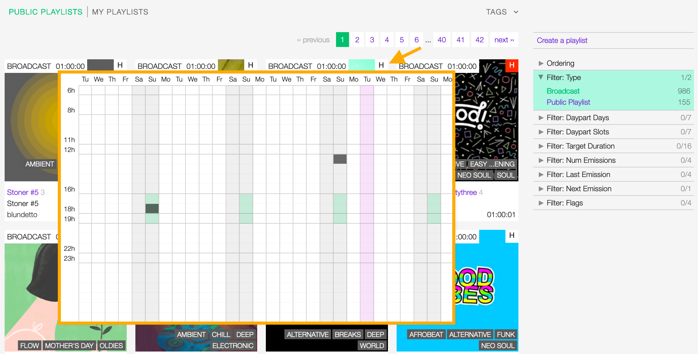

.. |wk-license| replace:: *CC-BY-SA License*
.. _wk-license: https://creativecommons.org/licenses/by-sa/3.0/

.. _playlist:

##############
Playlists
##############

The playlist is a list of :ref:`tracks <track-list>` that is created by the :ref:`user <user>`.

.. _playlist-list:

**************
Playlists list
**************

To access the list of playlists, open the **CONTENT** menu and click on **PLAYLISTS**.

.. figure:: img/content-sub-nav-playlists.png

By default the list is sorted by **Creation date** (descending), the newly created profile is displayed on the top-left
side of the list.

   Click on the active / highlighted option to change the sorting order from 'descending' to 'ascending' (DESC/ASC).

To sort it differently, click on **Ordering** and then on a different options:

* :ref:`Name: <playlist-form-title>` The title of the playlist.
* **Num emissions**: The number of times the playlist was broadcast.
* **Last emission**: The last date the playlist was broadcast.
* **Next emission**: The next date the playlist will be broadcast.
* **Duration**: The duration of the playlist.
* **Last Modified**: The last date the playlist profile was edited.
* **Creation date**: The date the playlist profile was created.

.. _playlist-list-filter:

Filtering the list
==================

The list of playlists can be filtered using the tags or some fields associated to the playlist.

To filter by tags, click on **TAGS** and select one or more tag/s from the list.

.. figure:: img/playlist-list-tags.png

To filter by a specific field, use the **Filters** located on the right side of the page,

.. figure:: img/playlist-list-filters.png

The available filters are:

* **Type**: The type of playlist.
* :ref:`Daypart Days: <playlist-form-best-dayparts>` The day the playlist was designed.
* :ref:`Daypart Slots: <playlist-form-best-dayparts>` The time / slot the playlist was designed.
* :ref:`Target duration: <playlist-form-target-duration>` The target duration of the playlist.
* **Num emissions**: The number of times the playlist was broadcast.
* **Last emission**: The last date the playlist was broadcast.
* **Next emission**: The next date the playlist will be broadcast.
* **Flags**: The flags applied to the playlist (Archived or Include in rotation).

.. note::

  **TAGS** and **Filters** also work in combination. To reset the result-set, Click again on the active tag/s or filter/s.

.. figure:: img/playlist-list-tags-filters.png

   Example: Show all **ELECTRONIC** and **DOWNTEMPO** **Broadcast** playlists sorted by **Creation date**.

.. _playlist-list-card:

The Playlist card
=================

The playlist card is the way the playlist appears in the list. It displays some information of the playlist and it
includes some functions to interact with.

.. figure:: img/playlist-list-card.png

Starting from the top, the information are:

* **Type**: The type of playlist.
* :ref:`Target duration: <playlist-form-target-duration>` The target duration of the playlist.
* **H (History)**: Shortcut to display the broadcast history of the playlist.
* :ref:`Cover art: <playlist-form-cover-art>` The cover art of the playlist.
* :ref:`Tags: <playlist-form-tags>` The tags associated to the playlist.
* :ref:`Title <playlist-form-title>` / count: The title of the playlist / The number of times the playlist was broadcast.
* :ref:`Series name <playlist-form-series-name>` /  :ref:`Series number: <playlist-form-series-number>` The series
  name / number of the playlist.
* **User name**: The name of the user who created the playlist.
* **Actual duration**: The actual duration of the playlist.

To play the playlist, move the cursor over the Cover art and click on the 'Play' icon. The :ref:`popup player <popup-player>`
will open automatically and start playing it.

.. figure:: img/playlist-list-card-play.png

To access additional options, click on **more options** (3 dots), then select one of the available options.

.. figure:: img/playlist-list-card-options.png

The options are:

* **Queue**: Queue the tracks in :ref:`the popup player <popup-player>`.
* **Download**: Download the entire release.
* **Schedule for playout**: Add the playlist to :ref:`the scheduler clipboard <scheduler-clipboard>`.
* **Edit**: Open the :ref:`playlist form <playlist-form>` for the playlist
  *(it is displayed only if you are the creator of the playlist)*.
* **Admin view**: *(Admin only)*.

.. _playlist-list-card-history:

The History tab: Notifications
------------------------------

UNDER CONSTRUCTION

.. figure:: img/playlist-list-card-emission-info.png

.. _playlist-list-card-matrix:

History tab: Emission matrix
----------------------------

UNDER CONSTRUCTION

.. _playlist-profile:

****************
Playlist profile
****************

UNDER CONSTRUCTION

.. _playlist-form:

****************
Playlist form
****************

The playlist form allows to edit the playlist information.

After editing the information, click on **SAVE** to confirm the changes or on **CANCEL** to undo the changes and
reset the form.

Below are described the information open broadcast collect for a playlist.

.. _playlist-form-general:

General
=======

.. figure:: img/playlist-form-general.png

  Mandatory fields are marked with ***** and cannot be omitted.

.. _playlist-form-title:

Title
-----

The title of the playlist.

.. _playlist-form-target-duration:

Target duration
---------------

The target duration of the playlist (required to can transform a 'Public' playlist into 'Broadcast ready').

The value will be compared to the 'actual' duration of the playlist, that is the sum of the tracks duration, including
fades and cue points.

.. _playlist-form-description:

Description
-----------

The description of the release.

.. _playlist-form-cover-art:

Main image
----------

The cover art of the playlist. To upload an image, click on **Browse** and select a picture from the computer file browser.

.. _playlist-form-tags:

Tags
====

One or more keyword/s to help describe the release (i.e. the music genre / style).

.. figure:: img/playlist-form-tags.png

Typing inside the 'Tags' field activates the auto-completion, listing all tags in the library whose name matches the
current text typed in.

Click on the matching tag to select it or hit the 'Enter' key to create a new tag.

.. figure:: img/tags-field-select-create-remove.gif

  To remove a tag click on the 'X' within it.

.. _playlist-form-series:

Series
======

.. figure:: img/playlist-form-series.png

.. _playlist-form-series-name:

Series name
-----------

The name of the series the playlist will be grouped under.

Typing inside the 'Series' field activates the auto-completion, listing all profiles in the library whose name matches
the current text typed in.

Click on the matching profile to select it or on 'Close' to close the list and create a new profile.

.. _playlist-form-series-number:

Series number
-------------

The series number. Leave it empty to let the system apply, or continue, the number progression of the series.

.. _playlist-form-random-rotation:

Random rotation
===============

In broadcasting, rotation is the repeated airing of a limited playlist of songs on a radio station or satellite radio
channel, or music videos on a TV network.
*(From the Wikipedia article* |wk-rotation-music|_ *, which is released under the* |wk-license|_ *).*

.. |wk-rotation-music| replace:: *Rotation (Music)*
.. _wk-rotation-music: https://en.wikipedia.org/wiki/Rotation_(music)

.. _playlist-form-include-rotation:

Include in rotation
-------------------

Include the playlist in the rotation.

.. _playlist-form-rotate-from:

Rotate from
-----------

Define at which date the playlist will be included in rotation.

.. _playlist-form-rotate-until:

Rotate until
------------

Define at which date the playlist will be excluded from rotation.

.. _playlist-form-best-broadcast:

Best broadcast
==============

.. _playlist-form-best-dayparts:

Dayparts
--------

The best dayparts to play the playlist. Please refer to the description below.

In broadcast programming, dayparting is the practice of dividing the broadcast day into several parts, in which a
different type of radio or television program apropos for that time period is aired.
*(From the Wikipedia article* |wk-dayparting|_ *, which is released under the* |wk-license|_ *).*

.. _wk-dayparting: https://en.wikipedia.org/wiki/Dayparting
.. |wk-dayparting| replace:: *dayparting*

.. _playlist-form-best-season:

Seasons
-------

The best 'season' to play the playlist.

.. _playlist-form-weather:

Weather
-------

The best 'weather' to play the playlist.

.. _playlist-form-playlist-editor:

Playlist editor
===============

UNDER CONSTRUCTION

.. _playlist-new-playlist:

*******************
Creating a playlist
*******************

UNDER CONSTRUCTION

.. _playlist-transform-broadcast-ready:

*************************************
Making the playlist 'Broadcast ready'
*************************************

UNDER CONSTRUCTION

