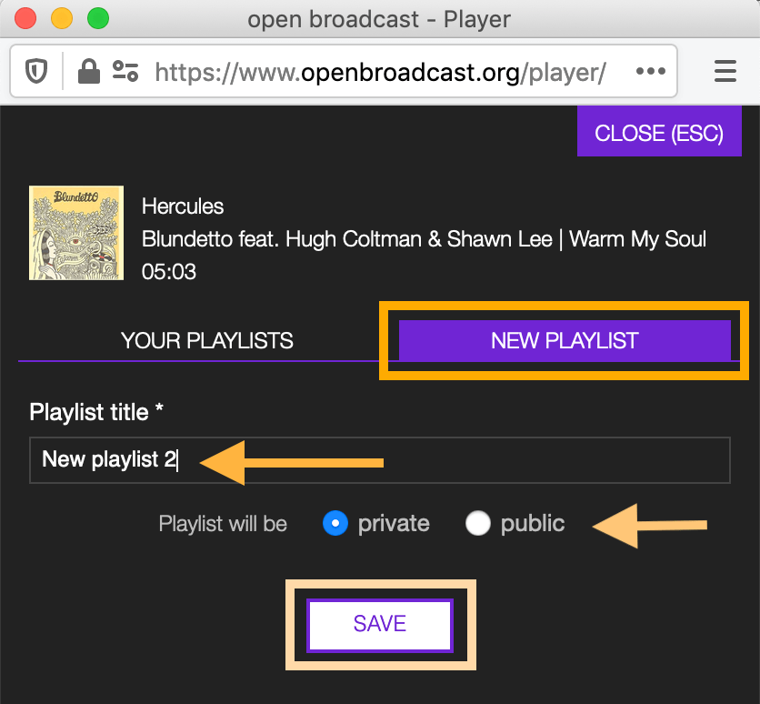

.. _popup-player:

################
The popup player
################

.. _popup-player-overview:

********
Overview
********

The popup player is the media player of the platform. It plays the media files associated with the :ref:`tracks<track>`.

It opens automatically by clicking on the 'Play' or 'Queue' buttons/icons on the platform. When you click 'Play,' it
also automatically starts playing the tracks sequentially (from top to bottom).

.. figure:: img/media-player-how-to-open-to-play-from-releases-list-02.png

  The track currently playing is highlighted in green.

.. note::

  Be sure the browser permissions are set to 'Autoplay' else click on the 'Play' button displayed within the player.

  .. figure:: img/media-player-browser-permission-play.png
     :width: 425px
     :height: 416px

Note that clicking on any 'Play' button on the platform will overwrite the current tracks list with the new selection.

To add tracks to the player use the 'Queue' function instead.

  Click on **more options** (3 dots) to open the menu and then click on **Queue**.

The player also read the cue and fade points of a playlist.

See also:

* :ref:`Changing browser permissions to 'Autoplay' <media-player-how-to-change-browser-permissions-to-autoplay>`

.. _media-player-main-view:

Main view
=========

The main view is composed of the header *(orange)*, the player controls *(blue)*, the tracklist *(green)*, and the
footer *(yellow)* elements.

.. figure:: img/media-player-main-view-overview.png
   :width: 416px
   :height: 600px

The header displays the information of the track currently playing.

The information is:

* The :ref:`title <track-form-title>` of the track.
* The :ref:`name <track-form-primary-artist>` of the artist the track is primarily credited to.
* The :ref:`title <release-form-title>` of the release the track appears on.
* The :ref:`cover art <release-form-cover-art>` of the release the track appears on (right side).

Right below are the media player controls.

   Click on the waveform to move the playing position to a new point.

* **Progress bar**: The frequency waveform of the media file associated with the track.
* **Previous track**: Skip to the previous track in the tracks list.
* **Pause**: Pause the track's media file.
* **Play**: Play the track's media file.
* **Next track**: Skip to the next track in the tracks list.

The following information and functions are available for each track in the tracks list:

* **Play**/**Pause**: Play/pause the track's media file.
* The :ref:`title <track-form-title>` of the track.
* The :ref:`name <track-form-primary-artist>` of the artist | The :ref:`title <release-form-title>` of the release.
* The current playing position/time elapsed from the beginning of the track (light grey).
* The duration of the track.
* **Remove** (one-way icon): Remove the track from the tracks list.
* **Add** (plus icon): Add the track to a playlist.

The footer displays the sum of the duration of the tracks currently in the tracks list.

Click on **ADD ALL TO PLAYLIST** to add the entire tracks list to a playlist.

.. _media-player-playlists-view:

Playlists panel
===============

Every time you click on the **ADD** icon or **ADD ALL TO PLAYLIST** button, it opens the playlists panel.

   Click on **CLOSE** (ESC) to close the panel and return to the main view.

On the top side, it displays the track you want to add to a playlist.

Under **YOUR PLAYLISTS**, you find your 'private' and 'public' playlists. At the top of the list are the playlists
updated more recently.

   Search for a playlist by typing its title inside the 'Search playlists' field.

The following information and functions are available for each playlist in the list:

* The :ref:`cover art <playlist-form-cover-art>` of the playlist.
* The :ref:`title <playlist-form-title>` of the playlist.
* The total duration of the playlist -- The number of tracks on the playlist.
* **ADD & CLOSE**: Add the track(s) to the playlist and close the playlists panel.
* **ADD**: Add the track(s) to the playlist.

Clicking on **NEW PLAYLIST** takes you to the form to create a new playlist.

Complete the information and click on **SAVE**.

See also:

* :ref:`Adding track(s) to existing playlists <media-player-add-track-to-existing-playlist>`
* :ref:`Adding track(s) to a new playlist <media-player-add-track-to-new-playlist>`

.. _media-player-how-to:

*******
How-tos
*******

.. _media-player-add-track-to-existing-playlist:

Adding tracks to an existing playlist
=====================================

Click on the **+** (plus) icon.

When the playlists panel opens, click the **ADD** button within the playlist.

The 'star' icon indicates that the track is now on the playlist. The overall duration and the tracks count of the
playlist updates automatically.

   The 'star' icon always informs you if the track you want to add is already on the playlist(s).

Keep adding the track(s) to other playlists or click on **CLOSE** (ESC) to close the playlists panel.

.. _media-player-add-track-to-new-playlist:

Adding tracks to a new playlist
===============================

Click on the **+** (plus) icon.

When the playlists panel opens:

#. Click on the **NEW PLAYLIST** tab.
#. Type the title of the new playlist.
#. Click on **private** or **public** to define the type of playlist.
#. Click on **SAVE**.

.. note::

  On the platform, a playlist set to 'Private' will not appear in the **PUBLIC PLAYLISTS** :ref:`list <playlist-list>`.
  To access your private playlists, click on **MY PLAYLISTS**.

  .. figure:: img/playlist-list-page-nav-my-playlists-sm.png

The new playlist is created, and the 'star' icon indicates that the track is now on the playlist. The overall duration
and the tracks count of the playlist updates automatically.

.. figure:: img/media-player-how-to-add-track-to-new-playlist-02.png
   :width: 416px
   :height: 328px

   The 'star' icon always informs you if the track you want to add is already on the playlist(s).

Click on **VISIT PLAYLIST** to open the :ref:`playlist profile <playlist-detail>` on the platform or on
**CLOSE (ESC)** to close the playlists panel.

.. _media-player-how-to-change-browser-permissions-to-autoplay:

Changing browser permission to 'Autoplay'
=========================================

When the popup player opens (i.e., Firefox):

#. Click on the 'Lock' icon.
#. Click on the 'Autoplay' dropdown menu to open it.
#. Click on 'Allow Audio and Video.'
#. Click on the 'Lock' icon again to close the panel.