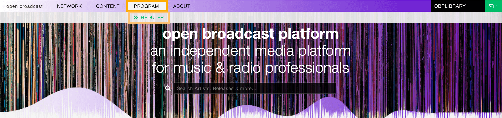
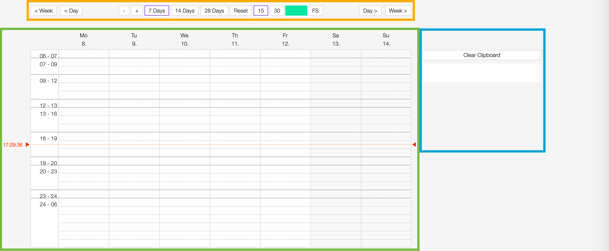
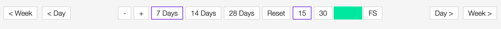
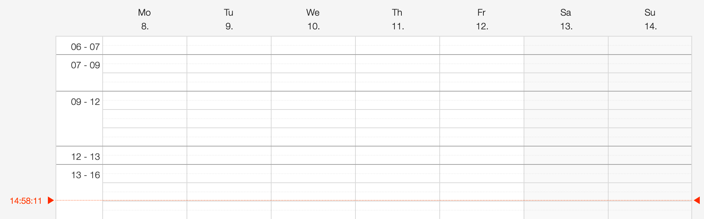
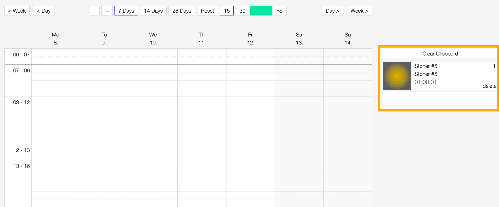
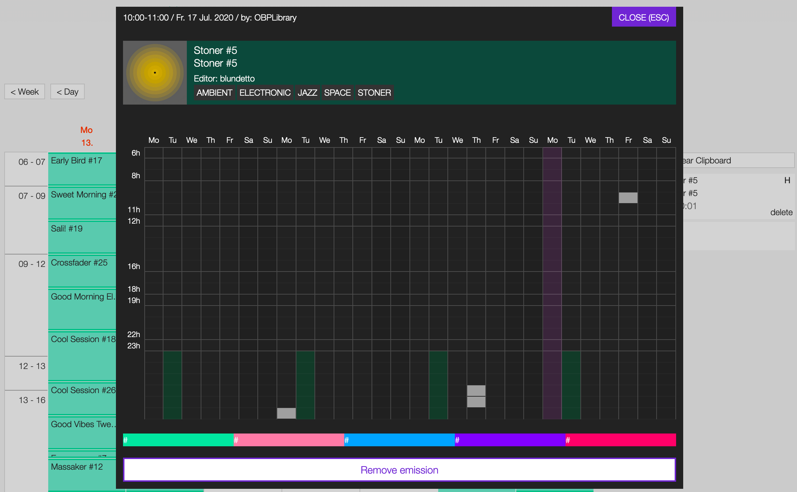
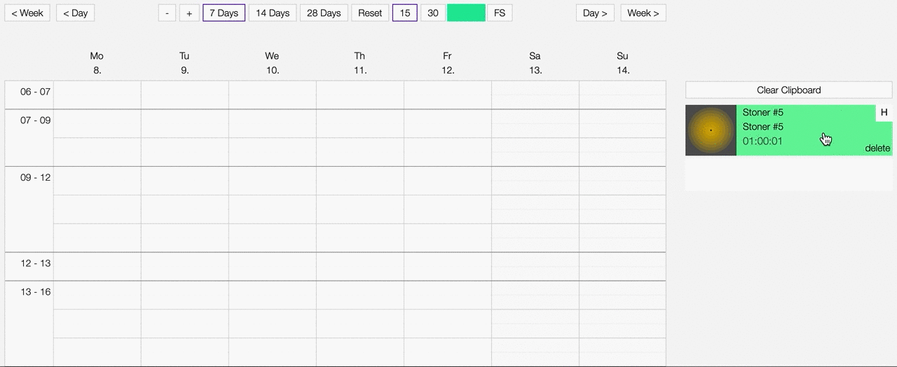
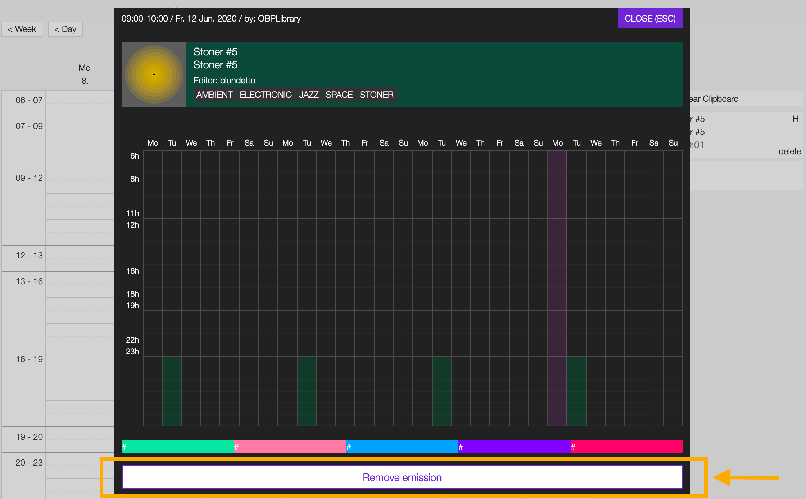

.. _scheduler:

##############
Scheduler
##############

.. _scheduler-introduction:

************
Introduction
************

The scheduler allows to schedule the playlists to broadcast, and it takes care to update the
`playout <https://en.wikipedia.org/wiki/Playout>`__ every time there's a change from one playlist to the other.

To access the 'Scheduler', open the **PROGRAM** menu and click on **SCHEDULER**.

It is composed of 3 elements:

* The :ref:`calendar navigation menu <scheduler-calendar-nav-menu>` (orange).
* The :ref:`calendar <scheduler-calendar>` (green).
* The :ref:`playlists clipboard <scheduler-clipboard>` (blue).

.. _scheduler-calendar-nav-menu:

************************
Calendar navigation menu
************************

The navigation menu allows to customize the calendar view.

The available options are:

* **< Week** / **Week >**: Move one week backward / forward.
* **< Day** / **Day >**: Move one day backward / forward.
* **-** / **+**: Decrease / increase the height of the time slots.
* **7 Days** / **14 Days** / **28 Days**: Change how many days to display.
* **Reset**: Reset settings to the default values.
* **15** / **30**: Change the grid steps from 15 to 30 minutes.
* **Colors**: Change the color of the playlist in the grid (it does not affect the playlists already scheduled).
* **FS**: Switch to full screen (click again to return to the default setting).

.. _scheduler-calendar:

********
Calendar
********

The calendar allows to organize and schedule the playlist(s) on specific days / dayparts.

It is composed of the following elements:

* **X axis**: The name and number of the day (the current day is highlighted in red).
* **Y axis**: The dayparts (from 6 a.m. onwards)
* **Current time cursor**: The cursor displaying the current time / position on the grid (highlighted in red).
* **Grid**: The area to place the playlists to broadcast.

.. _scheduler-clipboard:

*******************
Playlists clipboard
*******************

The clipboard lists the playlists to be scheduled.

Click on **Clear Clipboard** to clear / empty the entire clipboard. To remove a specific playlist, click on the
**delete** button within it.

See also:

* :ref:`Adding a playlist to the scheduler clipboard <playlist-how-to-add-playlist-to-clipboard>`.
* :ref:`Scheduling a playlist to broadcast <scheduler-how-to-schedule-playlist>`.

.. _scheduler-emission-panel:

******************
The emission panel
******************

UNDER CONSTRUCTION

.. _scheduler-how-to:

*******
How tos
*******

.. _scheduler-how-to-schedule-playlist:

Scheduling a playlist
=====================

Drag the playlist from the clipboard and drop it on any empty slot (playlists can't overlap).

See also:

* :ref:`Adding a playlist to the scheduler clipboard <playlist-how-to-add-playlist-to-clipboard>`.

.. _scheduler-how-to-unschedule-playlist:

Unscheduling a playlist
=======================

Double click on the title of the playlist to open the emission panel and click on **REMOVE EMISSION**

.. important::

  Playlists placed in the slots preceding the current day and time cannot be removed.

