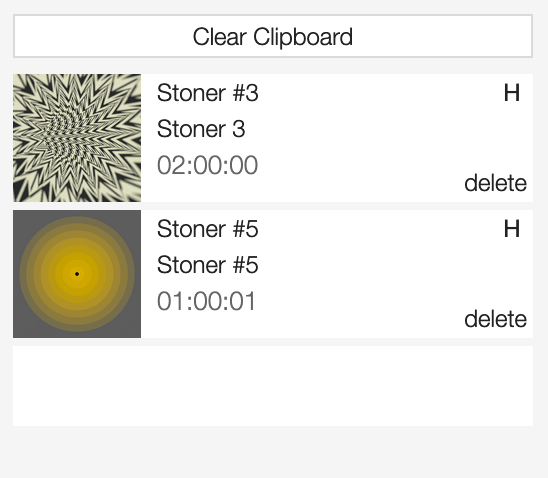
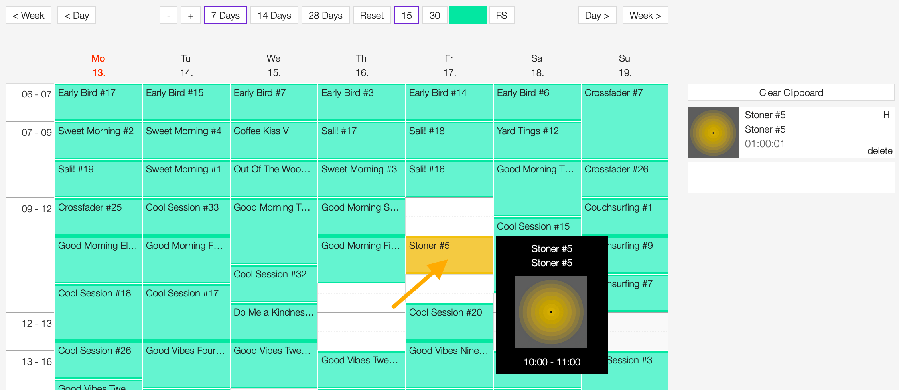

.. _scheduler:

#########
Scheduler
#########

.. _scheduler-overview:

********
Overview
********

The scheduler module allows you to schedule the playlists to broadcast, and it takes care to update the
`playout <https://en.wikipedia.org/wiki/Playout>`__ every time there's a change from one playlist to the other.

To access it, open the **PROGRAM** menu and click on **SCHEDULER**.

.. figure:: img/main-nav-program-scheduler.png

It is composed of three elements:

* The :ref:`calendar navigation menu <scheduler-calendar-nav-menu>` *(orange)*
* The :ref:`calendar grid <scheduler-calendar-grid>` *(green)*
* The :ref:`playlists clipboard <scheduler-clipboard>` *(blue)*

.. figure:: img/scheduler-main-view-overview.png

.. _scheduler-calendar-nav-menu:

Calendar navigation menu
========================

The navigation menu allows customizing the calendar grid.

The available options are:

* **< Week**: Move one week backward.
* **< Day**: Move one day backward.
* **-** - **+**: Decrease - Increase the height of the dayparts.
* **7 Days** - **14 Days** - **28 Days**: Change how many days to display.
* **Reset**: Reset settings to the default values.
* **15** - **30**: Change the grid steps from 15 to 30 minutes.
* **FS**: Switch to full screen (click again on it to reset the view to default settings).
* **Day >**: Move one day forward.
* **Week >**: Move one week forward.

.. _scheduler-calendar-grid:

Calendar grid
=============

The calendar grid is where the playlists are added/scheduled to broadcast on specific days/dayparts.

.. figure:: img/scheduler-main-view-calendar-grid.png

It is composed of the following elements:

* **X-axis**: The name and number of the day (the current day is highlighted in red).
* **Y-axis**: The dayparts (from 6 a.m. onwards)
* **Current time cursor**: The cursor displaying the current time/position on the grid (highlighted in red).
* **Grid**: The area to place the playlists to broadcast.

See also:

* :ref:`Scheduling a playlist to broadcast <scheduler-how-to-schedule-playlist>`

.. _scheduler-clipboard:

Playlists clipboard
===================

The clipboard lists the playlists collected using the **Schedule for playout** function.

Click on **Clear Clipboard** to clear/empty the entire clipboard. To remove a specific playlist, click on the
**delete** button within it.

See also:

* :ref:`Adding a playlist to the scheduler clipboard <scheduler-how-to-add-playlist-to-clipboard>`

.. _scheduler-emission-panel:

The emission panel
==================

Any playlists scheduled to broadcast become an emission. An emission combine both the playlist and the broadcast event
information.

This information is displayed in the emission panel, to open it, double click on the title of the playlist on the grid.

   To close the emission panel, click on the **CLOSE** **(ESC)** button located on the panel's top-right side.

On the top side are displayed the broadcast information, which are:

* The start time - end time of the emission.
* The date of the emission.
* The user who scheduled the emission.

Below is the playlist information:

* The :ref:`cover art <playlist-form-cover-art>` of the playlist.
* The :ref:`title <playlist-form-title>` of the playlist.
* The :ref:`series name <playlist-form-series-name>`/:ref:`Series number <playlist-form-series-number>`.
* The :ref:`user <user>` who created the playlist.
* The :ref:`tags <playlist-form-tags>` associated with the playlist.

The 'Emission matrix' displays:

* **X-axis**: The name of the days (28 days / 4 weeks).
* **Y-axis**: The dayparts (from 6 a.m. onwards)
* **Purple cursor**: It highlights the current day.
* **Green slots**: It highlights the :ref:`dayparts <playlist-form-best-dayparts>` defined by the user.
* **Light grey slots**: The position the playlist is scheduled to broadcast.

**REMOVE EMISSION** removes the emission from the calendar grid.

Note that some information is also visible by moving the cursor over the playlist on the grid.

A pop-up window will display the following information:

* The :ref:`title <playlist-form-title>` of the playlist.
* The :ref:`series name <playlist-form-series-name>`/:ref:`series number <playlist-form-series-number>`.
* The :ref:`cover art <playlist-form-cover-art>` of the playlist.
* The start time/end time of the emission.

See also:

* :ref:`Scheduling a playlist <scheduler-how-to-schedule-playlist>`
* :ref:`Unscheduling a playlist <scheduler-how-to-unschedule-playlist>`

.. _scheduler-how-to:

*******
How-tos
*******

.. _scheduler-how-to-add-playlist-to-clipboard:

Adding a playlist to the scheduler clipboard
============================================

Go the :ref:`playlists list <playlist-list>` page, click on **more options** (3 dots) within the playlist, and then
click on **Schedule for playout**.

The playlist is added automatically to the :ref:`scheduler clipboard <scheduler-clipboard>`.

.. _scheduler-how-to-schedule-playlist:

Scheduling a playlist
=====================

Drag the playlist from the clipboard and drop it on an empty slot.

The playlist is now scheduled to broadcast.

.. note::

   Playlists can't overlap.

See also:

* :ref:`Adding a playlist to the scheduler clipboard <scheduler-how-to-add-playlist-to-clipboard>`

.. _scheduler-how-to-unschedule-playlist:

Unscheduling a playlist
=======================

Double click on the title of the playlist on the grid to open the emission panel.

Click on **REMOVE EMISSION**.

The playlist is now removed.

.. important::

   Playlists that were broadcast cannot be removed.
