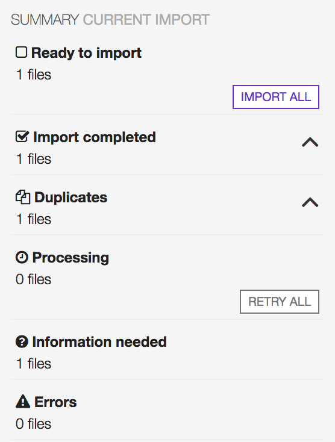

#######
Upload
#######

A guide to :ref:`upload <uploading_files>` and :ref:`import <importing_files>` audio files (recordings) in the library.

.. _uploading_files:

***************
Uploading files
***************

#. To start uploading audio files, open the 'CONTENT' menu and click on 'UPLOAD'.

    .. figure:: img/upload_001.png

        Move the cursor over 'CONTENT' and click on 'UPLOAD'.

#. Create a new upload session by clicking on 'UPLOAD MUSIC'.

    .. figure:: img/upload_002.png

        Below are listed the previous upload sessions.

#. Confirm that you agree to the 'Terms & Conditions' and that you have read the 'documentation'. Then click on 'AGREE & CONTINUE'.

    .. figure:: img/upload_003.png

        Use 'Notes' field to add information about the new upload session (optional).

#. To add audio files, click on 'ADD FILES' or drag-n-drop them from the desktop or file browser into the white box.

    .. warning::

        Currently supported audio formats are mp3, m4a, wav, ogg and flac.

    .. figure:: img/upload_004.png

#. Upload will starts automatically.

    .. figure:: img/upload_005.png

        If the upload doesn't start automatically, click on 'START UPLOAD'.

Once the upload is completed, the files will have to be :ref:`imported <importing_files>`.

.. _importing_files:

***************
Importing files
***************

To assist the importing procedure, a preliminary analysis is performed on the files and one of the following situations will be presented:

* :ref:`Mandatory information <mandatory_information>` are missing and must be filled in to continue importing the file.
* The file was recognized as :ref:`duplicate <duplicate_file>` (it already exists in the library) and a choice is required.
* The file was :ref:`pre-tagged <pretagged_file>` with `Picard <https://picard.musicbrainz.org/>`_ and was automatically imported in the library.

Import summary
===============

The 'Summary Current Import' displays the status of the whole import session.

Legend:

* **Ready to import:** file/s ready to be imported in the library (the :ref:`mandatory information <mandatory_information>` has been completed).
* **Import completed:** file/s imported in the libray (file/s :ref:`pre-tagged <pretagged_file>` with Picard is/are automatically imported in the library).
* **Duplicates:** file/s recognized as :ref:`possible duplicate <duplicate_file>` (already existing in the library).
* **Processing:** file/s has been processed (placed in the import queue).
* **Information needed:** file/s missing :ref:`mandatory information <mandatory_information>` to continue importing.
* **Errors:** errors occurred while uploading / importing.

.. _mandatory_information:

Fill in mandatory information
=============================

Mandatory information ('Selected information') are required to import and organize the file/s in the library.

The minimum information required are:

* **Title:** The title of the recording (track).
* **Release:** The name of the release the recording (track) appear on.
* **Artist:** The name of the artist(s) that the recording is primarily credited to.

.. note::

    More information (i.e. cover art, record label or additional artists) can be can be added at a later stage using the respective :ref:`release <release_form>`, :ref:`artist <artist_form>`, :ref:`track <track_form>` or :ref:`label <label_form>` forms.

To assist the editing procedure, the following information and functions are included in the recording form:

.. figure:: img/import_001.png

    Thumb will switch to 'Up' once mandatory information are completed.

* **Filename (A):** the original filename and audio format (as displayed in the computer file browser).
* **Metadata (B):** the information contained in the file (visible on common media players).
* **Selected information (C):** the mandatory information.
* **Remove file** Remove and don't import the file.
* **Scan again** Generates an acoustic ID and use it to find matching recordings on Musicbrainz.
* **Continue import** Import the file (mandatory information must be filled in).

Mandatory information can be entered :ref:`manually <manual_editing>`, copied from the :ref:`metadata container <copying_metadata>` or from a :ref:`match found on Musicbrainz <match_on_musicbrainz>`.

.. _manual_editing:

Manual editing
--------------
Move the cursor over a field and click on it to start entering information.
Typing inside the 'Release' and 'Artist' fields activate the auto-completion, recommending profiles already in the library.
Click on a recommended profile to select it or outside the field to create a new one.

The following examples show how to 'create' a new release and 'assign' it to an existing artist.

.. _creating_new_profile:

Creating a new release profile
^^^^^^^^^^^^^^^^^^^^^^^^^^^^^^^

To create a new 'Release', type the release title and click outside the field to confirm it.

.. figure:: img/import_mn_001.png

    Clicking outside the field also close the auto completion matches list (implies that nothing was selected / a new release profile will be created).

.. figure:: img/import_mn_002.png

    **'+ Create'** confirms that a new release profile will be created.

.. hint::

    #. To change release, click inside the 'Release' field and enter again the release title (reactivates autocomplete).
    #. If all uploaded files share the same release title (i.e. an album or compilation), click on **'Apply Release to all'** to complete all 'Release' fields at one go.

.. _assigning_to_profile:

Assigning an artist profile
^^^^^^^^^^^^^^^^^^^^^^^^^^^

To assign a recording to an existing artist, click on a profile recommended by the auto completion.

.. figure:: img/import_mn_003.png

    Highlight profile and click on it to select it.

.. figure:: img/import_mn_004.png

    **'Assigned'** confirms that artist profile was assigned with success (move the cursor over 'Assigned' to display assigned profile).

.. hint::

    #. To create a new artist profile click on **'Force Creation'**.
    #. To change artist, click inside the 'Artist' field and enter again the artist name (reactivates autocomplete).
    #. If all files share the same artist name (i.e. an album, ep), click on **'Apply Artist to all'** to complete all 'Artist' fields at one go.

Once mandatory information are completed, click on 'CONTINUE IMPORT' to import the file in the library.

.. figure:: img/import_mn_005.png

    Note the 'Thumb' switched to Up (ready to be imported).

.. _copying_metadata:

Copying metadata
----------------

Mandatory fields can be filled at one go by copying the information available in the metadata container.
To do so, highlight the metadata box and click anywhere in it.

.. figure:: img/import_mt_001.png

    Click anywhere inside the metadata box to transfer information.

.. figure:: img/import_mt_002.png

    A green checkmark informs copy was successfully completed.

Verify accuracy of release and artist information as described :ref:`here <creating_new_profile>` and click on 'CONTINUE IMPORT' to import the file.

.. _match_on_musicbrainz:

Selecting a match on Musicbrainz
--------------------------------

A match with a recording on `Musicbrainz <https://musicbrainz.org/>`_ was found using the `Acoustic ID <https://acoustid.org/>`_.
When found, matches are listed between the 'File metadata' and 'Selected information' (mandatory fields).

.. figure:: img/import_mb_001.png

Select one of the proposed match.

.. figure:: img/import_mb_002.png

    A green checkmark will highlight the chosen match.

Click on 'CONTINUE IMPORT' to import the file.

.. figure:: img/import_mb_003.png

.. _duplicate_file:

Possible duplicate
==================

A match with a recording in the library was found.

.. figure:: img/import_dp_001.png

    Click on the track title to open the recording profile and verify the accuracy of the match.

Click on 'REMOVE FILE' to remove and don't import the uploaded file or on 'Re-IMPORT FILE' if the file was not a duplicate (wrong match).
When clicking on 'Re-IMPORT FILE', one of the situations described :ref:`here <importing_files>` will be presented.

.. _pretagged_file:

Pre-tagged file
================

The analysis discovered a `Musicbrainz ID <https://musicbrainz.org/doc/MusicBrainz_Identifier>` inside the metadata container and the file was automatically imported in the library.
This happens when a file is previously tagged using `Picard <https://picard.musicbrainz.org/>`, a desktop music tagger by `Musicbrainz <https://musicbrainz.org/>`.

.. figure:: img/import_pt_001.png

.. figure:: img/import_pt_002.png
