.. _upload:

#######
Upload
#######

The following guidelines will help upload, review and import audio files in the library.

.. _new-upload:

***************
Uploading files
***************

To start uploading audio files, open the **CONTENT** menu and click on **UPLOAD**.

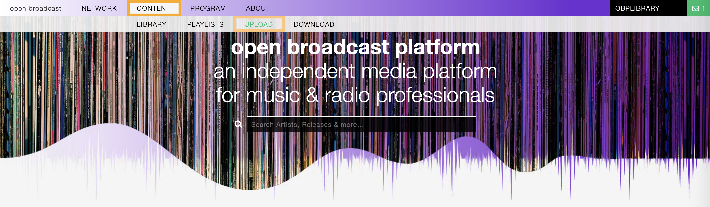

Click on **ACCEPT TERMS & UPLOAD MUSIC** to create a new upload session.

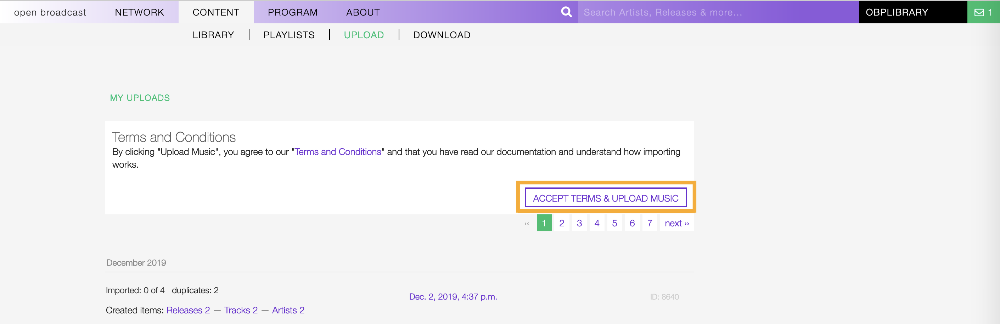

Confirm that you agree to the **Terms & Conditions** and that you have read the **documentation**. Then click on
**AGREE & CONTINUE**.

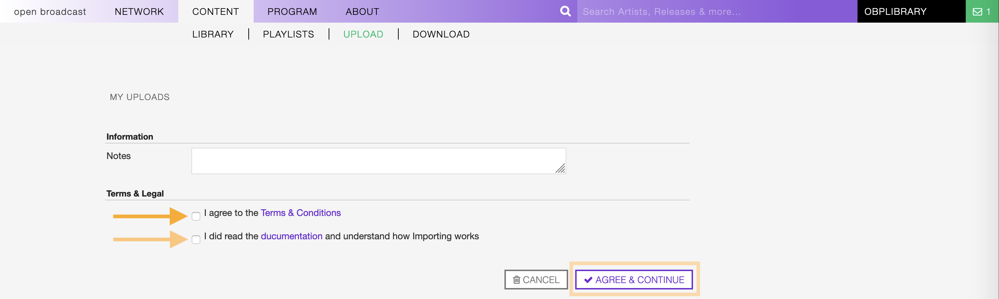

   Use the 'Notes' field to add extra information about the upload (optional).

Click on **ADD FILES** to open the computer file browser and select the files or drag-n-drop the files into the white frame.

.. warning::

   Currently supported audio formats are mp3, m4a, wav, ogg and flac.

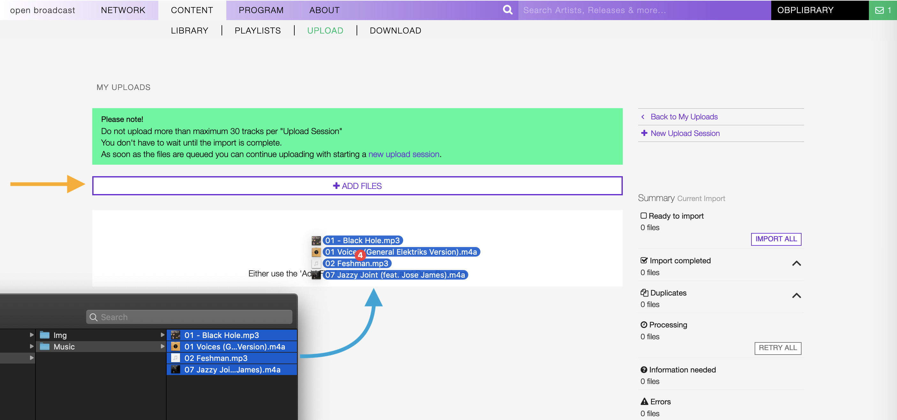

   Upload will starts automatically.

.. note::

   While the file is uploaded, it is processed to extract the music information / metadata stored in it (i.e. ID3 container
   for mp3 files or Vorbis for Flac files).

   In addition, an audio fingerprint will be generated. The information will help to:

   * Manage and discover duplicates in the library.
   * Find matches on `Musicbrainz <https://musicbrainz.org/>`__, an open music encyclopedia that collects music metadata
     and makes it available to the public.

.. _review-import-upload:

***************************
Reviewing & importing files
***************************

Depending on the result of the processing, one of the following situations will be presented:

* Mandatory information are missing and must be filled in to continue importing the file.

  .. figure:: img/review-mandatory-information.png

     Read more about in the chapter: :ref:`Completing mandatory information <review-mandatory-information>`.

* The file was recognized as duplicate (may already exists in the library) and a choice is required.

  .. figure:: img/review-possible-duplicate.png

     Read more about in the chapter: :ref:`Managing duplicate files <review-possible-duplicate>`.

* The audio file (recording) matches with a recording on `Musicbrainz <https://musicbrainz.org/>`_ and a choice is required.

  .. figure:: img/review-match-on-musicbrainz.png

     Read more about in the chapter: :ref:`Selecting a match on Musicbrainz <review-match-on-musicbrainz>`.

* The file was pre-tagged with `Picard <https://picard.musicbrainz.org/>`_ and was automatically imported in the library.

  .. figure:: img/review-pre-tagged-file.png

     Read more about in the chapter: :ref:`Files pre-tagged using Picard <review-pre-tagged-file>`.

The state of the current session is displayed on the right side of the page, and it automatically updates whenever
the information are completed or an action is taken on a file.

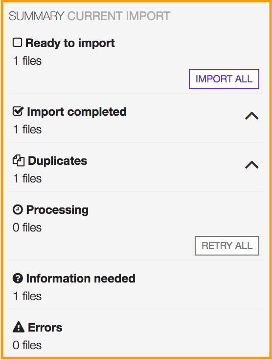

The summary includes:

* **Ready to import:** The file(s) ready to be imported in the library.
* **Import completed:** The file(s) imported in the library.
* **Duplicates:** The file(s) recognized as :ref:`possible duplicate <review-possible-duplicate>`.
* **Processing:** The file(s) has been processed (placed in the import queue).
* **Information needed:** The file(s) missing :ref:`mandatory information <review-mandatory-information>`.
* **Errors:** The errors occurred uploading / importing file(s).

.. hint::

  Complete the information for each file and click on **Import all** to import all files at one go.

.. _review-mandatory-information:

Completing mandatory fields
===========================

The 'import card' of the file includes various information and tools to help complete the mandatory fields.

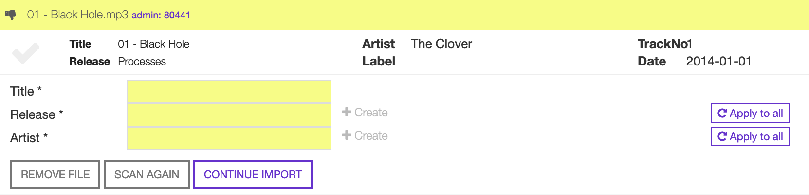

It consists of the following elements:

**Header:** It shows the original filename and audio format of the file (as displayed in the computer file browser).

   thumb turns 'up' as soon as mandatory fields are completed.

**File metadata:** The information found in the metadata container of the file (as displayed on most audio players).

**Mandatory information:** The required information in order to continue importing the file.

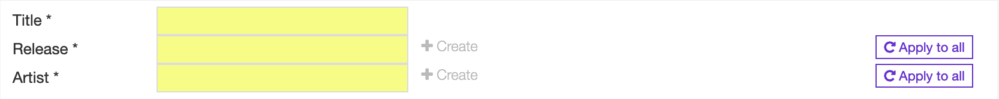

* **Title:** The title of the recording.
* **Release:** The name of the release the recording appear on.
* **Artist:** The name of the artist(s) the recording is primarily credited to.

**Actions**: The actions you can take on the file.

* **Remove file:** Remove and don't import the file.
* **Scan again:** Create an audio fingerprint and search matches on Musicbrainz (`acoustic ID <https://acoustid.org/>`_).
* **Continue import** Import the file.

The mandatory information can be entered manually or populated with the file metadata.
(read more about in the chapter: :ref:`completing mandatory fields using metadata <complete-mandatory-with-metadata>`).

.. _complete-mandatory-manually:

Completing information manually
-------------------------------

To start completing the information, click on the 'Title' field and type the text in it. Once entered, click outside the
field to confirm the entry. Repeat the step for the 'Release' and 'Artist' fields.

Note that typing inside the 'Release' or 'Artist' fields activate the auto-completion, listing all profiles in the
library whose name matches the current text typed in.

Click on the matching profile to select it or outside the list to close it and create a new profile.

The following examples show how to create a new release for the recording and assign it to an artist in the library.
The procedures are interchangeable.

.. _create-release-for-media:

Creating a new release profile
^^^^^^^^^^^^^^^^^^^^^^^^^^^^^^^

When the auto-completion opens up, click outside the list to close it.

.. figure:: img/media-card-create-release.gif

  **'+ Create'** confirms that a new release profile will be created.

.. hint::

   * If the system performs unwanted assignments, click on **'Force Creation'** to ensure that a new profile will be created.
   * To change the 'Release', click on the field and enter again the title (reactivates auto completion).
   * If all the recordings in the current import session appear on the same release (i.e. an album), type the 'Release'
     title only in the first card and click on **'Apply to all'** to complete all the others 'Release' fields at one go.

.. _assign-artist-to-media:

Assigning an artist profile
^^^^^^^^^^^^^^^^^^^^^^^^^^^

When the auto-completion opens up, click on the matching profile to select it and assign it to the recording.

.. figure:: img/media-card-assign-artist.gif

   **'Assigned'** confirms the assignment. Move the cursor over it to display the artist the recording was assigned to.

.. hint::

   * If the system performs unwanted assignments, click on **'Force Creation'** to ensure that a new profile will be
     created.
   * To change the 'Artist', click on the 'Artist' field and enter again the name (reactivates autocomplete).
   * If all the recordings in the current import session are credited to the same artist (i.e. an album), type the
     'Artist' name only in the first card and click on **'Apply to all'** to complete all the others 'Artist' fields at
     one go.

.. note::

  More information (i.e. cover art, record label or additional artists) can be added at a later stage, using the
  respective :ref:`release <release-form>`, :ref:`artist <artist-form>`, :ref:`track <track-form>` or
  :ref:`label <label-form>` form.

Once the mandatory information are complete, click on **CONTINUE IMPORT** to import the file in the library.

  The green color confirms the import was successful.

Click on the title to visit the :ref:`track profile <track-profile>`, on the artist name to visit the
:ref:`artist profile <artist-profile>` the track was credited to, or on the release title to visit the
:ref:`release profile <artist-profile>` the track appears on.

.. _complete-mandatory-with-metadata:

Completing information using metadata
-------------------------------------

Click anywhere on the 'File metadata' element to transfer the content to the respective required fields

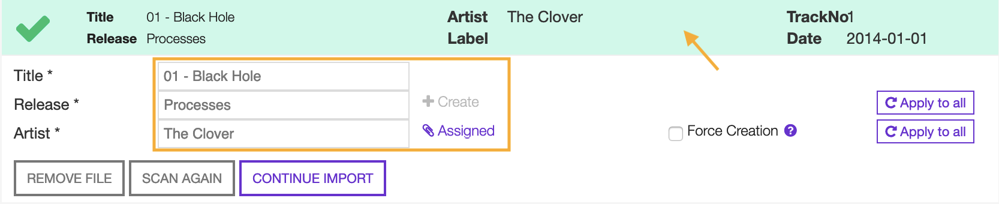

    The green check mark confirms the transfer was successful.

Verify the accuracy of the information and the assignments as described :ref:`here <create-release-for-media>`.

Click on **CONTINUE IMPORT** to import the file.

.. _review-match-on-musicbrainz:

Selecting a match on Musicbrainz
================================

'Possible releases' lists all recordings found on musicbrainz matching with the audio fingerprint generated for the file.
(`Acoustic ID <https://acoustid.org/>`_).

Click on a match to transfer the information.

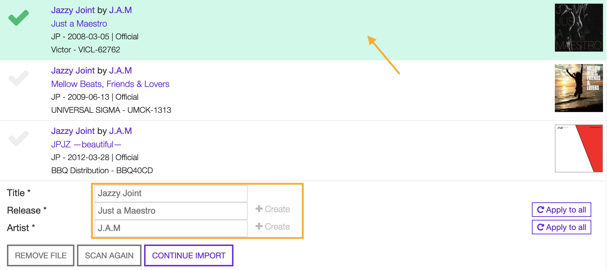

    A green check mark will highlight the chosen match.

Click on **CONTINUE IMPORT** to import the file in the library.

.. _review-possible-duplicate:

Managing a possible duplicate
==============================

'Possible duplicate' indicates the recording may already exist in the library.

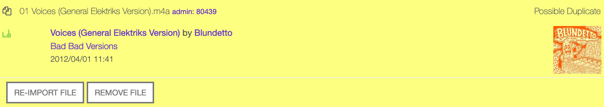

The options are:

#. Click on **REMOVE FILE** to remove and don't import the file.
#. Click on **RE-IMPORT FILE** to ignore the warning (i.e false positive)
   (wrong match).

After clicking on **RE-IMPORT FILE**, you may need to :ref:`review the mandatory information <review-mandatory-information>`.

.. hint::

 To verify the accuracy of the detection, right click on the title of the 'possible match' and select 'open in a new tab'.
 Check the duration or listen to the audio file to be sure it was not a *False Positive* case.

.. _review-pre-tagged-file:

Pre-tagged file
================

File(s) previously tagged using the Picard tag editor are automatically imported in the library (no additional steps required).

`Picard <https://picard.musicbrainz.org/>`__ is a desktop music tagger by `Musicbrainz <https://musicbrainz.org/>`__,
which insert identifiers
(`Musicbrainz ID <https://musicbrainz.org/doc/MusicBrainz_Identifier>`__) in the metadata container of the file.

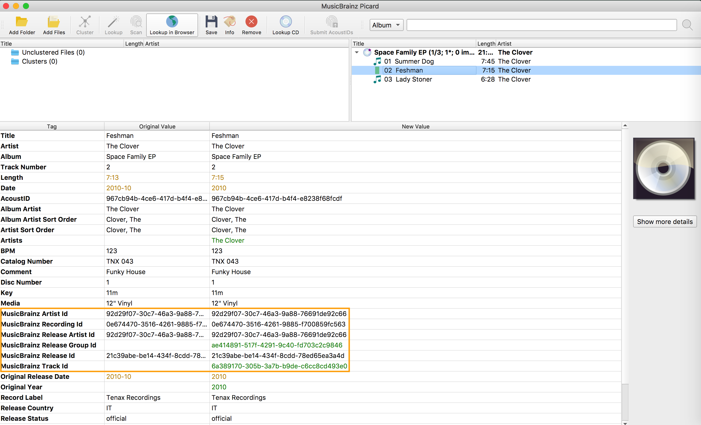

The identifiers are used by the system to find matches and keep organized the file(s) in the library.