Upload
=======

A guide to upload and import audio files in the music library.

***************
Uploading files
***************

#. To start uploading audio files, open the 'CONTENT' menu and click on 'UPLOAD'.

    .. figure:: img/upload_001.png

        Move the cursor over 'CONTENT' and click on 'UPLOAD'.

#. Create a new upload session by clicking on 'UPLOAD MUSIC'.

    .. figure:: img/upload_002.png

        Below are listed the previous upload sessions.

#. Confirm that you agree to the 'Terms & Conditions' and that you have read our 'documentation'. Then click on 'AGREE & CONTINUE'.

    .. figure:: img/upload_003.png

        Use 'Notes' field to add information about the new upload session (optional).

#. To add audio files, click on 'ADD FILES' or drag-n-drop them from your desktop / file browser into the white box.

    .. warning::

        Currently supported audio formats are mp3, m4a, wav, ogg and flac.

    .. figure:: img/upload_004.png

#. Upload will starts automatically.

    .. figure:: img/upload_005.png

        If the upload doesn't start automatically, click on 'START UPLOAD'.

***************
Importing files
***************

Once the upload is complete, one of the following situations will be presented for each file:

        #. :ref:`Mandatory <Mandatory_information>` information must be filled in to continue importing the file.
        #. The file was recognized as :ref:`duplicate <Duplicate_File>` (it's already available in the library).
        #. The file was :ref:`pre-tagged <Pretagged_File>` with Picard and was automatically imported in the library.

.. _Mandatory_information:

Fill in mandatory information
-----------------------------

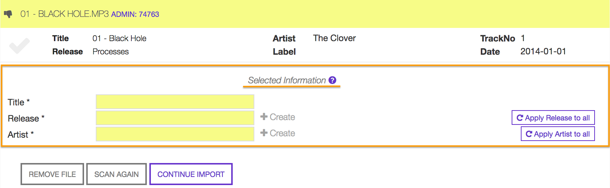

Mandatory information ('Selected information') consists in track title, release title and artist name.

Additional information and functions are available for each file:

    * **A.** The original filename and audio format (as displayed in the computer file browser).
    * **B.** Metadata information contained in the audio file (visible on common media players).
    * **C.** Mandatory information.
    * **Remove file** Remove and don't import the file.
    * **Scan again** Generates an acoustic ID for the file and use it to find matching recordings on Musicbrainz.
    * **Continue import** Import the file (mandatory information must be filled in).

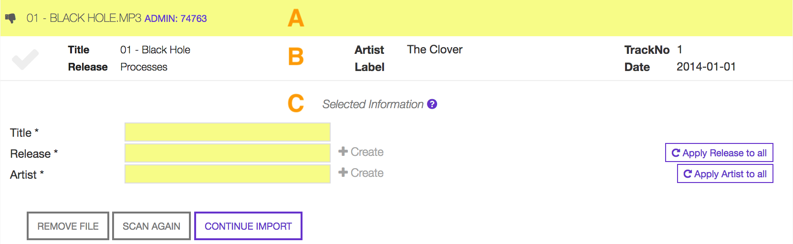

    Thumb will switch to 'Up' once mandatory information are provided.

Mandatory information can be entered :ref:`manually <Manual_editing>`, copy/pasted from the :ref:`metadata container <Metadata_edit>` or from a :ref:`match on Musicbrainz <Mbrainz_edit>`.
More information like record label or track credits can be entered in a second stage using the respective 'Release', 'Artist', 'Track' or 'Label' forms.

.. _Manual_editing:

Manual editing
^^^^^^^^^^^^^^
Click inside a field to enter information. Starting to write inside the 'Release' and / or 'Artist' fields will activate the auto-completion listing already existing profiles.

The following examples show how to 'create' a new release and 'assign' it an existing artist.

.. _Create_new_profile:

Creating a new release profile
"""""""""""""""""""""""""""""""""""""

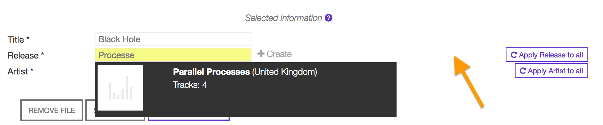

    Click outside the list to close it (implies the creation of a new profile).

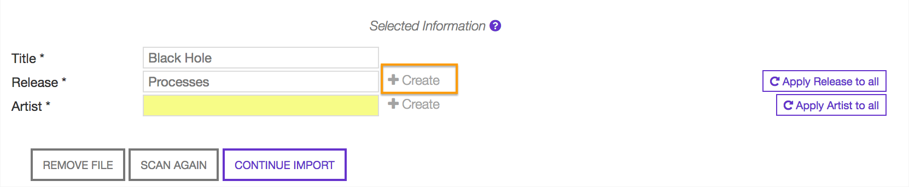

    **'+ Create'** confirms that a new release profile will be created.

.. hint::

    #. To change release click inside the release field and enter again the release title (reactivates autocomplete).
    #. If all files share the same release title (i.e. an album or compilation), click on **'Apply Release to all'** to complete all 'release' fields at one go.

.. _Assign_to_profile:

Assigning an artist profile
""""""""""""""""""""""""""""

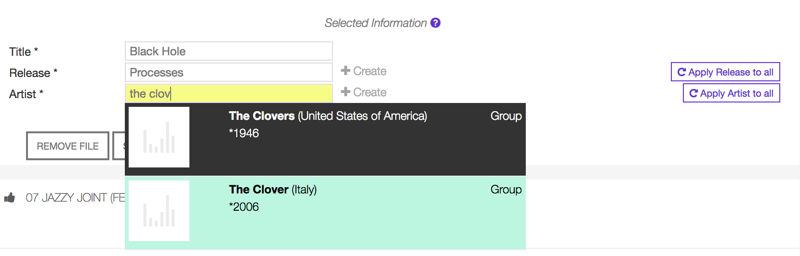

    Highlight profile and click on it to select it.

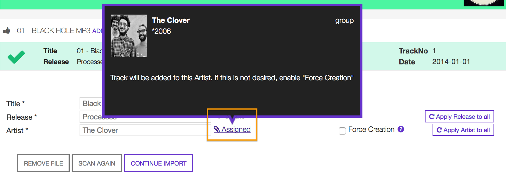

    **'Assigned'** confirms that artist profile was assigned with success (move the cursor over 'Assigned' to display assigned profile).

.. hint::

    #. To create a new artist profile click on **'Force Creation'**.
    #. To change artist click inside the artist field and enter again the artist name (reactivates autocomplete).
    #. If all files share the same artist name (i.e. an album, ep), click on **'Apply Artist to all'** to complete all 'artist' fields at one go.

Once mandatory information are completed, click on 'CONTINUE IMPORT' to import the file in the library.

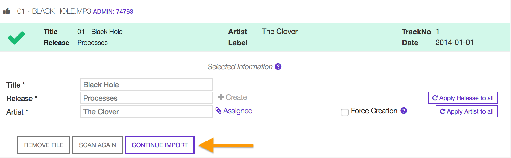

    Note 'Thumb' is Up (ready to be imported).

.. _Metadata_edit:

Copy from metadata container
^^^^^^^^^^^^^^^^^^^^^^^^^^^^

If available, mandatory information can be transferred from the file metadata container.

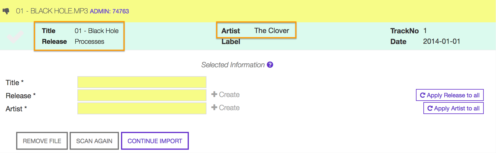

    Click anywhere inside the metadata container row to transfer information.

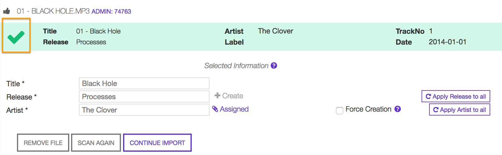

    A green checkmark informs copy was successfully completed.

Verify release / artist information and continue importing following the steps described :ref:`here <Create_new_profile>`.

.. _Mbrainz_edit:

Copy from Musicbrainz match
^^^^^^^^^^^^^^^^^^^^^^^^^^^

After uploading, an `Acoustic ID <https://acoustid.org/>`_ for the file is generated and used to find matching recordings on Musibrainz database.
If available, matches are listed between the 'File metadata' and 'Selected information' (mandatory fields).

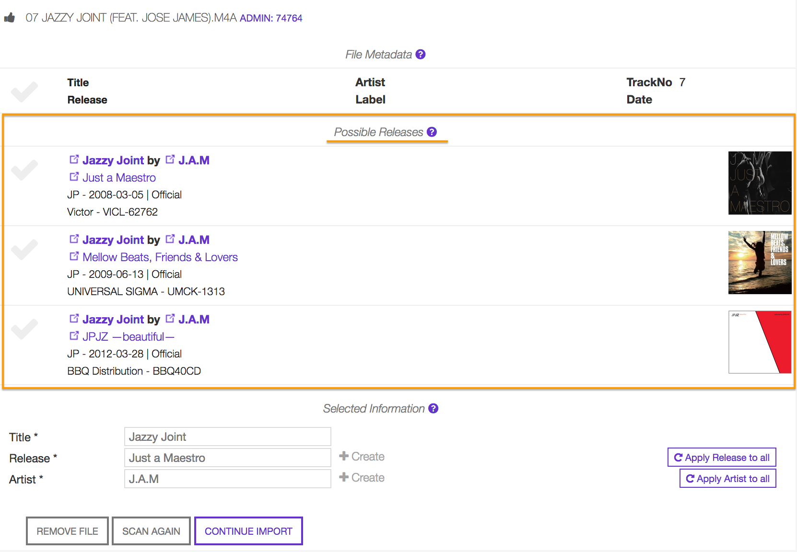

Select one of the proposed match,

.. figure:: img/import_mb_002.png

    A green checkmark will highlight the chosen match.

Click on 'CONTINUE IMPORT' to import the file.

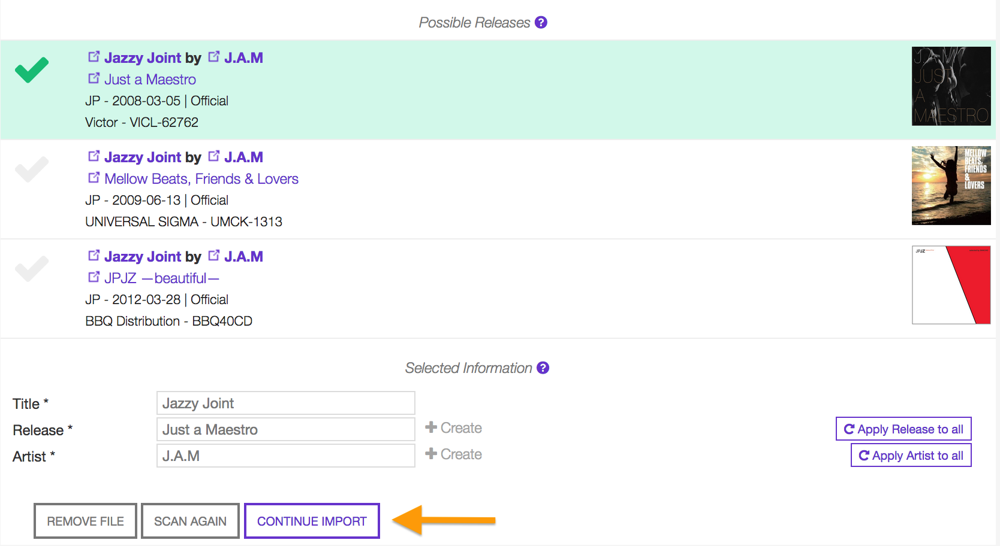

.. _Duplicate_File:

Possible duplicate
--------------------

After uploading, an audio fingerprint is generated and used to find match with recordings in the library.
If a file already exists, a "possible duplicate" box will be displayed:

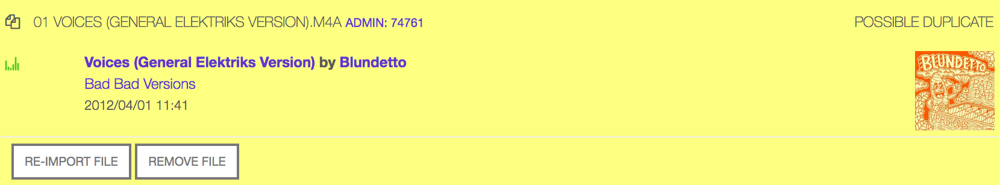

Click on 'REMOVE FILE' to don't import it again or on 'Re-IMPORT FILE' if the file is not a duplicate (wrong recognition).
One of the situations described :ref:`here information <Mandatory_information>` will occur.

.. _Pretagged_File:

Pre-tagged
--------------------

During the analysis, a Musicbrainz Identifier code has been found inside the container of the file (metadata).
This happens when the file was previously tagged using Picard, a desktop music tagger developed by Musicbrainz.
When audio files are previously tagged with Picard, after being uploaded they will be automatically imported in the library.

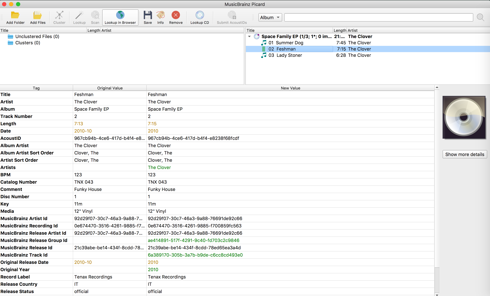
