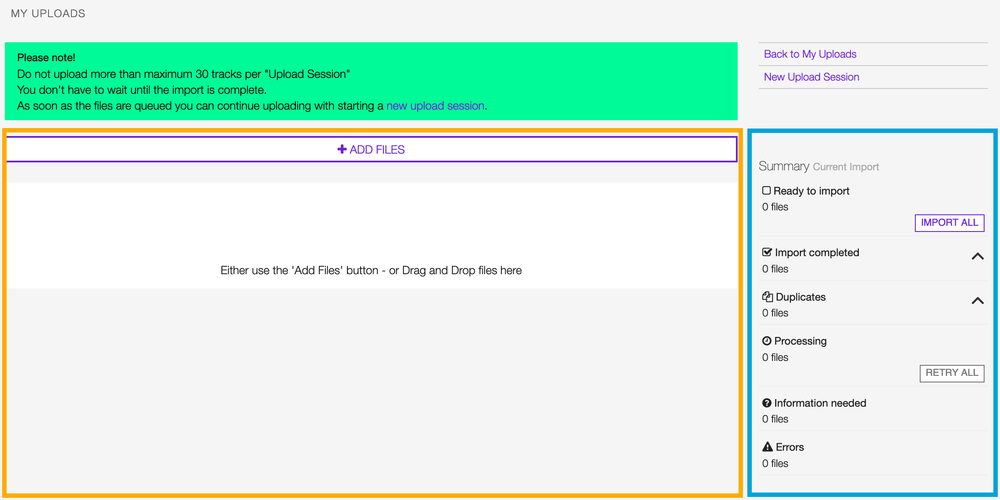

.. _upload:

#######
Upload
#######

.. _upload-overview:

********
Overview
********

The upload module allows you to upload and import recordings (audio files) in the library.

To access it, open the **CONTENT** menu and click on **UPLOAD**.

.. figure:: img/main-nav-content-upload.png

Click on **ACCEPT TERMS & UPLOAD MUSIC** to confirm that you agree to our
`Terms & Conditions <https://www.openbroadcast.org/about/terms-and-conditions/>`__ and that you have read this
:ref:`documentation <upload>` and understand how importing works.

.. figure:: img/upload-how-to-accept-terms.png

The module is composed of 2 elements:

* The area where the uploaded files are listed *(orange)*.
* The summary of the current upload session *(blue)*.

See also:

* :ref:`Uploading files <upload-new-upload-upload-file>`

.. _upload-media-info-card:

File info card
==============

The 'info card' displays various information associated with each uploaded file.

The card's appearance will vary depending on the processing result (more information is available
:ref:`here <upload-new-upload-upload-file>`),

Below the most common one, which alerts that information about the recording is missing (yellow fields).

.. figure:: img/upload-media-card-overview.png

It is composed of the following elements:

Header
------

The original filename and file extension (as displayed in the computer file browser).

.. figure:: img/upload-media-card-header.png

File metadata
-------------

The meta-information about the recording found in the file's metadata container (i.e., ID3 for mp3 files or Vorbis
for Flac files).

.. figure:: img/upload-media-card-metadata.png

Mandatory information
---------------------

The necessary information about the recording (the content of the audio file).

.. figure:: img/upload-media-card-mandatory-fields.png

Which is:

* **Title:** The title of the recording.
* **Release:** The title of the release the recording appears on.
* **Artist:** The name of the artist(s) the recording is primarily credited.

.. note::

   You can add more information later using the specific :ref:`release <release-form>`, :ref:`artist <artist-form>`,
   :ref:`track <track-form>`, or :ref:`label <label-form>`  forms (i.e., cover art, record label, additional artists, etc.).

Actions
-------

The actions you can take on the file, which are:

.. figure:: img/upload-media-card-footer-functions.png

* **Remove file**: Remove and don't import the file.
* **Scan again**: Create an audio fingerprint and search matches on Musicbrainz (`acoustic ID <https://acoustid.org/>`_).
* **Continue import**: Import the file.

See also:

* :ref:`Reviewing the files information <upload-new-upload-review-file>`

.. _upload-summary-current-import:

Summary panel
=============

The state of the current upload session automatically updates whenever the information is completed, or an action is
taken on the file(s) in the review/import area.

The summary includes:

* **Ready to import:** The number of files ready to be imported in the library.
* **Import completed:** The number of files imported in the library.
* **Duplicates:** The number of files recognized as :ref:`a possible duplicate <review-possible-duplicate>`.
* **Processing:** The number of files that have been processed (placed in the import queue).
* **Information needed:** The number of files missing :ref:`mandatory information <review-mandatory-information>`.
* **Errors:** The number of errors occurred in uploading files / importing recordings.

Note that sessions can be interrupted and resumed later. The history is available on the **UPLOAD** page under **MY UPLOADS**.

.. figure:: img/main-nav-content-upload.png

.. figure:: img/upload-my-uploads.png

The following information is available for each session:

* **Imported x of y**: The number of recordings imported | The number of recordings uploaded.
* **Warnings**: Generic warnings about the import session (duplicates found, mandatory information not completed).
* **Created items**: The number of :ref:`Releases <release-detail>`, :ref:`Tracks <track-detail>`,
  and :ref:`Artists <artist-detail>` profiles the system created in the library for the imported recordings.
* **Creation date**: The date the upload session was created (right side).

To reopen a session, click on **Imported: x of y** or on the creation date.

.. _upload-how-to:

*******
How-tos
*******

.. _upload-new-upload-upload-file:

Uploading files
===============

To start a new upload session, open the **CONTENT** menu, and click on **UPLOAD**.

.. figure:: img/main-nav-content-upload.png

Click on **ACCEPT TERMS & UPLOAD MUSIC** to confirm that you agree to our
`Terms & Conditions <https://www.openbroadcast.org/about/terms-and-conditions/>`__ and that you have read this
:ref:`documentation <upload>` and understand how importing works.

.. figure:: img/upload-how-to-accept-terms.png

Click on **ADD FILES** to open the computer file browser and select the files or drag-n-drop them into the white frame.

.. warning::

   Currently supported audio formats are mp3, m4a, wav, ogg and flac.

.. figure:: img/upload-how-to-add-files.png

The upload will start automatically, and the files will be listed one after the other in the area below.

See also:

* :ref:`Reviewing the files information <upload-new-upload-review-file>`
* :ref:`Importing recordings in the library <upload-import-file>`

.. _upload-new-upload-review-file:

Reviewing the files information
===============================

While a file is uploaded, it is processed to extract the meta-information it stores about the recording. Besides,
the system also generates an audio fingerprint (`Acoustic ID <https://acoustid.org/>`__). The information will help to:

* Manage and discover duplicates in the library.
* Find matches on `MusicBrainz <https://musicbrainz.org/>`__, an open music encyclopedia that collects music metadata and
  makes it available to the public.

.. hint::

   We strongly encourage you to download and tag your files using `Picard <https://picard.musicbrainz.org/>`__,
   the desktop music tagger by MusicBrainz.

   The recordings will be automatically uploaded and imported in the library (no need to review the information).

The appearance of the :ref:`files(s) info card <upload-media-info-card>` will vary depending on the processing result,
below the most common:

Mandatory information about the recording is missing.

   Read more about in the section: :ref:`Completing mandatory information <review-mandatory-information>`.

The audio fingerprint matches one or more recordings on `Musicbrainz <https://musicbrainz.org/>`_.

   Read more about in the section: :ref:`Selecting a match on Musicbrainz <review-match-on-musicbrainz>`.

The system recognized the file as a duplicate (the recording may already exist in the library).

.. figure:: img/upload-media-card-how-to-review-possible-duplicate.png

   Read more about in the section: :ref:`Managing duplicate files <review-possible-duplicate>`.

The recording has been automatically imported into the library because the file was pre-tagged with
`Picard <https://picard.musicbrainz.org/>`_.

.. figure:: img/upload-media-card-how-to-review-pre-tagged-file.png

   Read more about in the section: :ref:`Files pre-tagged using Picard <review-pre-tagged-file>`.

.. _review-mandatory-information:

Completing mandatory fields
===========================

Mandatory information is used by the system to import and organize the recording in the library.

The fields can be completed manually, by typing in it, or automatically, populating them with the metadata available
(read more about in the section: :ref:`Filling mandatory fields with metadata <complete-mandatory-with-metadata>`).

.. _complete-mandatory-manually:

Completing information manually
-------------------------------

Click on the field and start typing in it. Once finished, click outside the field to confirm the entry.

Note that typing inside the 'Release' or 'Artist' fields activate the auto-completion, listing all profiles in the
library whose name matches the current text typed in.

This feature helps you to check if a release or artist associated with the recording is already available in the library.
The following examples show how to create a new release profile (not available in the library) and how to assign the
recording to an artist that is already in the library. The procedures are interchangeable.

.. _create-release-for-media:

**Creating a new release profile for the recording**

Start typing the title in the field. When the auto-completion opens up, click outside the list to close it.

.. figure:: img/upload-media-card-how-to-create-release.gif

The alert **+ Create** informs that it will create a new release profile.

If the recordings in the current upload session belong to the same release (i.e., an entire album), click on
**Apply to all** to auto-complete this field in the other cards.

.. figure:: img/upload-media-card-how-to-apply-release-to-all.png

.. warning::

   We are aware of a bug where the system assigns the recording to the existing releases without letting you create
   a new profile. To get around the problem, check the box **Force creation**.

   .. figure:: img/upload-media-card-how-to-force-creation-01.png

   Note the alert switched from **Assigned** (wrong) to **+ Create** (correct).

   .. figure:: img/upload-media-card-how-to-force-creation-02.png

      **'X' matches** only informs that an 'X' number of releases with the same title are available in the library.

.. _assign-artist-to-media:

**Assigning the recording to an artist in the library**

Start typing the name in the field. When the auto-completion opens up, click on the matching artist to select it.

.. figure:: img/upload-media-card-how-to-assign-artist.gif

The alert **Assigned** confirms the assignment. Move the cursor over it to display the artist's information.

If the recordings in the current upload session are credited to the same artist (i.e., an entire album by artist 'X'),
click on **Apply to all** to auto-complete this field in the other cards.

.. figure:: img/upload-media-card-how-to-apply-artist-to-all.png

See also:

* :ref:`Importing recordings in the library <upload-import-file>`

.. _complete-mandatory-with-metadata:

Completing information using metadata
-------------------------------------

Click anywhere on the 'File metadata' element to transfer the information to the respective mandatory fields.

The green checkmark confirms the transfer was successful.

.. note::

   While transferring the information, the system will check if an artist or release with the same name is already in the
   library and assign it. Verify the accuracy of the assignments and correct where needed.

See also:

* :ref:`Creating a new release profile for the recording<create-release-for-media>`
* :ref:`Assigning the recording to an artist in the library <assign-artist-to-media>`
* :ref:`Importing recordings in the library<upload-import-file>`

.. _review-match-on-musicbrainz:

Choosing a match on MusicBrainz
===============================

'Possible releases' lists all recordings found on MusicBrainz, whose audio fingerprint (`Acoustic ID <https://acoustid.org/>`_)
matches the one generated for the file.

Click on a match to transfer the information to the respective mandatory fields.

.. figure:: img/upload-media-card-how-to-select-match-on-musicbrainz.png

The green checkmark confirms the transfer was successful, and it highlights the currently chosen match.

See also:

* :ref:`Importing recordings in the library<upload-import-file>`

.. _review-possible-duplicate:

Managing a possible duplicate
=============================

'Possible duplicate' indicates the recording may already exist in the library.

.. figure:: img/upload-media-card-how-to-review-possible-duplicate.png

The options are:

#. Click on **REMOVE FILE** to remove and don't import the file.
#. Click on **RE-IMPORT FILE** to ignore the warning (i.e., false positive).

After clicking on **RE-IMPORT FILE**, you may need to :ref:`review the mandatory information <review-mandatory-information>`.

.. hint::

  To verify the detection's accuracy, right-click on the title of the **Possible duplicate**, and select 'open in a new tab.'
  It will open the detailed view of the recording that's already in the library. Check that the duration matches or
  listen to the recording to ensure it was not a *False Positive* case.

.. _review-pre-tagged-file:

Pre-tagged file
---------------

File(s) previously tagged using `Picard <https://picard.musicbrainz.org/>`__ are automatically imported
in the library (no additional steps required).

.. figure:: img/upload-media-card-how-to-review-pre-tagged-file.png

`Picard <https://picard.musicbrainz.org/>`__ is a desktop music tagger by `MusicBrainz <https://musicbrainz.org/>`__,
which in addition to descriptive information, inserts unique identifiers
(`MusicBrainz IDs <https://musicbrainz.org/doc/MusicBrainz_Identifier>`__) in the file's metadata container.

While the file is uploaded/processed, the system read and uses these identifiers to find matches and to organize the
recordings in the library automatically.

.. _upload-import-file:

Importing recordings in the library
===================================

To import recordings individually, click on **CONTINUE IMPORT** within the info card.

.. figure:: img/upload-media-card-footer-functions.png

The recording will be automatically added to the import queue (highlighted in blue) and then imported into the library
(highlighted in green).

.. figure:: img/upload-media-card-how-to-import-file.png

The green color confirms the import was successful. At this point, you can:

* Click on the title to visit the recording's :ref:`track profile <track-detail>` in the library.
* Click on the artist's name to visit the :ref:`artist profile <artist-detail>` in the library.
* Click on the release title to visit the :ref:`release profile <release-detail>` in the library.
* Continue to review and import the remaining files in the current upload session.

To import all recordings at one go, review each file/recording information, and then click on **Import all**.

